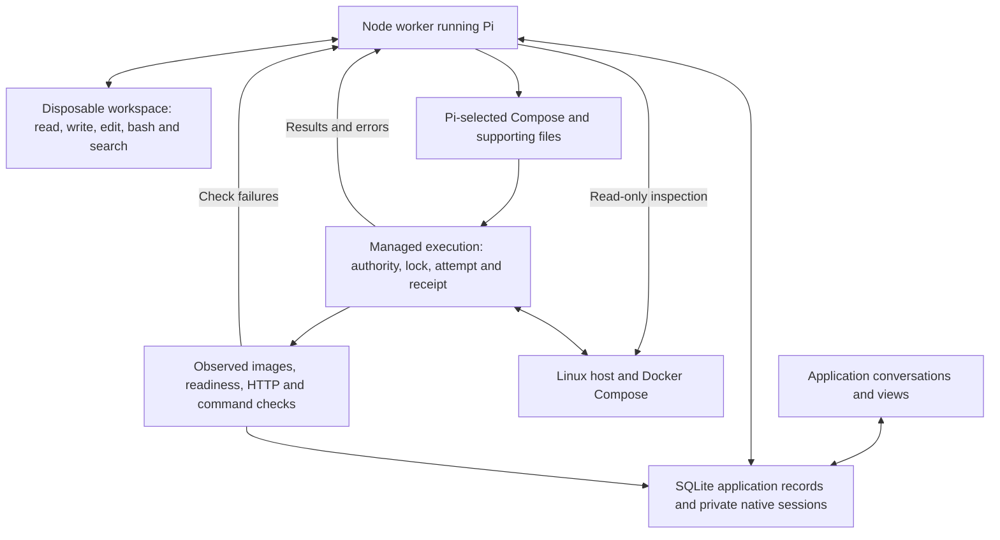

# Architecture

Current at schema v14, 11 September 2026. Server Guy is a Next.js application with SQLite records and a Node worker running Pi. Pi investigates, authors configuration and chooses corrections; tools execute authorized effects and record actual outcomes. [Product](../PRODUCT.md) defines scope, [requirements](requirements.md) defines outcomes, and [Roadmap](../ROADMAP.md) owns what remains.

## Pi and its tools

Pi reads the selected repository revision and application records, uses native tools in a disposable Docker workspace, and authors ordinary Compose, Dockerfiles and supporting configuration. The workspace does not receive controller/host credentials. Its bash tool is not unrestricted host access. Once an application is deployed, its workspace also holds the configuration last executed on the host under `.server-guy/current/`: the resolved Compose with private values as `${NAME}`, the records Compose cannot express, and every file the release built or mounted.

For example, Pi can discover separate web/worker Dockerfiles and a shared documents directory, choose the appropriate mounts and build contexts, and author Compose directly. It need not squeeze the application into a custom primary-service/companion language. Server Guy does not change application code or open branches and pull requests: when an operability change is needed, Pi explains it and gives a copyable handoff for a coding agent, the owner merges it, and a release deploys the merged revision.

Every Pi session, conversational or planning, shares the same read-only evidence tools. `inspect_runtime` collects fresh container state and bounded, redacted logs through fixed queries; from a conversation it runs immediately and is recorded as an inspection. `read_repository` and `compare_repository` read this application's repository at any revision and public upstream projects, never another private repository. `read_operation` returns an operation's stored outcome, the attempts it ran and its planning journal. Planning sessions journal their custom tool calls, results, errors, model retries and stops beside the workspace's own entries, so a failed or stopped release can be read later rather than retried blind.

The initial `recommend_deployment` tool selects Compose files in order, all needed supporting files, private-input names (or random values the controller generates), data records and checks. A pinned Compose 2.40.3 resolver retains the resolved configuration and selected artifacts. Controller overrides pin every public image tag to its Linux amd64 digest through the registry's own OCI token flow, limited to public addresses, and preserve deployment attribution. `${SERVER_GUY_PUBLIC_URL}` supplies the application's own address once the server exists. Read-side facts provide the service/mount inventory that the UI, scope and backup consumers need; they do not become another authoring language.

## Applying a change

First deployment retains its priced Hetzner recommendation and approval. After provisioning, it uses the same `releaseLoop` as updates. Updates select an exact revision on the existing host; Pi's `deploy_release` receives preparation, execution and verification results and may correct configuration within the approved effects. A single operation permits up to three executions. Ordinary corrections do not require another configuration approval.

The executor retains the application/host lock, private inputs, stable Compose project, image/data identities and immutable execution evidence. It stages the selected files, runs the host script and verifies the outcome. An update cannot silently buy another host, widen exposure, remove or relocate existing named-volume mounts, change their access, change or remove the managed PostgreSQL instance, or change the image of a declared state owner unless its approval names that change with compatibility evidence.

Verification checks each service's exact image and readiness, then the behavior criterion: HTTP checks on the primary listener, private HTTP checks, and commands that run in a running service with named private inputs passed on SSH standard input. A one-shot service declared through Compose's `service_completed_successfully` must have exited 0. Each attempt records every check it ran with its time, status or exit code and redacted output. A release may correct a recorded check under its name but not drop one. A command called a check can change data; it runs under the release's authority.

A successful shell command is not a verified application. A lost SSH reply is an unknown outcome: `reconcile_release` reads the matching durable host result under the same lock. Busy, missing or mismatched results do not authorize repetition. A known completed replacement can be checked without restarting; a known failed command can return to Pi for correction within the remaining scope. Unknown creation of a verification object cannot be resolved by guessing its identity.

## Durable records and the UI

| Record | Meaning |
| --- | --- |
| Application | The software being managed, with conversations and operational history. |
| Host binding | The stable machine/provider identity for that application's stack. |
| Release | Immutable selected source/configuration and artifacts. A configuration correction produces another snapshot. |
| Attempt | One execution of a release, attributed to an operation and host, with outcome, timestamps and the checks it ran. |
| Runtime observation | What execution or inspection established was running, including actual image identities and observation time. |
| Last verified runtime | Retained successful verification evidence; historical success is not a claim of current health. |
| Operation | Requested work and its origin, authority, progress, outcome and links to evidence; shared by chat receipts and views. |
| Retired record | A read-only Observation holding a record of the retired preparation workflow under its original ID. |

Release/attempt/host records live in the existing deployment aggregate, not separate tables for every concept. Operation records serialize conflicting application changes; queued work rechecks its assumptions before execution. Unknown external effects retain a hold even after the local worker dies. Pi does not manually release those locks; reconciliation does, or, for work whose capability was retired, an owner attestation the operation records with that consequence.

Conversations retain separate native transcripts and drafts while sharing application facts. `list_operations` (unresolved and recently settled work), `read_operation`, `propose_change` and `record_inspection` expose recorded work; reading records does not establish fresh host health, and `inspect_runtime` is the fresh observation. Views render the same evidence, and proposals remain distinct from applied state. The Deployment history is built from recorded attempts and operations, not from event prose. Keep the request, selected release, attempts and unresolved results durable so Pi can continue from records plus fresh inspection without prescribing every reasoning step.

Execution reads native configuration only. Known runtime with failed behavior can support corrective updates without being called verified; an unknown runtime needs reconciliation first.

## Schema 14: retired preparation and deployment plans

Schema 14 removes the phase workspaces, application contracts, conformance, preview, publication and process-guard tables. Chats, Pi runs and Activity belong to their application; messages, decisions, observations, deployments and operations keep their IDs. The [migration](../scripts/retire-preparation.mjs) runs in `npm run db:push`, is repeat-safe, and never re-executes retired work:

- Every retired row becomes a `retired-record` Observation under its original ID, with its source links and a note when it left something open, such as a pull request, branch or preview.
- Retired operations lose their command. Work that had definitely not started is cancelled. Completed receipts are untouched. Anything else is failed with its unknown outcome and change-queue hold preserved; a held operation ends only with an owner attestation ("What you verified"), which records that Server Guy did not verify it. A live process guard becomes such a held operation.
- Each legacy deployment plan in a lifecycle or live record is converted once into native Compose (`native.converted`). The conversion is accepted only if the plan reproduces its recorded release ID, so approvals, receipts, Compose projects, volume names, private inputs and recorded images keep the identities they named. The plan stays as an Observation. A recommendation from the retired planner that was never approved or run is marked failed with a retry path instead of converted.

The conversion is a one-time adapter inside the migration. No executor, rollback or view reads a plan afterwards, and new releases are never converted.

## Data protection and rollback

Compose tells us which services mount storage; separate data records identify its meaning and consistency procedure: files, a SQLite path, a clean-stop file copy, or `capture: "dump"` with an `owner` service and a procedure of `dump`, `restore` and `verify` commands Pi chooses from the software's documentation. Mounting a volume does not make a service its owner. Owners run without revision labels, so an application release does not recreate them.

A capture stops writers in dependency order, copies files and SQLite consistently, dumps the managed PostgreSQL, and runs each owner's dump and content fingerprint inside its still-running container. A recovery journal restarts the containers this capture stopped. The runner identifies the deployment by every container the controller labeled, whatever its service is called. A restore test loads each dump into a fresh instance of the owner's recorded image and environment, on its own volume with no network, and passes only when the owner's fingerprint matches the one printed from the source. The deployment lock coordinates Server Guy operations, not arbitrary host administrators.

Capture, off-host transfer, file/SQLite/database restore checks and useful application behavior are distinct evidence. File equality does not prove a specialised database's semantic recovery, and a fingerprint only covers what its command reads. Historical schedules and receipts keep their readers; changing a release does not silently reconfigure an installed schedule.

Compatible rollback selects a previously verified release's retained local image IDs, with Pi's written assessment that the old code can use current data and explicit approval. It keeps every state owner's current image. It uses retained configuration and current private inputs, without rebuilding or pulling mutable tags. Missing images or incompatible storage/database/exposure block it. It does not reverse migrations or restore old data, and it is not automatic failover. A written assessment is evidence to evaluate, not a compatibility oracle.

## Current limits

- Initial intake requires meaningful HTTP checks and publishes the primary service on host port 80. Additional public endpoints, BYOM adoption and worker-only/no-HTTP intake remain gaps.
- Command checks run only in running services and under the release's authority; there is no separate on-demand re-verification operation. Mutating HTTP checks require marked create/read/delete behavior. Readiness and useful background processing must not be conflated.
- Native artifacts do not imply support for every Compose effect. Capability/authority failures return to Pi; unsupported state mounts and broader network arrangements are not made supported by approval. A declared dump procedure is only as sound as its commands and fingerprint.
- A restore test restores data into isolated instances; it does not start the application on the restored data. Native-stack scheduled capture/restore and compatible rollback need broader end-to-end evidence; current proofs do not certify every application or migration.
- The controller currently enforces local access. Remote authenticated bootstrap, full takeover/replacement-host recovery, proactive care, migration orchestration and broad standing authorization remain incomplete.
- Plugins are an optional extension direction, not a required workaround for missing core capability. Prefer native tools and small record/effect APIs before adding an extension framework or fixed workflow engine.

## Source and proof

Core source: [Pi runtime](../src/server/pi.ts), [evidence tools](../src/server/pi-evidence.ts), [workspace](../src/server/pi-workspace.ts), [planner](../src/server/deployment-planner.ts), [native preparation](../src/server/native-compose.ts), [shared release loop](../src/server/application-releases.ts), [executor](../src/server/release-executor.ts), [command checks](../src/server/command-checks.ts), [release facts](../src/server/release-facts.ts), [operation store](../src/server/operation-store.ts), [reconciliation](../src/server/release-reconciliation.ts), [backup runner](../scripts/scheduled-backups/runner.py), [rollback](../src/server/rollback.ts) and the [schema 14 migration](../scripts/retire-preparation.mjs).

[Evidence](testing/README.md) distinguishes actual model runs, scripted tests, local Docker and live-host observations. PRs #43–#45 established the native path and reuse across two application structures; that is demonstrated generalization, not universal compatibility. Preserve existing IDs, native sessions, history and pending-work evidence when changing legacy storage. Retire obsolete implementation only when its required behavior has an equivalent path.
