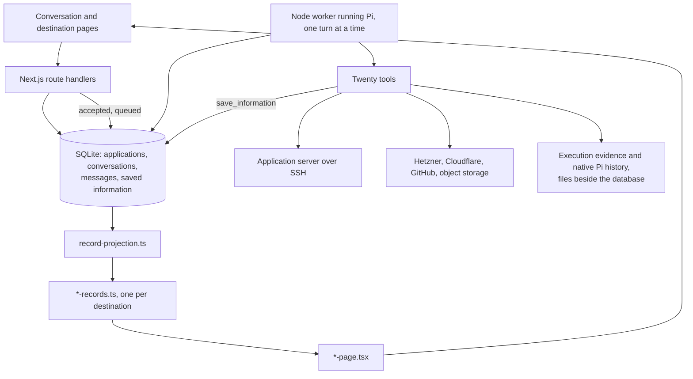
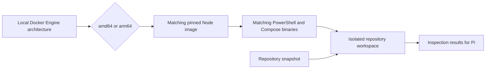

# Architecture

The [operator design](operator-design.md) defines the target. Delivery follows the [Roadmap](../ROADMAP.md).

## The operator

The main conversation owns the work. Pi reads the repository, decides what to
do and does it through the tools below; side chats read and search but change
nothing. There is no workflow engine, no plan entity and no state machine: the
old deployment and operation workers, their mutation endpoints and their
approval cards were removed, and nothing replaced them.

The first chat of an application is its permanent main conversation.
Conversations own current status and response pointers; messages own response
text, structured blocks and completion metadata. The worker and the API still
call a response projection a "run", though no runs table remains. Permissions
and the host reference live on the application; execution evidence lives in
files. See the storage [verification](testing/2026-09-12-operator-execution.md).

## The shape of it

The web process accepts and reads. It never runs a turn: a message is saved
queued, and the worker — a separate process holding an exclusive lock on the
database — claims it, runs it, and writes what happened. That separation is
why a crash takes one process rather than the server, and why the product has
to say when no worker is running.

## What is stored

Four tables, in [db-schema.ts](../src/server/db-schema.ts), at schema 15:

| Table | What it holds |
| --- | --- |
| `applications` | The application, its repository, its permission mode and its host reference. |
| `conversations` | One permanent main conversation per application, plus read-only side chats. |
| `messages` | Both sides of every turn, with structured blocks, status and completion metadata. |
| `saved_information` | Everything Pi established, with its presentation: what it is about, what it states, its facts and its checks. |

Everything a destination page says about an application comes from
`saved_information`. There is no deployment table, no operation table and no
runtime table: a release, a backup copy, a restore test and a certificate are
all records with a subject and a claim.

Three things live in files beside the database rather than in it. Native Pi
conversation history, under `pi-sessions/<application>/<chat>.jsonl`, because
the SDK owns it. Execution evidence — every command, its output and its
outcome — under `operator/<application>/executions/`, because a command's
output is large and append-only. And local diagnostics, under `diagnostics/`.

## What Pi can do

Twenty-two tools, registered in [pi.ts](../src/server/pi.ts). There is no workflow
engine behind them: Pi reads the repository, decides what to do and does it,
and the tools are the only things that can reach outside.

- **The server.** `server_bash` runs commands over the controller's SSH
  connection. `open_server_port` opens a private tunnel from this computer and
  checks that something answers.
- **Provisioning.** `hetzner_request` is the provider's own REST API;
  `server_public_key` supplies this application's key; `connect_server`
  verifies SSH and saves the connection.
- **Asking for a connection.** `request_connection` asks where the application
  should run and `request_domain_access` asks how to reach a domain's DNS. Each
  puts a guided card in the conversation and ends the turn; the controller
  does the checking, and a message tells Pi what was connected.
  [Onboarding](design/onboarding.md) owns the design.
- **Publishing.** `set_domain_record` writes one DNS record; `check_domain`
  and `check_public_access` ask the internet what it can see.
- **Records.** `save_information` writes what Pi established;
  `search_information` reads it back; `get_application_status` is the current
  state on demand, rather than a summary injected into every reply.
- **Secrets.** `generate_secret`, `request_secret`, `list_secrets`,
  `begin_credential_change` and `settle_credential_change`. The controller
  generates values from the system random source and stores them; no tool
  returns one, and a credential change keeps the working value until the new
  one is proven.
- **Backups.** `fetch_backup_copy` pulls one file onto this computer with its
  digest checked on arrival, `list_backup_copies` says what is actually here,
  and `prune_backup_copies` enforces retention where the files are.
- **Approval.** `request_approval` is how Pi asks when it has decided
  something needs the owner.

## The permission boundary

[operator-execution.ts](../src/server/operator-execution.ts) owns it. Every
call that reaches a server or a provider passes through it and is recorded
with its mode, its input and its outcome, whatever the answer.
Executor-backed calls require the runtime tool-call ID, linking the activity
and execution records without an optional identity argument.

The three modes are defined in
[Product](../PRODUCT.md#permission-modes). A call awaiting
approval is a durable record: the page reads pending calls, the owner decides,
and the tool continues or declines. A worker restart does not replay a call.

Command execution, the owner's terminal, private tunnels and backup transfers
share [managedSshOptions](../src/server/managed-ssh.ts) for the saved SSH key,
port and pinned-host verification policy. Each caller retains its own timeout,
keepalive, terminal, forwarding and output handling.

## From a record to a page

A record is checked when it is written, not when it is read.
[record-contract.ts](../src/server/record-contract.ts) refuses what shape alone
would accept — a check with no claim has no horizon, two facts sharing a key
silently erase one, a record that says a thing is absent and then describes it
says two things at once — and returns the finding to Pi as a tool error it can
act on.

[record-projection.ts](../src/server/record-projection.ts) is the one place
that answers questions about records: what subjects exist, what is currently
true about one, how fresh that is, and whether an absence was established or
simply never looked at. Freshness is a property of the claim, not of the
record: identity never ages, configuration ages in days, liveness in minutes.
[**Empty means unassessed, never healthy**](../PRODUCT.md#empty-means-unassessed-never-healthy)
— a destination with no records says nobody has looked.

Each destination has a `*-records.ts` beside the projection that turns those
answers into what its page needs, and a `*-page.tsx` that draws it. The
conversation shows the same records as cards; the page is not a list of the
cards, it is composed from the same records.

## Repository workspace architecture

The repository workspace runs natively on the local Docker Engine's Linux
architecture: amd64 or arm64. The controller reads the daemon's architecture,
selects the matching immutable Node image, and includes that architecture in
the workspace image cache key. PowerShell and Compose are pinned downloads
with separate checksums for each architecture. This avoids requiring x86
emulation on Apple-silicon Macs.

Only the workspace architecture follows the controller's engine. Deployment
image resolution retains its existing Linux amd64 default. The workspace's
non-root user, absent network, read-only container filesystem, temporary
repository volume and lack of controller credentials or Docker socket remain
unchanged.

## Publishing at a domain

Merged in [PR #76](https://github.com/lustoykov/hallvi/pull/76) on 15 September 2026, this lets the main operator make a privately
deployed application answer at a hostname the owner supplies, over HTTPS, from
the internet. It adds two tools and no workflow, table or approval type. The
public request path is browser → DNS → a reverse proxy on the deployment server
→ the application → its private dependencies; the controller is on none of it.
See the [decision diagram](architecture/publishing-evidence.html) and the
[evidence](testing/2026-09-15-publish-custom-domain.md).

`set_domain_record` writes one exact name of one exact type per call at the DNS
provider, so no request it can make touches a record it was not given. It
refuses to take a name away from whatever already holds it unless the caller
passes `replace`, and refuses to remove a record whose address is not the one it
expects, so withdrawal cannot delete somebody else's record. Its result reports
what stood there before and every other address record still at the name, which
is how a leftover AAAA becomes visible rather than silently breaking the name
for IPv6 visitors.

`check_public_access` is the vantage point the operator otherwise lacks: a
command on the host answers from inside the firewall over loopback, and the
repository workspace has no route to the host at all. From the controller it
reads public DNS in both families, the certificate each resolved address serves
and whether it is trusted and covers the name, an ordinary HTTPS request, what
plain HTTP does, and TCP ports that must stay private. It compares the address
that served the certificate against the origin's, so an edge answering for a
dead origin cannot be reported as a working site.

Everything else is ordinary `server_bash` work under the existing permission
mode, guided by the system prompt: reuse a suitable proxy or install Caddy
without asking the owner to choose one, address the application by Compose
service name from inside the network and by loopback from the host, keep
certificate state on a volume that survives replacement, open only 80 and 443,
finish an unclaimed first-run setup before the name is reachable, and undo only
what publishing did when it is withdrawn.

The records are the existing vocabulary: a `domain` subject whose `configured`,
`resolves` and `serves` checks are three different questions, a `certificate`,
`door` subjects for what is open and what refuses, and the same
`application-access` record updated in place to `mode: "public"`. The contract
refuses a public access record that still carries tunnel ports or a loopback
address, and refuses any record that says a subject is absent and then carries a
passing check about it. Domains offers the work in whichever of its three states
the records establish — publish, finish publishing, or make it private again —
and a published address is asked whether it answers rather than assumed open
because it is public.

Automatic renewal is verified as configuration plus persistent certificate
storage. An issued certificate is not a renewed one, and nothing in this path
claims to have observed a renewal.

## Provisioning

Merged in [PR #56](https://github.com/lustoykov/hallvi/pull/56) on 12 September 2026, this adds general `hetzner_request`, `server_public_key` and `connect_server` tools to the main operator. Pi selects resources from live API evidence. The controller keeps provider tokens and private SSH keys outside model arguments, verifies SSH before saving host/provider/account references on the application, and records calls through the existing permission/execution boundary. Shared information presents Pi's chosen recommendation or outcome. Existing-machine setup uses the public key and a trusted fingerprint in the main conversation; since 18 September the [host request card](design/onboarding.md) gathers both with one command the owner pastes on the machine, and `connection-checks.ts` also requires passwordless administrator rights and a 64-bit Linux before the host is saved. The same card proves a Hetzner token can write by registering the application's public SSH key. No schema table, workflow engine or approval mode is added. See the [evidence and limits](testing/2026-09-12-hetzner-provisioning.md).

## Protecting the controller

When a backup destination is connected, the worker copies Hallvi's own
records and keys after each piece of work and once a day, encrypted, under the
bucket's `controller/` prefix, keeping the last fourteen.
[controller-protection.ts](../src/server/controller-protection.ts) owns it, and
Backups states it beside the application's own data. Activating a replacement
controller stays manual; see
[scripts/controller-backups/README.md](../scripts/controller-backups/README.md).

## Current limits

- The controller binds to loopback and rejects arbitrary Host headers. Remote
  authenticated access, and a replacement controller brought up from a copy,
  are not implemented.
- A private application is reached through a tunnel this computer holds. There
  is no tunnel supervisor: if it drops, the owner asks Pi to reopen it, and the
  product says the address does not answer rather than offering it.
- Renewal of a certificate is verified as configuration plus persistent
  storage. An issued certificate is not a renewed one.
- One DNS provider and one host provider are implemented. An IPv6 publishing
  path is not proved.
- Nothing retrieves an application's own logs; the Logs destination holds what
  Hallvi's own commands printed, and says so.
- The worker runs one turn at a time for the whole controller. Native queueing
  and parallel read-only side work are deferred.

## Source and proof

Core source: [Pi runtime](../src/server/pi.ts),
[worker](../src/server/pi-worker.ts), [workspace](../src/server/pi-workspace.ts),
[execution and permissions](../src/server/operator-execution.ts),
[schema](../src/server/db-schema.ts),
[record contract](../src/server/record-contract.ts),
[record projection](../src/server/record-projection.ts),
[saved information](../src/server/saved-information.ts),
[publishing](../src/server/public-access.ts),
[private access](../src/server/private-access.ts),
[secrets](../src/server/application-secrets.ts) and
[controller protection](../src/server/controller-protection.ts).

[Evidence](testing/README.md) distinguishes actual model runs, scripted tests,
local Docker and live-host observations. Documentation does not establish
shipped support.
