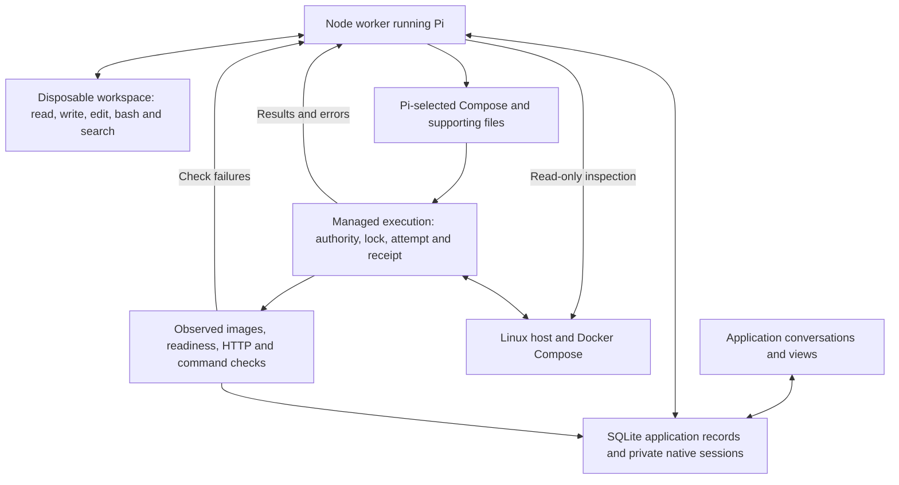

# Architecture

The [operator design](operator-design.md) defines the target. Delivery follows the [Roadmap](../ROADMAP.md).

## Current operator checkpoint

The main application conversation owns general server execution. `pi.ts` registers repository workspace tools, `server_bash`, `request_approval` and `get_application_status`; side chats get only read/search and recorded evidence. The Node worker runs Pi directly. The old deployment/operation workers and their mutation endpoints and approval controls are deleted.

`operator-execution.ts` owns application permission settings, an existing SSH connection and per-call JSON execution history. Credentials stay in controller-side files. Always ask pauses each command/file mutation; Pi decides permits ordinary execution and exposes an explicit approval tool; Bypass does not prompt. The UI reads pending calls and records a decision, and the live tool continues or declines. A worker restart does not replay calls. The default ten-minute conversation deadline was removed; host commands retain individual timeouts and report uncertain termination.

The first chat is the permanent main conversation. The worker still serializes turns globally; native queue/steer and parallel read-only side explanations are deferred. The current local checkpoint replaces storage with schema 15: applications, conversations, messages and saved information. Conversations own current status and response pointers; messages own response text, structured references and completion metadata. The worker/API still calls its response projection a run, but no runs table remains. Permissions and optional host references live on applications; execution evidence stays in files. Pi saves shared information and selects presentation in stable views. Legacy deployment/operation stores and executors are deleted; old visual-reference types remain isolated from live storage. Hetzner provisioning and first deployment are separate subsequent checkpoints. See [verification](testing/2026-09-12-operator-execution.md).

## Previous architecture and remaining legacy modules

The sections below describe the pre-redesign implementation at PR #49. Remaining modules/tables are transitional, not requirements or a preservation checklist. Current development data and obsolete code may be discarded.

Implementation baseline: schema v14, merged PR #49 at `2a1258a`. Server Guy is a Next.js application with SQLite records and a Node worker running Pi. Pi investigates, authors configuration and chooses corrections; tools execute authorized effects and record actual outcomes. [Product](../PRODUCT.md) defines scope, [requirements](requirements.md) defines outcomes, and [Roadmap](../ROADMAP.md) owns what remains.

## Pi and its tools

Pi reads the selected repository revision and application records, uses native tools in a disposable Docker workspace, and authors ordinary Compose, Dockerfiles and supporting configuration. The workspace does not receive controller/host credentials. Its bash tool is not unrestricted host access. Once an application is deployed, its workspace also holds the configuration last executed on the host under `.server-guy/current/`: the resolved Compose with private values as `${NAME}`, the records Compose cannot express, and every file the release built or mounted.

For example, Pi can discover separate web/worker Dockerfiles and a shared documents directory, choose the appropriate mounts and build contexts, and author Compose directly. It need not squeeze the application into a custom primary-service/companion language. Server Guy does not change application code or open branches and pull requests: when an operability change is needed, Pi explains it and gives a copyable handoff for a coding agent, the owner merges it, and a release deploys the merged revision.

Every Pi session, conversational or planning, shares the same read-only evidence tools. `inspect_runtime` collects fresh container state and bounded, redacted logs through fixed queries; from a conversation it runs immediately and is recorded as an inspection. `read_repository` and `compare_repository` read this application's repository at any revision and public upstream projects, never another private repository. `read_operation` returns an operation's stored outcome, the attempts it ran and its planning journal. Planning sessions journal their custom tool calls, results, errors, model retries and stops beside the workspace's own entries, so a failed or stopped release can be read later rather than retried blind.

The initial `recommend_deployment` tool selects Compose files in order, all needed supporting files, private-input names (or random values the controller generates, never one a person must know or type), data records and checks. A pinned Compose 2.40.3 resolver retains the resolved configuration and selected artifacts. Controller overrides pin every public image tag to its Linux amd64 digest through the registry's own OCI token flow, limited to public addresses, and preserve deployment attribution. `${SERVER_GUY_PUBLIC_URL}` supplies the application's own address once the server exists. Read-side facts provide the service/mount inventory that the UI, scope and backup consumers need; they do not become another authoring language.

## Applying a change

First deployment retains its priced Hetzner recommendation and approval. After provisioning, it uses the same `releaseLoop` as updates. Updates select an exact revision on the existing host; Pi's `deploy_release` receives preparation, execution and verification results and may correct configuration within the approved effects. A single operation permits up to three executions. Ordinary corrections do not require another configuration approval.

A first deployment that stopped after its host was prepared is continued from a conversation, not replaced. `prepare_release` on it resumes the stopped deployment operation under the approval it already has, with Pi's instructions recorded on the deployment for the release session; that is an ordinary correction and needs no new approval. When the correction must change a state owner's image, `prepare_release` names that owner in `stateChange` with compatibility evidence, and the proposal the owner approves says so; that release binds the approved release as its baseline, passes the stopped operation's hold as its successor, and makes the deployment live on the same host when it verifies.

The executor retains the application/host lock, private inputs, stable Compose project, image/data identities and immutable execution evidence. It stages the selected files, runs the host script and verifies the outcome. An update cannot silently buy another host, widen exposure, remove or relocate existing named-volume mounts, change their access, change or remove the managed PostgreSQL instance, or change the image of a declared state owner unless its approval names that change with compatibility evidence.

Verification checks each service's exact image and readiness (a health path that answers with a redirect or a client error is rejected with that status and target, and an application that never becomes ready is reported with the last response seen), then the behavior criterion: HTTP checks on the primary listener, private HTTP checks, and commands that run in a running service with named private inputs passed on SSH standard input. A one-shot service declared through Compose's `service_completed_successfully` must have exited 0. Each attempt records every check it ran with its time, status or exit code and redacted output. A release may correct a recorded check under its name but not drop one. A command called a check can change data; it runs under the release's authority.

A successful shell command is not a verified application. A lost SSH reply is an unknown outcome: `reconcile_release` reads the matching durable host result under the same lock. Busy, missing or mismatched results do not authorize repetition. A known completed replacement can be checked without restarting; a known failed command can return to Pi for correction within the remaining scope. Unknown creation of a verification object cannot be resolved by guessing its identity.

A command check may change data, so its outcome is never guessed either. The host runs it detached from the SSH session and writes its exit status and output beside the attempt's host result; when the container has `timeout`, the command runs under it, so a time limit stops the command instead of abandoning it. Before the command starts, the deployment records the pending command. That hold belongs to the deployment, not to the operation that ran the command: a lost session, a missing record, a still-running command or a limit the container could not enforce leaves it, and no operation, a continuation Pi prepares under existing authority included, executes or verifies again until `reconcile_release` reads the host's record; a release operation reads it before anything else runs. The record turns the hold into a known pass, a known failure (correction within the scope), a command that never started, or an explicit unresolved hold. A known pass resumes verification from the reconciled attempt's receipts: the HTTP checks and commands it recorded passed are carried, the resolved command is consumed, and only unfinished commands run, so a mutation whose reply was lost happens once. Only an owner decision made through a card, the deployment's Retry or an approval whose text names the unknown, marks the hold accepted, and even then a command still running holds; the acceptance lets the command run again only when the host's record is lost.

## Durable records and the UI

| Record | Meaning |
| --- | --- |
| Application | The software being managed, with conversations and operational history. |
| Host binding | The stable machine/provider identity for that application's stack. |
| Release | Immutable selected source/configuration and artifacts. A configuration correction produces another snapshot. |
| Attempt | One execution of a release, attributed to an operation and host, with outcome, timestamps and the checks it ran. |
| Runtime observation | What execution or inspection established was running, including actual image identities and observation time. |
| Last verified runtime | Retained successful verification evidence; historical success is not a claim of current health. |
| Operation | Requested work and its origin, authority, progress, outcome and links to evidence; shared by chat receipts and views. |
| Retired record | A read-only Observation holding a record of the retired preparation workflow under its original ID. |

Release/attempt/host records live in the existing deployment aggregate, not separate tables for every concept. Operation records serialize conflicting application changes; queued work rechecks its assumptions before execution. Unknown external effects retain a hold even after the local worker dies. Pi does not manually release those locks; reconciliation does, or, for work whose capability was retired, an owner attestation the operation records with that consequence.

Conversations retain separate native transcripts and drafts while sharing application facts. `list_operations` (unresolved and recently settled work), `read_operation`, `propose_change` and `record_inspection` expose recorded work; reading records does not establish fresh host health, and `inspect_runtime` is the fresh observation. Views render the same evidence, and proposals remain distinct from applied state. The Deployment history is built from recorded attempts and operations, not from event prose. Keep the request, selected release, attempts and unresolved results durable so Pi can continue from records plus fresh inspection without prescribing every reasoning step.

Execution reads native configuration only. Known runtime with failed behavior can support corrective updates without being called verified; an unknown runtime needs reconciliation first.

## Schema 14: retired preparation and deployment plans

Schema 14 removes the phase workspaces, application contracts, conformance, preview, publication and process-guard tables. Chats, Pi runs and Activity belong to their application; messages, decisions, observations, deployments and operations keep their IDs. The [migration](../scripts/retire-preparation.mjs) runs in `npm run db:push`, is repeat-safe, and never re-executes retired work:

- Every retired row becomes a `retired-record` Observation under its original ID, with its source links and a note when it left something open, such as a pull request, branch or preview.
- Retired operations lose their command. Work that had definitely not started is cancelled. Completed receipts are untouched. Anything else is failed with its unknown outcome and change-queue hold preserved; a held operation ends only with an owner attestation ("What you verified"), which records that Server Guy did not verify it. A live process guard becomes such a held operation.
- Each legacy deployment plan in a lifecycle or live record is converted once into native Compose (`native.converted`). The conversion is accepted only if the plan reproduces its recorded release ID, so approvals, receipts, Compose projects, volume names, private inputs and recorded images keep the identities they named. The plan stays as an Observation. A recommendation from the retired planner that was never approved or run is marked failed with a retry path instead of converted.

The conversion is a one-time adapter inside the migration. No executor, rollback or view reads a plan afterwards, and new releases are never converted.

## Data protection and rollback

Compose tells us which services mount storage; separate data records identify its meaning and consistency procedure: files, a SQLite path, a clean-stop file copy, or `capture: "dump"` with an `owner` service and a procedure of `dump`, `restore` and `verify` commands Pi chooses from the software's documentation. Mounting a volume does not make a service its owner. Owners run without revision labels, so an application release does not recreate them. There is one mechanism for every database: the managed PostgreSQL slot still supplies a generated password, the official image and image continuity, but its volume is protected like any other owner's, with a default PostgreSQL procedure (a custom-format `pg_dump`, `pg_restore` from standard input, a per-table row-hash fingerprint) recorded when Pi declares none. A volume a release already records keeps its owner, capture and procedure through a correction that redeclares it; changing or removing them is that owner's state change, which can name any declared owner, files included, while the owner-image rule applies to database owners and compares the image reference actually run.

A capture stops only the services that write captured data, dependents first: the read-write mounters the recorded mounts show, plus the `writers` Pi declares for a volume, the services that change its data without mounting it, such as the web and worker processes that write a database over the network. Owners with a dump keep running and dump during that pause; everything else is untouched. Mounts are evidence, not the whole consistency boundary, so a dump is quiescent only when Pi declared its writers (an empty list asserts that none but the owner exist) or when nothing else keeps running at all; then its live fingerprint describes the same moment as the dump and the files beside it. Otherwise the dump is taken online by the tool's own snapshot, no live fingerprint is taken, the approval text says so, and the restore test proves the copy by loading it rather than by comparison; files captured beside an online dump may be from another moment. The runner reads each volume where Docker keeps it, copies the files the definition binds into containers, and refuses a captured volume any container outside the plan holds writable. A recovery journal restarts the containers this capture stopped. The runner identifies the deployment by every container the controller labeled, whatever its service is called. The deployment lock coordinates Server Guy operations, not arbitrary host administrators.

A restore test restores the whole application in isolation on the same host: the archived Compose configuration comes up as its own project with no published ports, internal networks, fresh labeled volumes filled from the archive, no controller labels and no restart policy. Each owner starts alone and loads its dump through the recorded restore command, and the restore passes only when the owner's fingerprint matches the one printed from the source. The whole stack then boots, and the controller runs the recorded command checks, plus any checks Pi chose for that restore, inside the restored containers through the same check executor, with the same private inputs; the target is derived from the run's identity, never read from a host receipt, so a check cannot reach the running application. The host's own recovery removes the copy afterwards, and the controller asks for that recovery once before it refuses a new run for pending cleanup; a verified archive never waits on storage to be closed. Pi chooses the restore procedure and the checks; the tool guarantees where they run and records what happened.

Capture, off-host transfer, restoration, boot and useful application behavior are distinct evidence, and each is recorded separately on the run and its operation. File equality does not prove a specialised database's semantic recovery, and a fingerprint only covers what its command reads. When an owner's declared command fails, during capture or in the restore test, the run records which step, the exit code and the tail of what the command printed, with every value of the owner's environment replaced by its variable name, so the declaration can be corrected from the record; a paused service that does not stop within the grace period is named the same way, with how it ended. The failure code itself stays bounded. Historical schedules and receipts keep their readers: an archive from the earlier runner is restored offline as before. Changing a release does not silently reconfigure an installed schedule.

Compatible rollback selects a previously verified release's retained local image IDs, with Pi's written assessment that the old code can use current data and explicit approval. It keeps every state owner's current image. It uses retained configuration and current private inputs, without rebuilding or pulling mutable tags. Missing images or incompatible storage/database/exposure block it. It does not reverse migrations or restore old data, and it is not automatic failover. A written assessment is evidence to evaluate, not a compatibility oracle.

## Current limits

- Initial intake requires meaningful HTTP checks and publishes the primary service on host port 80. Additional public endpoints, BYOM adoption and worker-only/no-HTTP intake remain gaps.
- Command checks run in running services under a release's authority, or inside a restored copy during a restore test; there is no separate on-demand re-verification operation against the running application. Mutating HTTP checks require marked create/read/delete behavior. Readiness and useful background processing must not be conflated.
- Native artifacts do not imply support for every Compose effect. Capability/authority failures return to Pi; unsupported state mounts and broader network arrangements are not made supported by approval. A declared dump procedure is only as sound as its commands and fingerprint.
- A restore test boots the restored copy and checks it with commands, not with the release's HTTP checks, which would need a published port; production cutover onto a restored copy is not performed. Native-stack scheduled capture/restore and compatible rollback need broader end-to-end evidence; current proofs do not certify every application or migration.
- The controller currently enforces local access. Remote authenticated bootstrap, full takeover/replacement-host recovery, proactive care, migration orchestration and broad standing authorization remain incomplete.
- Plugins are an optional extension direction, not a required workaround for missing core capability. Prefer native tools and small record/effect APIs before adding an extension framework or fixed workflow engine.

## Source and proof

Core source: [Pi runtime](../src/server/pi.ts), [evidence tools](../src/server/pi-evidence.ts), [workspace](../src/server/pi-workspace.ts), [planner](../src/server/deployment-planner.ts), [native preparation](../src/server/native-compose.ts), [shared release loop](../src/server/application-releases.ts), [executor](../src/server/release-executor.ts), [command checks](../src/server/command-checks.ts), [release facts](../src/server/release-facts.ts), [operation store](../src/server/operation-store.ts), [reconciliation](../src/server/release-reconciliation.ts), [backup runner](../scripts/scheduled-backups/runner.py), [rollback](../src/server/rollback.ts) and the [schema 14 migration](../scripts/retire-preparation.mjs).

[Evidence](testing/README.md) distinguishes actual model runs, scripted tests, local Docker and live-host observations. PRs #43–#45 established the native path and reuse across two application structures; that is demonstrated generalization, not universal compatibility. For the redesign, existing development records may be discarded instead of migrated. Retain behavior still required by the agreed design; explicitly retire obsolete workflow constraints and their tests. Preserving historical records does not require preserving the executors that produced them.
