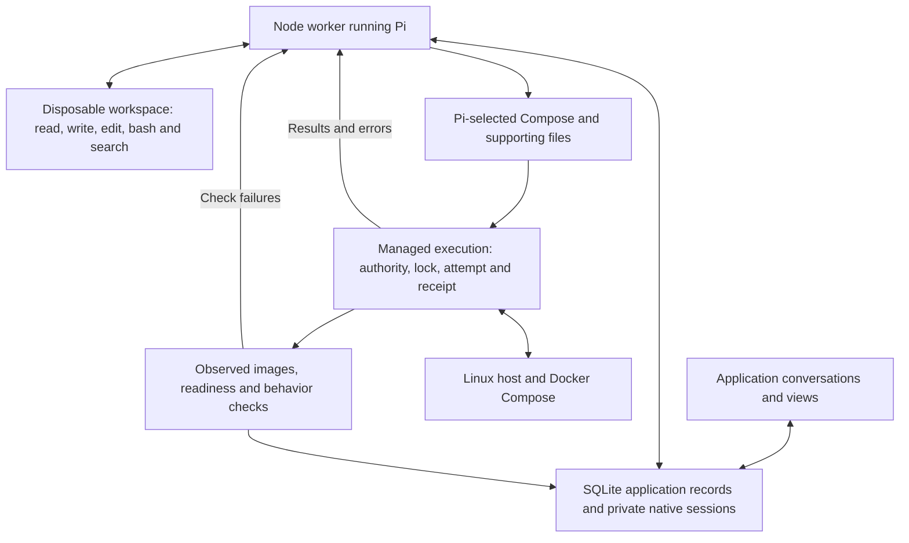

# Architecture

Current at main `0682ab2` (PR #45), 11 September 2026. Server Guy is a Next.js application with SQLite records and a Node worker running Pi. Pi investigates, authors configuration and chooses corrections; tools execute authorized effects and record actual outcomes. [Product](../PRODUCT.md) defines scope, [requirements](requirements.md) defines outcomes, and [Roadmap](../ROADMAP.md) owns what remains.

## Pi and its tools

Pi reads the selected repository revision and application records, uses native tools in a disposable Docker workspace, and authors ordinary Compose, Dockerfiles and supporting configuration. The workspace does not receive controller/host credentials. Its bash tool is not unrestricted host access.

For example, Pi can discover separate web/worker Dockerfiles and a shared documents directory, choose the appropriate mounts and build contexts, and author Compose directly. It need not squeeze the application into a custom primary-service/companion language. Application-code fixes still follow Product's owner-merged operability-PR boundary.

The initial `recommend_deployment` tool selects Compose files in order, all needed supporting files, private-input names, data metadata and checks. A pinned Compose 2.40.3 resolver retains the resolved configuration and selected artifacts. Controller overrides pin image identities and preserve deployment attribution. Read-side facts provide the service/mount inventory that the UI, scope and backup consumers need; they do not become another authoring language.

## Applying a change

First deployment retains its priced Hetzner recommendation and approval. After provisioning, it uses the same `releaseLoop` as updates. Updates select an exact revision on the existing host; Pi's `deploy_release` receives preparation, execution and verification results and may correct configuration within the approved effects. A single operation permits up to three executions. Ordinary corrections do not require another configuration approval.

The executor retains the application/host lock, private inputs, stable Compose project, image/data identities and immutable execution evidence. It stages the selected files, runs the host script and verifies the outcome. An update cannot silently buy another host, widen exposure, remove or relocate existing named-volume mounts, change their access, or change/remove the managed PostgreSQL instance.

A successful shell command is not a verified application. A lost SSH reply is an unknown outcome: `reconcile_release` reads the matching durable host result under the same lock. Busy, missing or mismatched results do not authorize repetition. A known completed replacement can be checked without restarting; a known failed command can return to Pi for correction within the remaining scope. Unknown creation of a verification object cannot be resolved by guessing its identity.

## Durable records and the UI

| Record | Meaning |
| --- | --- |
| Application | The software being managed, with conversations and operational history. |
| Host binding | The stable machine/provider identity for that application's stack. |
| Release | Immutable selected source/configuration and artifacts. A configuration correction produces another snapshot. |
| Attempt | One execution of a release, attributed to an operation and host, with outcome and timestamps. |
| Runtime observation | What execution or inspection established was running, including actual image identities and observation time. |
| Last verified runtime | Retained successful verification evidence; historical success is not a claim of current health. |
| Operation | Requested work and its origin, authority, progress, outcome and links to evidence; shared by chat receipts and views. |

Release/attempt/host records live in the existing deployment aggregate, not separate tables for every concept. Operation records serialize conflicting application changes; queued work rechecks its assumptions before execution. Unknown external effects retain a hold even after the local worker dies. Pi does not manually release those locks.

Conversations retain separate native transcripts and drafts while sharing application facts. `list_operations`, `propose_change` and `record_inspection` expose recorded work; reading records does not establish fresh host health. Views render the same evidence, and proposals remain distinct from applied state. Keep the request, selected release, attempts and unresolved results durable so Pi can continue from records plus fresh inspection without prescribing every reasoning step.

Historical plan/hash/receipt readers remain for existing deployments and recommendations. New intake uses native artifacts. Known runtime with failed behavior can support corrective updates without being called verified; an unknown runtime needs reconciliation first.

## Data protection and rollback

Compose tells us which services mount storage; separate data records identify its meaning, SQLite paths and consistency procedure. New schedules use data and writer relationships rather than application-name admission. Stop dependents before dependencies, pause relevant clients/writers, capture files or SQLite consistently, and dump managed PostgreSQL while it runs. A recovery journal restarts the containers this capture stopped. The deployment lock coordinates Server Guy operations, not arbitrary host administrators.

Capture, off-host transfer, file/SQLite/database restore checks and useful application behavior are distinct evidence. File equality does not prove a specialised database's semantic recovery. Historical schedules and receipts keep their readers; changing a release does not silently reconfigure an installed schedule. Backup consumers still contain `app`/`postgres` service-name assumptions, and intake preserves those names today.

Compatible rollback selects a previously verified release's retained local image IDs, with Pi's written assessment that the old code can use current data and explicit approval. It uses retained configuration and current private inputs, without rebuilding or pulling mutable tags. Missing images or incompatible storage/database/exposure block it. It does not reverse migrations or restore old data, and it is not automatic failover. A written assessment is evidence to evaluate, not a compatibility oracle.

## Current limits

- Initial intake requires meaningful HTTP checks and publishes the primary service on host port 80. Additional public endpoints, BYOM adoption and worker-only/no-HTTP intake remain gaps.
- Private HTTP service checks exist; general Pi-selected command checks do not. Mutating HTTP checks require marked create/read/delete behavior. Readiness and useful background processing must not be conflated.
- Native artifacts do not imply support for every Compose effect. Capability/authority failures return to Pi; arbitrary database engines, unsupported state mounts and broader network arrangements are not made supported by approval.
- Native-stack scheduled capture/restore and compatible rollback need broader end-to-end evidence. Current proofs do not certify every application or migration.
- The controller currently enforces local access. Remote authenticated bootstrap, full takeover/replacement-host recovery, proactive care, migration orchestration and broad standing authorization remain incomplete.
- Plugins are an optional extension direction, not a required workaround for missing core capability. Prefer native tools and small record/effect APIs before adding an extension framework or fixed workflow engine.

## Source and proof

Core source: [Pi runtime](../src/server/pi.ts), [workspace](../src/server/pi-workspace.ts), [planner](../src/server/deployment-planner.ts), [native preparation](../src/server/native-compose.ts), [shared release loop](../src/server/application-releases.ts), [executor](../src/server/release-executor.ts), [release facts](../src/server/release-facts.ts), [operation store](../src/server/operation-store.ts), [reconciliation](../src/server/release-reconciliation.ts), [backup runner](../scripts/scheduled-backups/runner.py) and [rollback](../src/server/rollback.ts).

[Evidence](testing/README.md) distinguishes actual model runs, scripted tests, local Docker and live-host observations. PRs #43–#45 established the native path and reuse across two application structures; that is demonstrated generalization, not universal compatibility. Preserve existing IDs, native sessions, history and pending-work evidence when changing legacy storage. Retire obsolete implementation only when its required behavior has an equivalent path.
