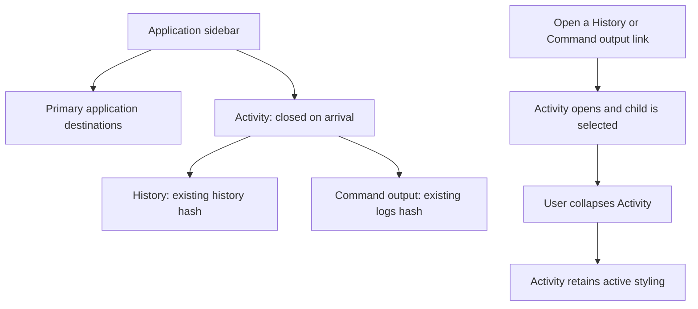

# Activity navigation

The owner selected N4: keep History and Command output accessible under an
Activity disclosure below the main destinations. Preserve their existing routes,
text size and hit targets.

This changes navigation placement only. The six comparison prototypes remain
separate, and the selected Deployment, Backups and terminal treatments are not
bundled into this change.
