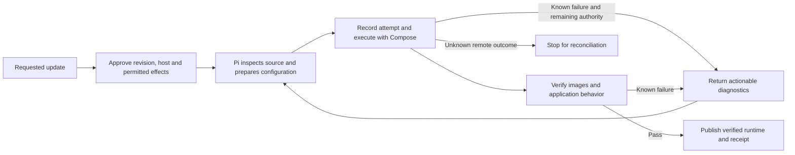

# Agent-directed releases on an existing host

10 September 2026. Builds on [deployment lifecycle](deployment-lifecycle.md).

A release update applies a selected source revision and configuration to an application's existing host. One authorized task can include several corrected configurations. Each executed configuration gets an immutable release snapshot and a separate attempt; approval is not tied to every container command.

For example, the user requests an update. Pi proposes the exact resolved commit on the current host. After scope approval, a missing build directory produces a native Compose error. The release session reads that error, corrects the build context and executes again under the same scope. Only fresh image, readiness and behavior checks establish the new verified runtime.

## Who decides what

The release session also has `inspect_release`: fixed, read-only queries for the authorized Compose project’s container identities, states and bounded logs. Saved private values are redacted before returning or recording output. Inspection remains available when retries are blocked; it does not establish that a disconnected command finished.

Pi chooses commands, environment configuration, service dependencies, build context and relevant behavior checks. Source code is evidence, not instructions or authorization. Pi can read it but cannot silently change application code. An application-code fix still goes through an owner-merged PR.

The tool input schema defines what the current executor can represent and prevents invalid references from breaking serialization. Native `docker compose config`, build and startup diagnostics are returned to Pi. This slice does not remove all existing schema checks or add support for arbitrary Compose features. It changes what happens when a check fails: ordinary configuration errors become feedback for the agent rather than another human approval step.

Code enforces the task's authority, operation ownership, private inputs and persistent evidence. A successful command is not sufficient evidence of application behavior. A better model can make better decisions and corrections without requiring application names in the executor.

## Scope and execution

`prepare_release` resolves a ref to an exact GitHub commit and records a proposed operation. The approval covers that application, repository identity, host binding and revision, with brief downtime and up to three executions. New pushes do not move the selected revision. The same configured Pi runtime runs the release planning session, whose `deploy_release` tool returns structured success or failure feedback.

Corrections may adjust ordinary configuration within the existing executor's capabilities. They may not change the host, purchase or resize a server, change public exposure, remove or relocate existing named volumes, or remove/upgrade the managed PostgreSQL instance. Existing private inputs are reused and redacted from feedback. Missing inputs must be supplied privately. Destructive data migrations are outside this scope; source inspection is not a general migration-compatibility proof.

Each execution stages a complete source tree in its own directory. One remote lock covers upload, Compose validation, build/pull and replacement. Existing volume identities and the stable Compose project are retained. The executor never uses `down -v`. Managed PostgreSQL is not pulled or upgraded as an update side effect. Execution results record the phase and exit status; transport failure without a complete result is an unknown outcome and prevents blind retries. The follow-up [reconciliation protocol](release-reconciliation.md) reads the matching host result under the deployment lock and verifies completed replacements without restarting them.

Three executions bound a single operation. An explicit user retry authorizes another bounded operation, but does not erase an unknown remote outcome. Correction does not grant new spending, access or a different source revision. Initial deployment still uses its existing exact priced-recommendation approval; this is not a general standing-authorization engine.

## Evidence and limits

- The Pi session test supplies malformed configuration and an execution failure, then submits a correction through the same session. It verifies feedback plumbing with a scripted model, not the quality of a live model's judgment.
- Temporary SQLite controller tests exercise proposal, approval, two attempts, retained release/runtime history, unchanged original deployment receipt, and refusal to repeat an unknown remote outcome.
- The opt-in Docker proof executes a source application with SQLite, seeds meaningful state, triggers a native Compose build failure and a behavior-check failure, inspects running container state and logs, and applies a corrected newer revision using the production release script and verifiers. It checks a changed image, new version and retained state. The transport maps SSH to local shell and uses an ephemeral loopback port; it does not prove remote SSH, the host lock or a live Hetzner update.

Run the Docker proof with `SG_RUN_DOCKER_PROOF=1 npm test -- tests/application/integration/release-docker.test.ts`.

Follow-up slices now add [shared storage and independent source builds](shared-storage-builds.md) and [reconciliation after a lost reply](release-reconciliation.md). Compatible rollback, migration orchestration, zero-downtime replacement, arbitrary Compose import, BYOM adoption and a plugin runtime remain unimplemented. Build directories accumulate for inspection; automated retention is not implemented. Existing schema limitations remain visible capability limits, not permanent product policy. Missing host result evidence and unresolved verification objects still prevent automatic recovery.
