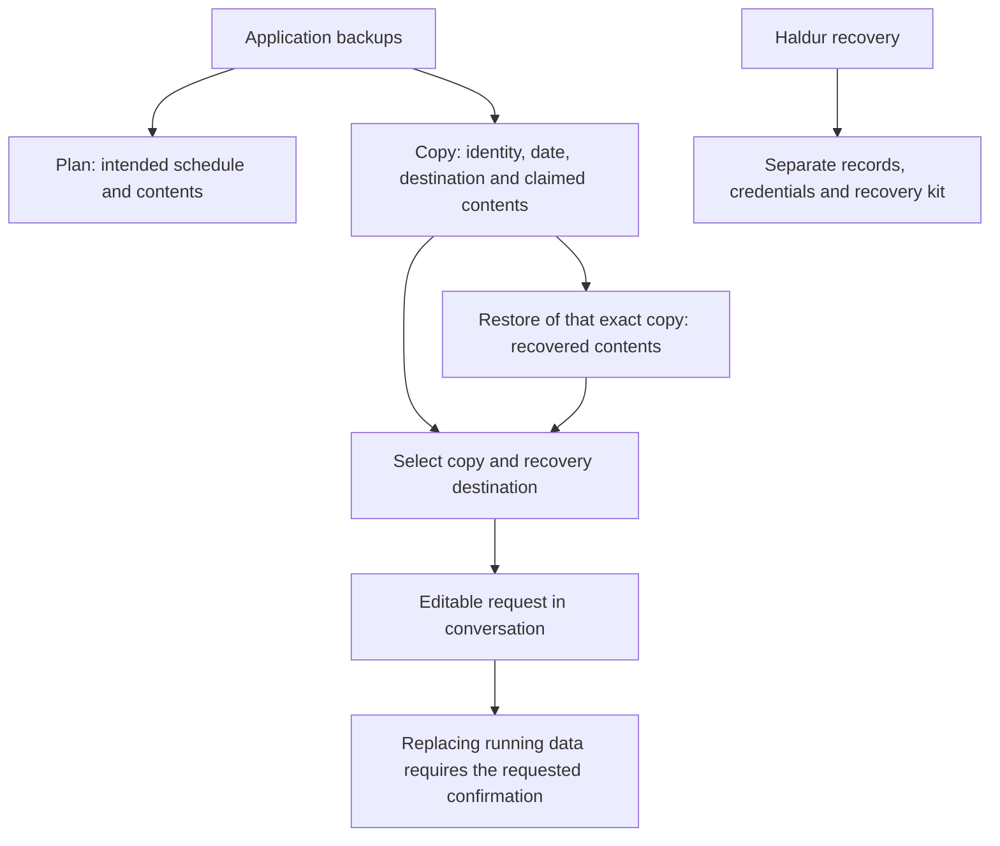

# Backups: inspect a copy before recovery

The Backups page keeps the application’s data separate from Haldur’s own
recovery. Expand a stage to inspect the inventory, destination and retained
copies; expand recovery to choose a copy and draft a request.

Restore results take precedence over a copy’s claimed contents. A restore
without an item list does not verify that list. Recovery requests name the
selected copy by identity and timestamp; choosing a mode does not run a restore.
