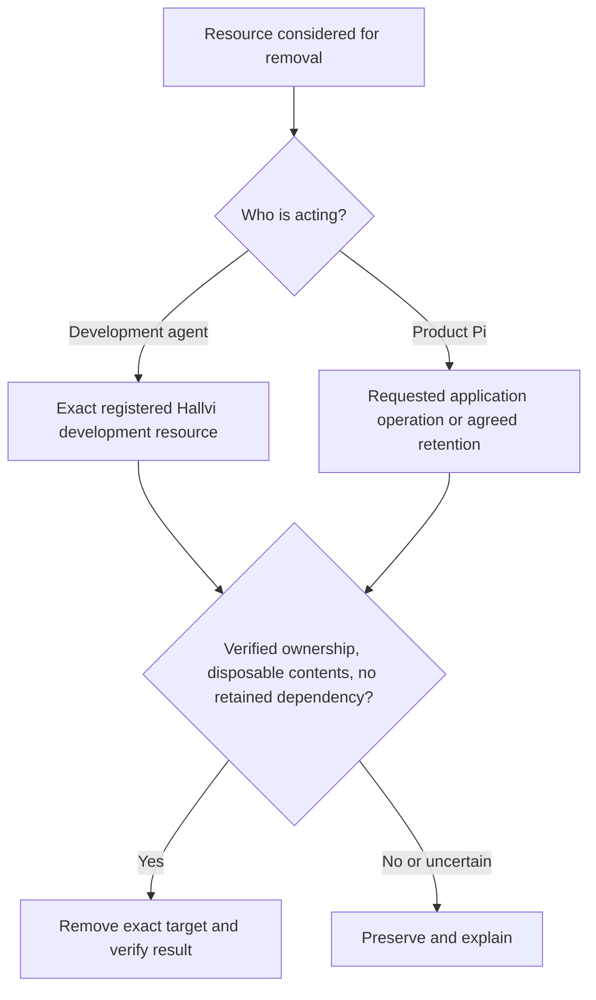

# Cleanup scope

Development housekeeping and product operations have separate authority. A
folder name, resource label or idle process is never enough to permit deletion.

Disposal of Pi's repository workspace is owned by the runtime. Contributor cleanup
rules are not loaded into the product session, and running a development server
does not make its users' deployments disposable. General remote shell access is
not a deletion sandbox; the runtime prompt governs Pi's use of that access.

See [development policy](../development-resources.md#scope-development-resources-not-user-systems)
and [product boundary](../../PRODUCT.md#operating-boundary).
