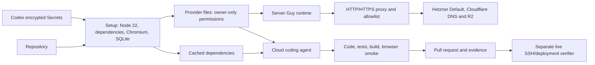

# Codex cloud development during beta

The owner accepts agent-readable development credentials for beta. Use one
Hetzner project (Default) and existing development credentials covering DNS
and R2 backup operations. Dedicated cloud tokens are optional.
Codex Secrets protect stored values; the setup script deliberately persists
runtime copies that the application and the agent can read.

Provider API access and SSH connectivity are separate checks. A successful API
call or VM creation is not proof that the cloud environment can configure that
machine. Tokens and cached files must never be included in the PR or evidence.
