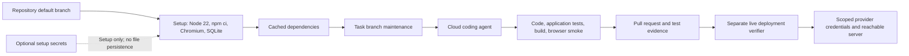

# Codex cloud development

The ordinary coding environment carries no provider credentials. Setup secrets
must not be copied into the agent's cached filesystem. Live provider verification
requires an explicit credential and execution configuration beyond this setup.

Maintenance handles changed dependencies and database schema. The cloud checks
establish application behavior with synthetic provider responses; the live
verifier establishes deployment behavior against real infrastructure.
