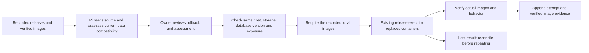

# Compatible application rollback

A **compatible rollback** returns application code to a previously verified release while keeping the current data. It is not a database restore and does not reverse migrations.

## Behavior

Successful runtime verification now appends the observed image IDs with the attempt, release and host identities. Before a later update, the currently verified observation is retained. Existing historical releases without verified image evidence are not retroactively declared rollback-ready. History remains append-only.

Pi can list releases, read bounded source files at their immutable revisions, and prepare a rollback with a written compatibility assessment. Source is untrusted evidence; reading migration code alone does not prove which migrations actually ran. If compatibility is unknown, the tool description directs Pi to explain the missing evidence rather than propose a rollback. Credential-shaped and saved private values are redacted from the persisted assessment.

The proposal identifies an exact historical release and its observed local images. Approval covers the existing host, storage and network exposure, with the existing three-attempt budget. Execution uses the original plan and current saved private inputs. It does not fetch build source, build images, or pull mutable tags. Every image must exist locally before activation. PostgreSQL retains its current image, and changing its recorded version or removing existing mounts is outside this scope.

The normal release executor and verification path handle replacement. The prior runtime remains the last verified observation until checks establish the result. A lost reply is reconciled from the host's attempt result before another replacement; a successful host command with failed verification is investigated rather than blindly repeated. Missing or inconsistent result evidence does not authorize retry.

## Compatibility is an assessment, not a new oracle

The code checks identity, image availability and the declared storage/database/exposure boundaries. Pi assesses whether the old application can use current data, and the owner sees that assessment before approval. A nonempty explanation does not mathematically establish compatibility. No migration engine, schema downgrade or data conversion is introduced.

For example, if v2 adds an optional column and v1 can still operate with that schema, an image rollback may be appropriate after examining the actual migration outcome. If v2 removed a column required by v1, reverting images alone is not sufficient. A separately planned data migration or restore is required.

There is no automatic rollback on a failed update, zero-downtime promise, remote image archive, registry repull fallback, or full configuration/data restore. Earlier images removed by host cleanup make that target unavailable. Queue/database companions other than managed PostgreSQL may also have data compatibility requirements; the assessment must cover them.

## Evidence

Opus extended the existing release integration tests and opt-in Docker proof. Codex ran the actual Docker proof: both the single-build SQLite layout and separate web/worker builds with shared volumes updated to v2 and returned to v1's original images while retaining seeded state. Read-only mounts remained enforced. A missing image failed during preflight while v2 continued running. Lost-result reconciliation and Linux locking also passed.

Those tests use real local containers with a mapped SSH transport. Integration tests use real operation/deployment records but stub remote execution and the planner. Together they cover the production code paths without claiming a full remote Hetzner/Pi rollback session. Paperless's version upgrade is separately proved; a Paperless downgrade has not been attempted or declared compatible.
