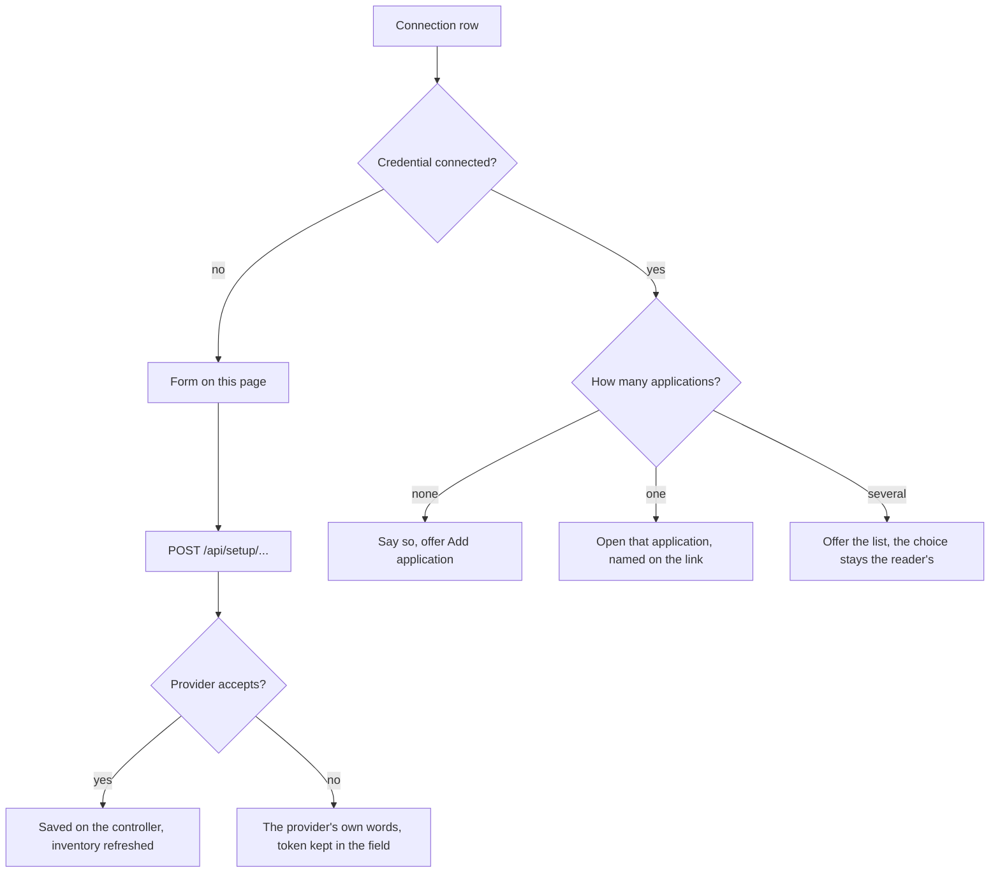

# What a Connections row does

Every row on Settings › Connections used to link to `/applications` whatever
its button said, so "Connect" for Hetzner reached the applications list, and
`hetzner.ts` told the reader to connect Hetzner in Settings — the page they
had just left. Each row now leads to the one place that can do the thing it
names.

Three credentials, three rows, because they are obtained separately: the
Hetzner Cloud API token, the Cloudflare **management** token (zones, DNS, and
listing or creating R2 buckets), and an **S3 access key pair** that can write
a backup object into a bucket. A working management token is not a working
backup destination. The Backup storage row opens the same
`BackupStorageForm` the application's Backups page uses, posting to the same
route; it needs no application, so it is offered here directly.

A token is typed into a password field and posted in a same-origin JSON body.
It is never put in a URL, a query string, a chat message or a log, and nothing
about it is returned to the browser beyond whether the provider accepted it.
Connecting an account authorises nothing further: every purchase or change is
still approved in the conversation that proposes it.
