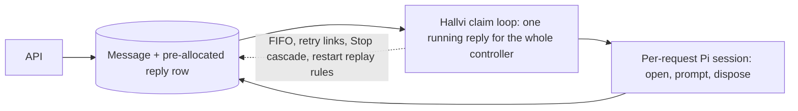
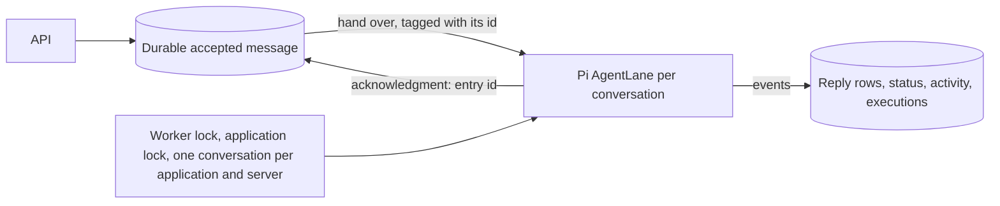
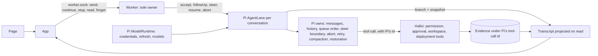

# Who owns a conversation's lifecycle

Owned by [Interaction while Pi is busy](../operator-design.md#interaction-while-pi-is-busy).

## Before: Hallvi ran a request at a time

Hallvi decided when every message ran, kept its own queue, linked retries,
and opened and closed a Pi session around each request. An approval in one
application held up every other.

## Then: Pi's lane ran it, and Hallvi kept a second record

Pi owned the queue and the run, but Hallvi still held every message until Pi
acknowledged it, kept its own reply rows and status beside Pi's history, and
reconciled the two when a conversation was opened.

## Now: Pi keeps the conversation, and the worker owns Pi's sessions

A send is answered once Pi has durably taken the message, and fails visibly
otherwise. There is no intake queue, no reply row, no stored status, no
reconciliation and no lock: one process owns the sessions because only it is
asked, and what the page shows is read from Pi each time. Hallvi keeps what
is the product's own: permissions, approvals and execution evidence, each
record under the id Pi gave the tool call.
