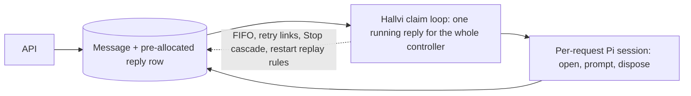
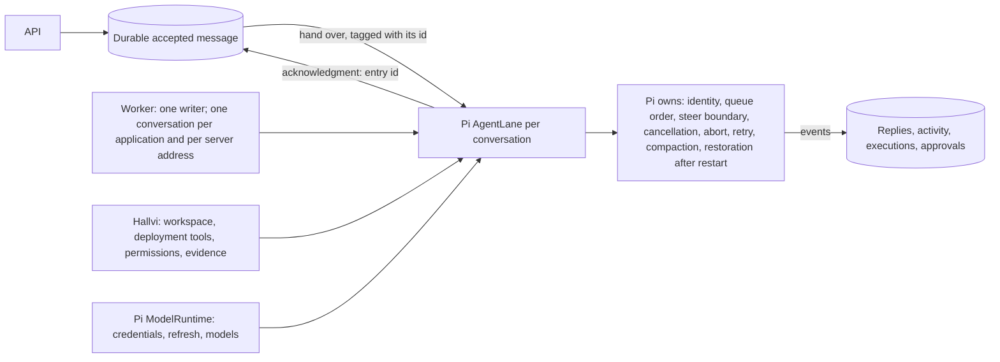

# Who owns a conversation's lifecycle

Owned by [Interaction while Pi is busy](../operator-design.md#interaction-while-pi-is-busy).

## Before: Hallvi ran a request at a time

Hallvi decided when every message ran, kept its own queue, linked retries,
and opened and closed a Pi session around each request. An approval in one
application held up every other.

## After: Pi's lane runs the conversation

Hallvi keeps the durable intake from the API to the process that owns the
session, the acknowledgment that Pi has taken a message, the rule for whether
a conversation may start, and everything the product records. It reconciles
with Pi in exactly one place: when a conversation is opened, it asks Pi what
it already holds.
