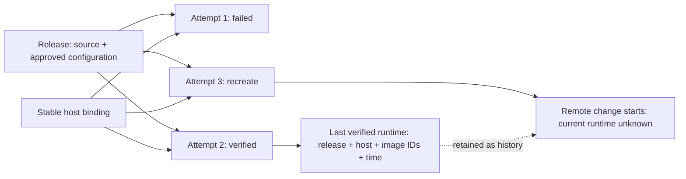

# Deployment lifecycle

10 September 2026. This builds on [service-based deployment](service-deployment.md). It separates release identity, the host binding, individual execution attempts and the last verified runtime for the existing initial-deployment and container-recreation paths.

## Behavior

A retry has a new attempt ID and keeps the same release ID when its source/configuration did not change. Recreation is also a separate attempt at the same release and host. Completed attempts retain their outcome, reason, operation ID and timestamps; selected releases retain their source/configuration snapshot.

Before execution, the worker persists an attempt. Before a potentially mutating provider/SSH action, it records that remote changes may occur. Successful image/readiness/application verification publishes the new runtime observation together with the completed attempt. A preflight failure preserves the previous observation. A failed or interrupted remote change leaves the current runtime unknown and retains the earlier observation as history. An old check does not prove the previous release is still serving.

The Deployment view shows these outcomes separately from the latest verification. Overview and recorded stack state no longer infer “running” from an old verification after an uncertain change. The agent's status tool reads the same runtime/attempt evidence. Monitoring remains separate; passing reachability alone does not establish the complete serving release.

## Storage and compatibility

The lifecycle records live inside the existing per-application deployment JSON aggregate. Its compare-and-swap transaction stores host, attempt and runtime changes atomically. This avoids a database migration while there is still one host assignment and one operational deployment workspace per application. These are distinct domain records, **not independent database tables or shared-host scheduling**.

The top-level Deployment fields remain the executor's compatibility workspace: credentials, provider reconciliation labels, Compose project, remote directory and retained volumes continue using its stable ID. Attempts do not get new credential directories or new Compose projects. `syncDeploymentHost` rejects silently changing an established server or provider project on retry. Completed attempts and saved releases cannot be edited or removed through ordinary saves. Recreation no longer rewrites the original deployment operation receipt.

Existing rows are not rewritten just by viewing them. On their next execution, a legacy live record with a revision, plan, server and verification contributes one labelled imported attempt and runtime observation. No missing retry history is invented. A legacy failed record's old `verifiedAt` cannot establish the identity of its current runtime, so it starts unknown; its original evidence remains in the old record and operation history.

Deployment-worker recovery interrupts its unfinished attempt. Generic operation-worker recovery settles an unfinished recreation attempt in the same transaction as its failed operation. Neither recovery claims that a dead local process stopped its remote commands. Existing application operation coordination and uncertain-effect queue blocking still apply.

## Scope and next work

The original lifecycle slice records attempts for initial deployment/retries and recreation on an existing Hetzner host. The follow-up [scoped release executor](agent-releases.md) adds subsequent revisions and Pi-directed configuration correction on that host. First deployments now run through the same executor: each host execution is its own attempt under the approved recommendation. Rollback, BYOM adoption, host sharing, rolling/zero-downtime replacement, migration orchestration, secret-value versioning and a plugin runtime remain unimplemented. Release identity still does not guarantee reproducible source builds.

The subsequent-release executor targets another release without replacing earlier release/attempt evidence. Authorization binds the host, selected revision and permitted effects; corrected configurations receive distinct release snapshots under that scope. If a change fails after remote effects, it must reconcile what runs; it cannot label the old release as serving solely because that release passed yesterday.

The aggregate keeps history with each application and sends it with deployment state. Pagination/normalised storage is a later change if measured history size warrants it. Cancellation of a definitively uncreated setup retains its operation/chat receipts under the existing policy but removes the deployment aggregate; this slice does not introduce a separate cancelled-setup archive.

## Validation

Synthetic lifecycle and SQLite integration tests cover two attempts at one release, host stability, immutable completed evidence, failure at a different release, preflight versus remote failure, initial-worker interruption, stale-writer rejection, and dead recreation-worker recovery without changing the initial receipt. Render tests cover historical verification beside a failed recreation and unknown process state. They use temporary controller databases; no live app, provider project or production credentials are involved.
