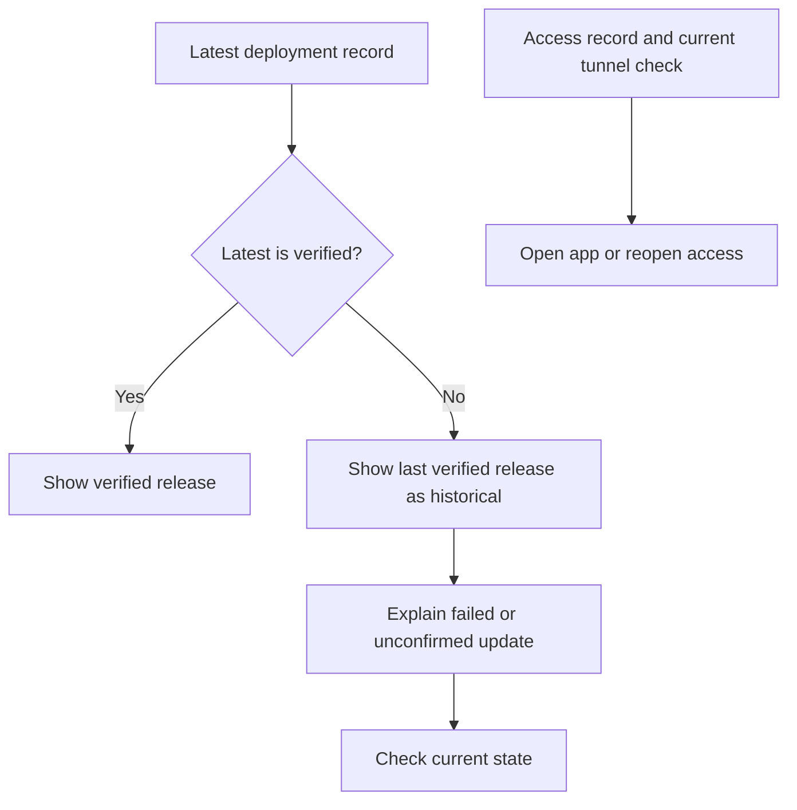

# Deployment release status

Deployment distinguishes the latest attempt from the last verified release. A failed update does not prove the previous containers are still running.

History shows meaningful events. Command output remains available for diagnosis. Navigation arrangements remain provisional pending owner selection.
