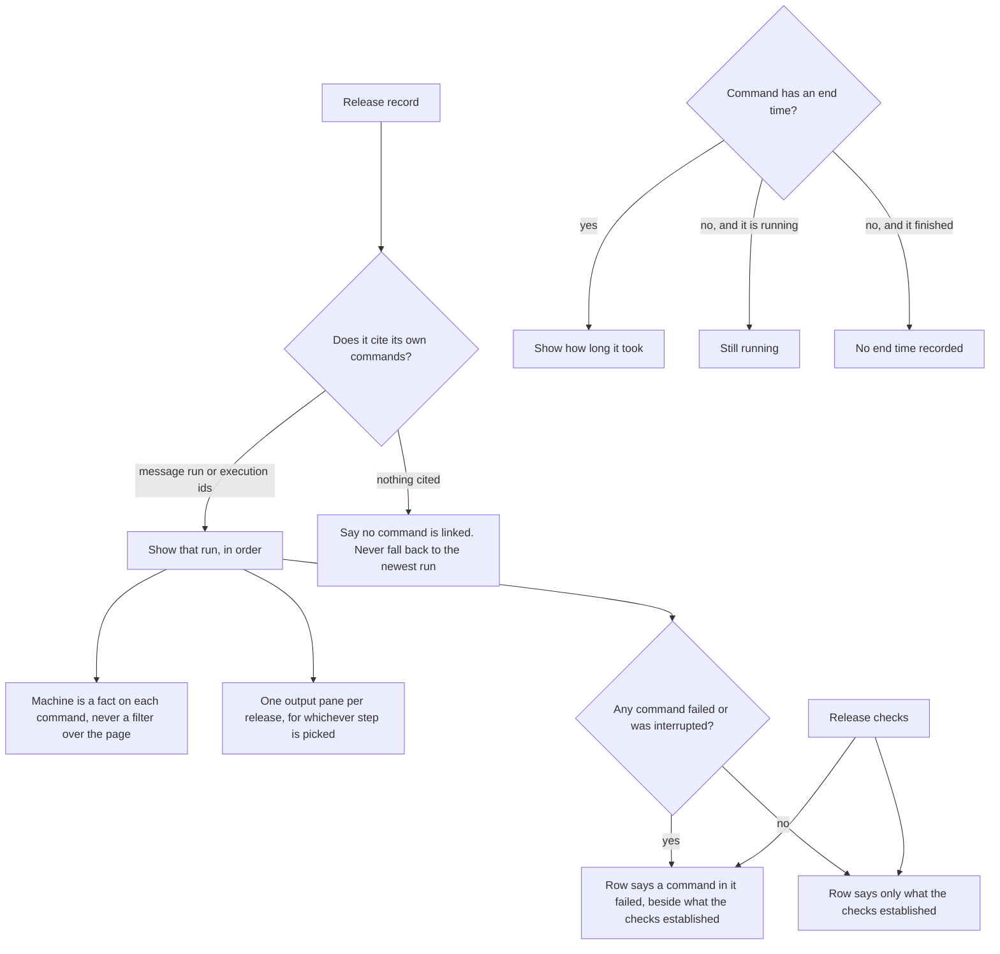

# Deployment: what a release is allowed to say

Deployment is one list of releases, newest first, with what is serving named
once above it. A release opens on its own facts and on the commands that
produced it. Two rules decide what may appear there.

A release's checks and the commands inside it answer different questions, and
the row carries both rather than letting either stand for the other. A missing
field is not a state: a command with no end time has no duration on record,
which is not the same as one that is still going.
