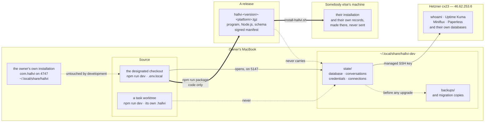

# Where the records live, and which of them travel

Four kinds of state, and only one of them ever leaves this machine. The thing
worth holding in mind is that a release carries **code**: it never carries
records, and it never fetches them. An installed user's records are made on
their own machine the first time they run Hallvi, and are only ever changed
there.

The dotted edges are the ones to remember.

**A task worktree does not reach the retained state.** It has no `.env.local`,
so it keeps a throwaway database beside its own source. Attaching every
checkout by default is how four live applications would acquire a second
writer nobody meant to start.

**A release carries no records.** `scripts/package.mjs` copies an explicit
list of paths; `.hallvi`, the state directory, backups, secrets and every
database are unreachable by it. An installed user's records are created by
their own first run and migrated in place on their own machine — publishing a
release migrates nobody.

**The owner's own installation is not this.** It is a normal installed Hallvi
on port 4747, with its own records under `~/.local/share/hallvi`, and
development never starts, stops or upgrades it.

Owned by [the development environment](../development-environment.md) and
[Installing Hallvi](../installation.md).
