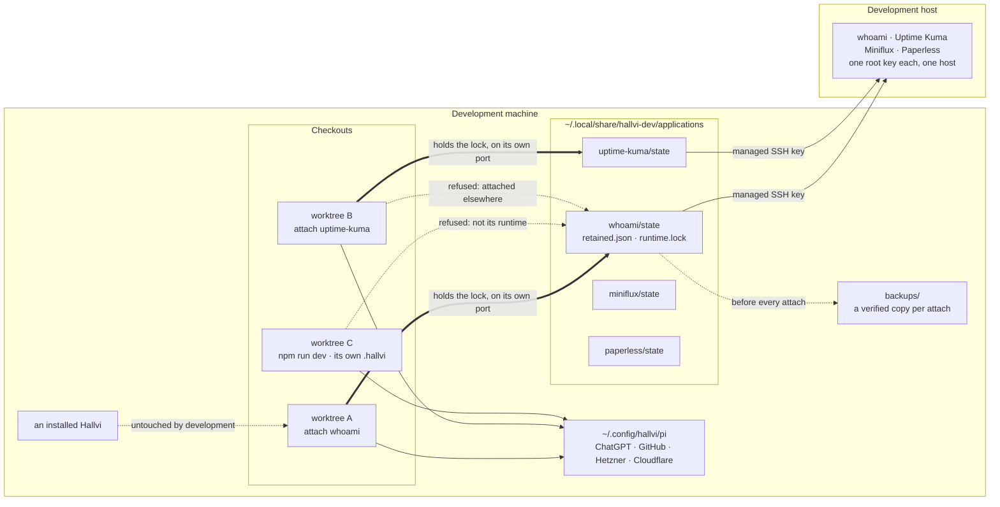

# Where the records live, and who may open them

Retained applications, one state directory each, outside every checkout.
A checkout that needs one attaches it and becomes its runtime for a while;
the directory never moves. The thing worth holding in mind is that a release
carries **code**: it never carries records, and it never fetches them. An
installed user's records are made on their own machine the first time they
run Hallvi, and are only ever changed there.

The dotted edges are the ones to remember.

**A marked directory is opened only by its runtime.** `attach` holds an
exclusive lock on the directory and starts the app and worker with its runtime
id; `db.ts`, the launcher, `db:push` and the migration all ask the same rule
before opening the database, so a second attach, a second `npm run dev`
pointed at the directory, or a script started by hand is refused — the
interface writes records too, so the worker's own lock was never enough.
A copy of the directory anywhere else is not protected: copies are for
looking and for trying things on.

**Ownership is a process, not a timestamp.** The operating system releases
the lock when the attaching process ends, however it ends; nothing expires.
A crash leaves `runtime.json` behind, and the next attach accounts for the
commands that were running before it starts.

**One host, several keys.** State ownership isolates Hallvi's records. When
every application's key is root on the same server, so work stays with the
application you hold and host-wide changes are said out loud.

**A release carries no records.** `scripts/package.mjs` copies an explicit
list of paths; the state directories, backups, secrets and every database are
unreachable by it.

Owned by [the development environment](../development-environment.md) and
[Installing Hallvi](../installation.md).
