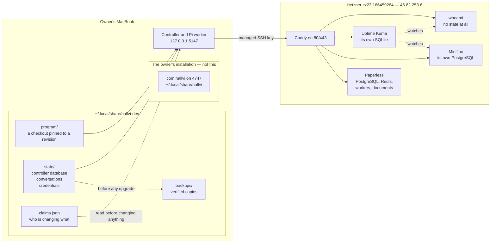

# The persistent development environment

Four stores, and who owns each. Losing any one of them loses something the
others cannot bring back: rows without conversations are records nobody can
read, and conversations without the applications' own data describe a host that
no longer holds what they describe.

The controller is an ordinary background process, not a service. The service
manager knows one Hallvi per user — launchd's `com.hallvi` — and that one is
the owner's installation; a second copy that started or stopped "its" service
would replace it.

Owned by [the development environment](../development-environment.md).
