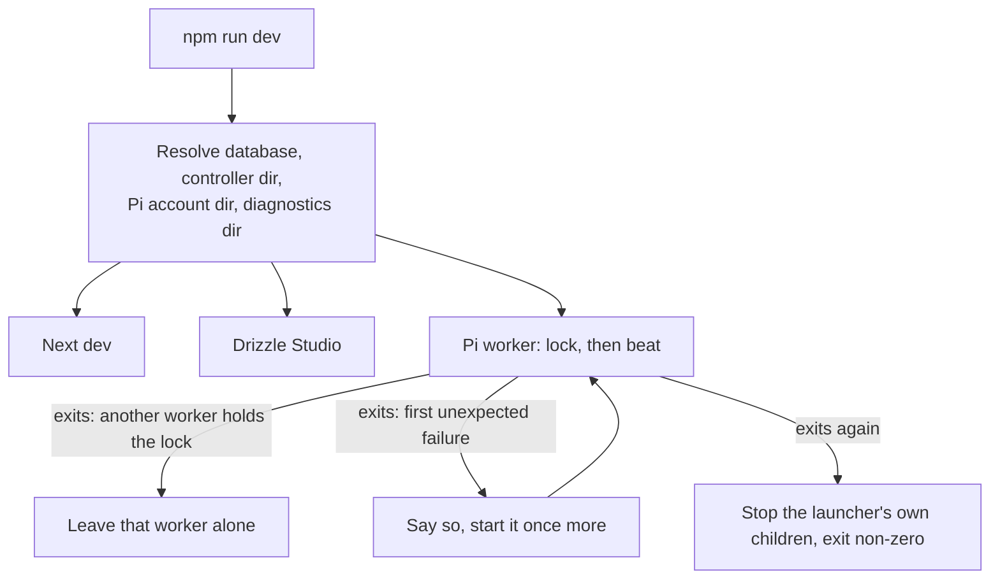
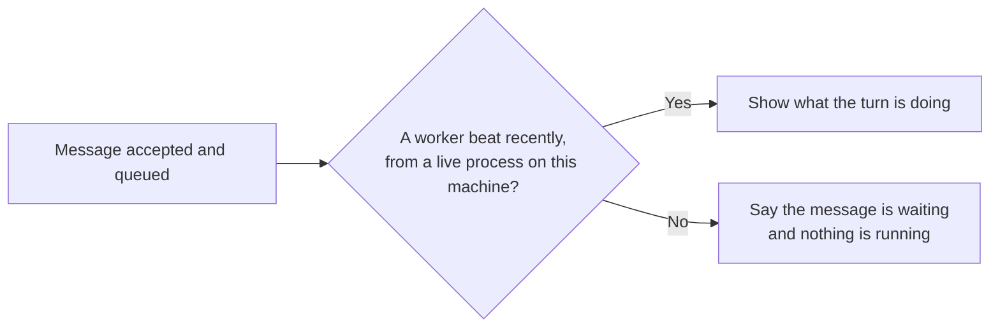

# One development command, and what happens when the worker stops

`npm run dev` resolves the database, controller directory, Pi account directory
and diagnostics directory once, then hands the same values to all three
children. The worker stays its own process: it holds an exclusive lock and
drains the model adapter before releasing it, which a thread inside the web
server could not do.

The product reads the beat, not the lock. The lock file exists after any worker
has ever run, so its presence proves nothing; the worker writes its process id,
its machine and the time beside it and refreshes that time while it runs. A
reader believes a live worker only when the machine is this one, the process
still exists, and the last beat is recent.

The [README's Run section](../../README.md#run) owns this decision; this page
is the picture of it.
