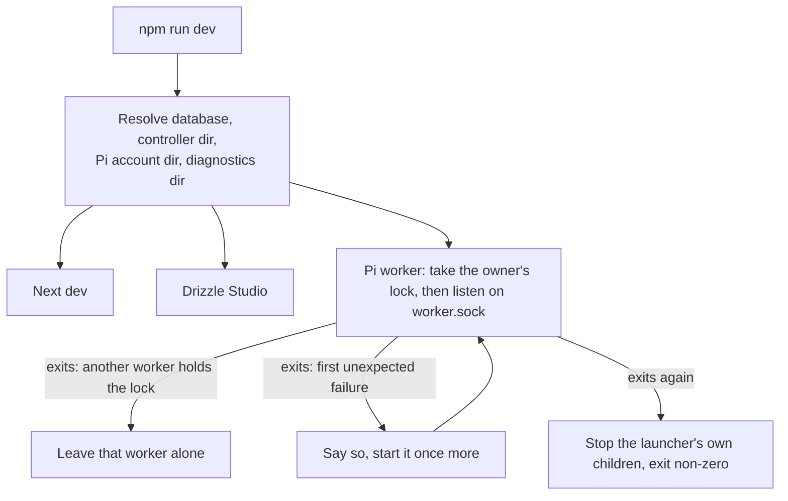
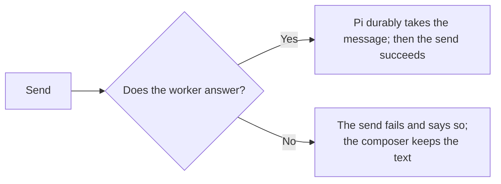

# One development command, and what happens when the worker stops

`npm run dev` resolves the database, controller directory, Pi account directory
and diagnostics directory once, then hands the same values to all three
children. The worker stays its own process: it alone owns Pi's sessions, and
the app reaches it over `worker.sock` beside the database.

Whether a worker is there is whether it answers. Which process may answer is
decided by a lock the operating system holds for it and releases when it ends;
the owner then replaces whatever socket path a dead worker left. A process
that does not get the lock changes nothing. There is no heartbeat.

The [README's Run section](../../README.md#run) owns this decision; this page
is the picture of it.
