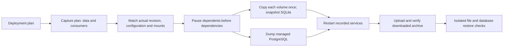

# Backups described by data and writers

New backup schedules use the recorded deployment plan rather than repository or image names. A **backup capture plan** identifies the persistent volumes, their consumers and access modes, the SQLite paths, managed PostgreSQL, and which application services must pause.

## Supported capture procedures

- Ordinary named file volumes: copy while all application services are stopped. Shared read-only and writable mounts refer to one captured volume.
- SQLite: use the declared in-volume database path and SQLite's backup API; verify integrity and table evidence on the resulting database. WAL sidecars are not copied as a second database state.
- Managed PostgreSQL: keep the database running for a custom-format dump, while application clients are paused. Restore checks use an isolated PostgreSQL container and table evidence.
- Another file-backed database: the plan must explicitly declare `capture: "quiesced-files"`, justified by its documented clean-shutdown persistence behavior. The generic verifier proves file equality only; it does not claim a semantic restore of that database.

Independent builds do not change the capture procedure. Network database clients are paused even when they mount no volume. Dependents stop before dependencies so a worker can finish while its broker remains available. Each stop gets 120 seconds; normal exit 0 or SIGTERM 143 is accepted, while a force-killed or unsuccessfully stopped writer prevents a successful capture. This does not promise draining every queued job or exactly-once processing.

Before pausing, the runner matches the installed Compose hash, deployment revision, running service identities, named mounts and access modes. It refuses undeclared mounts, foreign writable containers on captured volumes, and unsupported filesystem entries. The controller/host deployment lock coordinates Server Guy operations; it cannot prevent an unrelated host administrator from changing the application concurrently.

A durable journal records the containers before any stop. Normal completion and interruption recovery restart only recorded containers that are stopped, in reverse shutdown order so dependencies start first. A process-running observation is separate from application readiness. Upload follows source restart; interrupted runs retain their failed/interrupted outcome and cleanup obligations.

## What the UI evidence means

A downloaded archive hash is an off-host copy check. File inventory, SQLite checks and isolated PostgreSQL restore are recorded separately. Policies retain which kinds of data need verification, so a file-only check cannot earn PostgreSQL or SQLite restore credit. File-captured databases explicitly say they received file-hash checks only. The scheduled restore action still does not boot the whole application.

Legacy installed `sqlite-stack` and `postgres` policies and their old archives retain their existing paths. Their application-specific capture helper remains for compatibility; newly configured schedules no longer use its application-name admission rule. There is no silent conversion of historical receipts or automatic rewriting of an installed policy after a release changes its revision/configuration. Reconfigure the schedule for the new verified deployment.

## Concrete proof and remaining limits

The [Paperless acceptance](../testing/2026-09-10-generalized-protection.md) captures managed PostgreSQL, document/media files and a declared file-captured broker, restores them into an independent local stack, and processes another document. Operator tests separately exercise shared writers/readers, SQLite WAL data, mixed PostgreSQL/SQLite/file capture, file-only capture and interrupted cleanup.

This is a single-host named-volume capability. Arbitrary database engines, bind-mounted state, symlinks/special files, multi-host consistency, unattended full-application restoration and remote Paperless acceptance are not established by this change. A model selects a supported procedure from evidence; a declaration alone does not prove that an unfamiliar database can recover.
