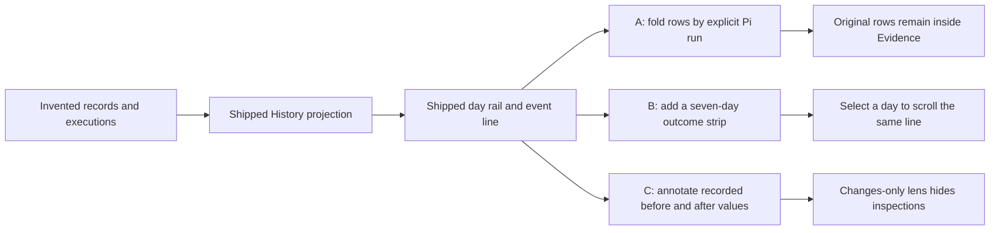

# History light variants

The prototype keeps the shipped Transit History as the frame. One invented,
in-memory timeline is projected into the same operations and rows, then each
variant adds one independently removable reading aid.

Decision boundary: a task exists only when a record names execution evidence
whose `runId` identifies that Pi run. Timestamp proximity never creates
attribution. The strip and change lens read the same projected facts; they do
not create new records or mutate application state.
