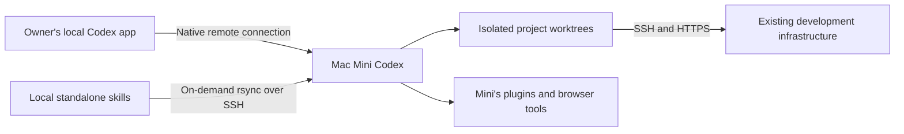

# Remote development host

Use native Codex remote connections to keep development compute on the Mac Mini.
The desktop app on the Mini is retained for desktop capabilities. SSH-only
execution remains available when a task needs only files, shell and coding tools.

No managed-cloud proxy, relay or application transport adapter is involved.
[Remote development](../development/mac-mini.md) owns setup and verified limits.
