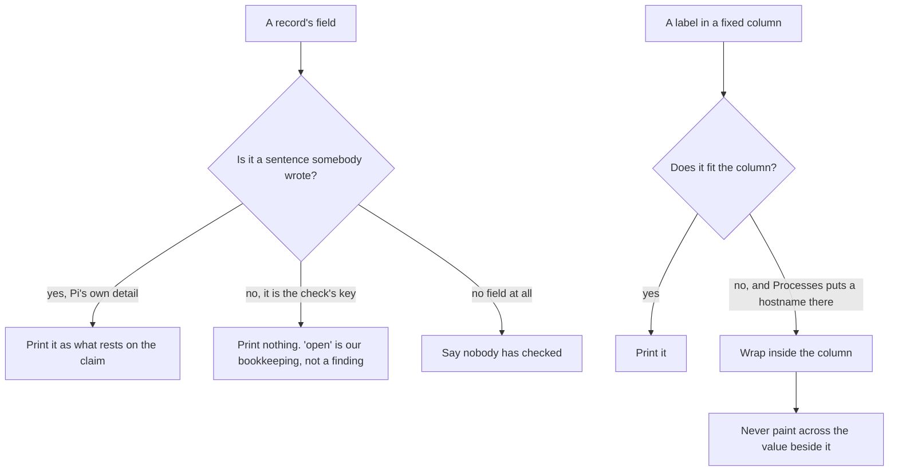

# What a page may print, and where it may print it

Two defects the integrated pass found, and the rule each one broke.

A check named `open` is the name of a check. Printing it under "What that
rests on" tells a reader what our records call the thing rather than what
anyone found out about their server, which is the same defect as "checked,
with no detail recorded" in fewer words.

A fixed label column is fine until a page puts a service name in it.
`Registry.example.com` is 125px wide in a 76px column, and with visible
overflow it painted straight across the value beside it.
