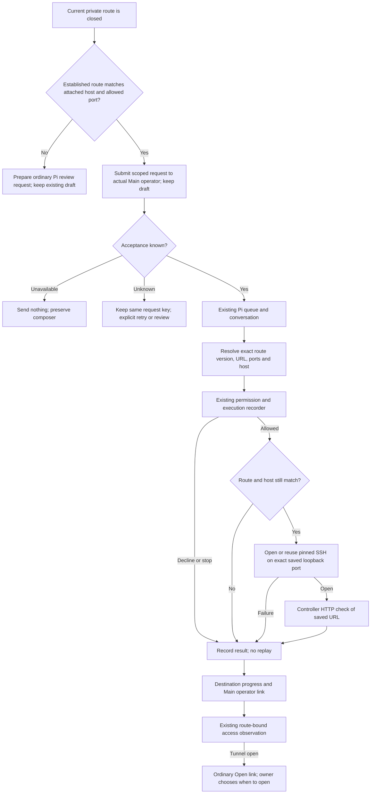

# Reconnect an established private route

[Operator design](../operator-design.md) owns the permission and private-access
contract. This action uses the existing Pi request, queue and execution evidence.

The tool's saved-route arguments are `accessRecordId` and `expectedUpdatedAt`,
mutually exclusive with explicit `remotePort`/`localPort` setup. Its approval
shows the resolved public host metadata, URL and ports. Private connection paths
stay inside the tool. Revalidation rejects changed credentials as well as a
changed address; an occupied local port fails rather than selecting another.

The HTTP status and check time describe what this controller observed, not
application health or remote-device usability. Missing responses do not authorize
repairs. Investigation, service restarts, exposure changes and publishing need
separate owner requests. Controller restart and a return from the owner's actual
remote device remain the next acceptance increment.
