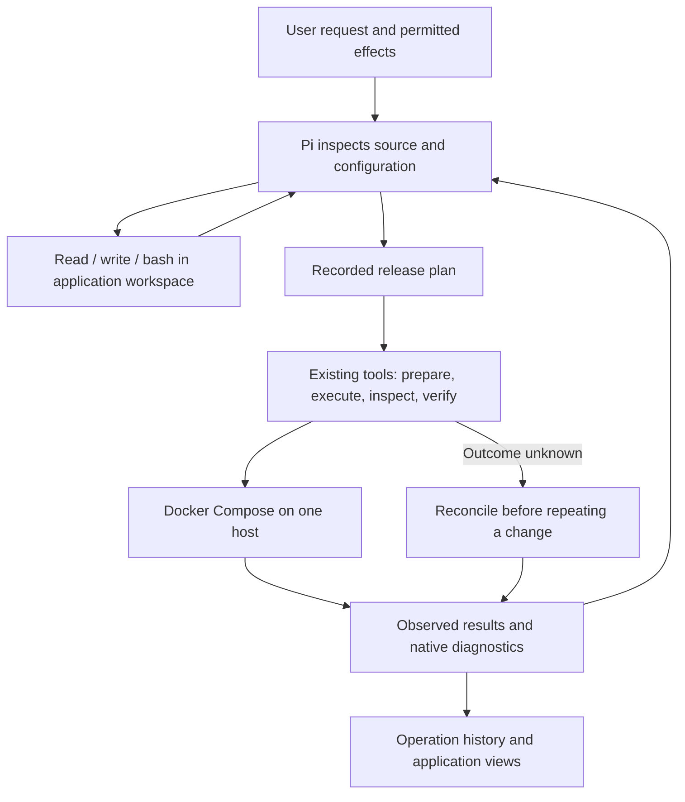

# Requirements-driven deployment with a small reusable core

10 September 2026. **Proposed design; not implemented.** Baseline: `ee396b2` on `origin/main`, including PRs #40 and #41. [Reviewed twice by Fable](requirements-driven-deployment-review.md); revised to address both reviews and the owner's general shell/file-tool direction. [Product](../../PRODUCT.md) owns supported scope; this document proposes the next implementation sequence, rather than claiming that scope is delivered.

## Decision in one sentence

Support applications through their declared requirements, with the smallest set of reusable capabilities that actually works.

A requirement describes what an application needs to run or be checked: an image or build, a process, a connection, a mount, an endpoint, or an observable outcome. A capability is something an existing tool can actually do with those requirements. Neither an application name nor a model's confidence establishes capability.

For example, a document application can require independently built API and worker services, a read-only shared input mount, a writable results mount, a PostgreSQL connection and an upload/process/download check. Pi determines those requirements from source, upstream configuration and the user's request. The same execution and inspection tools should handle another application with the same arrangement.

There is no separate requirements database, capability registry, workflow language or plugin runtime in this proposal. The release plan is the recorded configuration; source references and Pi's explanation describe why it was chosen. Existing operation records hold execution and observations.

The owner's central requirement is a toolbox of reusable primitives that the model combines. Prefer useful, observable actions such as inspect source, prepare a release, execute it, inspect a service, send a scoped request and inspect its result. Pi owns their order, choice and recovery. Do not introduce a fixed recipe for each application or encode Pi's reasoning in a new workflow language. Equally, do not split a coherent deployment mutation into tiny remote commands that lose its lock, authority, durable result or reconciliation boundary. A primitive should be the smallest action with an honest outcome and safe interruption semantics, not necessarily the smallest shell command.

**Further owner clarification: start from `bash`, `read` and `write`; those may provide most of the toolbox.** A specialized tool needs to earn its place through a concrete execution, credential or durability requirement. Do not wrap every command Pi can already run in a new product API. The preferred foundation is generic tools in an explicit execution environment, plus the few existing operations that own managed effects.

## Scope and success

The target remains one application's Docker Compose stack on one Linux host: multiple web/API services, workers, existing scheduled commands, PostgreSQL, SQLite, files and Redis/Valkey where needed. Public images and independent repository builds are separate intake capabilities. Reuse application libraries and existing schedulers. Running a supplied image does not imply supporting its database's backup or upgrade semantics.

This design does not add MySQL/MariaDB, Kafka/RabbitMQ, clusters, failover, arbitrary Compose compatibility, a marketplace, or a general migration engine. Those are either outside current Product scope or separate unimplemented capabilities. PostgreSQL support can remain a concrete engine integration; pretending all databases share a lifecycle would increase risk and complexity.

Scheduled commands remain an explicit Product target and implementation gap: recorded job metadata does not install a schedule. The first slices can run an application's existing in-container scheduler; installing host timers or introducing managed one-shot migration jobs is deferred. Pi's workspace shell must not bypass this gap by installing unrecorded host timers. Private registry authentication and non-HTTP public protocols are also separate gaps; current image intake supports public Docker Hub/GHCR references, not every registry.

Success means a materially different in-scope application can deploy, update and demonstrate meaningful behavior without adding its name, image prefix, service-name template or a dedicated execution branch to core production code. We also record what remains unsupported. Removing an allowlist alone is not success.

## What exists, and what still constrains us

| Area | Verified code at the baseline | Consequence |
| --- | --- | --- |
| Service model | [Plan schema](../../src/server/deployment-types.ts) has a special `app`, optional special `postgres`, up to five companions and mandatory primary HTTP fields. [Layout](../../src/server/deployment-layout.ts) handles independent builds and shared mounts. | Builds/storage are reusable, but topology and HTTP assumptions still constrain otherwise ordinary stacks. |
| Connections | [Bindings](../../src/server/compose-plan.ts) support private inputs and fields of one managed PostgreSQL connection. | Other private service endpoints are manually assembled. They are not evidence that other managed database engines are supported. |
| Verification | Primary checks are GET/POST/DELETE, relative paths, JSON bodies and 2xx expectations; a GET content assertion beyond the health route is mandatory. Companion checks have another smaller shape. | A worker-only stack or authenticated asynchronous upload flow cannot naturally establish its useful behavior. |
| Pi tools | [Pi session construction](../../src/server/pi.ts) disables built-in tools with `noTools: "all"` and selects custom tools by phase. A repository command preview exists in preparation. | Giving Pi general file/shell tools is an implementation change; the current model does not already have this general access. |
| Authority | [Release scope](../../src/server/release-scope.ts) binds host/source/revision and protects current mounts, PostgreSQL and primary exposure. Initial deployment retains priced-recommendation approval. | Corrected updates can stay authorized; multiple endpoint effects are not yet represented. |
| Backups | [Capture planning](../../src/server/backup-capture-plan.ts) derives data, consumers and supported capture procedures. New policies no longer gate by application name. | Deployment support and recovery support can differ; unknown consistency is not made safe by changing a label. |
| Evidence | [Backup facts](../../src/server/backup-evidence.ts), [plugin evidence](../../src/server/backup-plugin-evidence.ts) and UI still include Grafana-specific results. Pi's operation description and backup UI still list the old supported stacks. | Core presentation is overfit and some guidance is stale even after backend generalization. |

Application-specific test fixtures are useful. Legacy readers for already recorded policies/receipts may also be necessary. Keep those exceptions explicit and out of new-plan admission and new generic evidence.

## Responsibility boundary



Pi chooses topology, commands, input bindings, checks and corrective action. Tools enforce target identity, secret handling, permitted effects, data preservation and honest result recording. Native Compose/build/process errors go back to Pi. The UI reads those same observations; it does not invent a different success state.

Do not duplicate Compose's complete validator. Retain checks that make our own records executable and unambiguous (unique identities, valid references, required private inputs), prevent unapproved effects or protect data. Resource/time/output bounds remain operational safeguards, with documented reasons and actionable errors. Remove topology limits such as five companions unless an executor constraint actually justifies them; do not replace them with unlimited output or execution.

## 1. Make services uniform, preserve engine-specific behavior

Evolve the existing plan so all application processes use one `services` collection. A service has one image/build/image reference, command, environment/input references, mounts, optional readiness and initially at most one optional endpoint. Keep descriptive role in application facts, outside executable branching; `worker` must not introduce a separate deployment algorithm or force HTTP readiness. A worker without a usable check is running-but-unverified, not verified-by-role.

Illustrative shape, not a second specification or a committed API:

```typescript
plan = {
  services: [
    { name: "api", build: { context: "api", dockerfile: "Dockerfile" },
      volumes: [{ name: "documents", target: "/documents", readOnly: false }],
      endpoint: { port: 8000, exposure: "private" } },
    { name: "processor", build: { context: "worker", dockerfile: "Dockerfile" },
      volumes: [{ name: "documents", target: "/input", readOnly: true }],
      endpoint: null },
    { name: "frontend", image: "<resolved image>",
      endpoint: { port: 3000, exposure: "public" } }
  ],
  // Existing data/capture metadata and private-input storage remain in use.
  inputBindings: [
    { service: "processor", variable: "API_URL",
      endpoint: { service: "api" } }
  ]
}
```

Read-only access already renders a real `:ro` mount; preserve that behavior. Existing data/capture fields (omitted from the sketch), shared-volume identity and consumer declarations remain authoritative; do not redesign storage merely to make this sample prettier. Public exposure and internal address resolution are separate: a worker reaches the API over the private Compose network even if the API also has a public route.

Initially identify an endpoint by its service, with explicit exposure; defer multiple endpoints on one service until a concrete application needs them. No public endpoint should ultimately be mandatory. An application may have a preferred link for navigation; this does not make that service special to deployment. First permit zero or one public endpoint on any service. Multiple public services remain a subsequent in-scope capability requiring actual routing/port allocation, collision handling and firewall changes, not just an array field. Before even relocating the current single endpoint, compare the set of service identity, container/host ports, protocol, exposure and permitted source/routing consequences against authority. Preserve equivalent network behavior during normalization.

Keep the managed PostgreSQL provision/credential/dump implementation. Lower its existing configuration into the same service representation for execution and observation, while retaining explicit engine metadata for backup and upgrade checks. This is one built-in integration, not a generic database driver framework. Non-PostgreSQL services use ordinary service endpoints and private inputs; they gain no implied managed-database guarantees.

Avoid a generic connection-expression language. Add only endpoint references alongside existing private-input and PostgreSQL-field references. Pi can supply ordinary configuration values directly. Secrets stay as private references, never interpolated into model-visible records.

## 2. Give Pi general file/shell tools before inventing check APIs

Prefer `read`, `write` and `bash` for source inspection, packaging files, native configuration validation and application-specific test scripts. Pi can use available programs or authorized dependencies to send requests, upload a fixture, inspect a result and compute a digest. These are normal commands the model can compose, not separate mandatory product tools. A generated check script is an operation artifact with recorded inputs/output, not an automatically installed plugin or a permanent per-application branch in Server Guy.

The execution location matters more than the spelling of the tool:

| Environment | Access and purpose | Boundary |
| --- | --- | --- |
| Disposable application workspace | Selected source snapshot, writable packaging/check artifacts, shell and authorized dependencies | No controller home, credential store, unrelated workspace, host Docker socket or provider credentials. A working directory alone does not enforce this. |
| Verification environment | Approved application's endpoints and disposable fixtures; narrowly supplied credentials when a check needs them | Treat checks as potentially mutating. Establish allowed network destinations and data access before supplying credentials; redacted logs are not an exfiltration boundary. |
| Managed host changes | Existing release/backup/rollback operations | Keep their application lock, authority, durable execution identity and reconciliation. Do not hand a preparation shell a root SSH key as a shortcut. |

The first shell slice must select and demonstrate an OS/container isolation boundary, filesystem mounts, network access and cancellation behavior. Reuse the existing isolated repository runner if it meets these requirements. Do not claim arbitrary shell code is constrained by a prompt, command regex, `cwd`, or a tool named `safe_bash`. If a command needs access beyond the environment, extend the authorized environment deliberately or use an existing managed operation. Repository edits in the disposable copy cannot silently become an application-code deployment; the existing owner-merged PR boundary remains.

The existing runner is one-shot, re-materializes source and performs `uv sync` for each command, and is coupled to a Python preparation profile. Reuse its isolation, bounds, execution records and cleanup; profile/image decoupling and a workspace shared by successive file/shell calls are new work. In the first slice, keep a disposable workspace for one Pi run only. Record each execution using the existing run records with its source/artifact identity; filesystem edits must be visible to the next call. On cancellation or loss, terminate the owned processes, retain selected artifacts and records, and report the interruption. Cross-run sessions, detached background jobs and automatic command replay are not required.

**Verification networking is a separate prerequisite, not present runner capability.** Today's workload network is internal-only, and its install-time allowlist proxy is removed before commands run. It cannot reach a deployed application. Two concrete options exist: scoped runner egress reusing that proxy pattern, or a check container beside the application's Compose network launched through existing managed-host machinery. Prefer scoped runner egress for the first checks against reachable declared HTTP endpoints; private-only Compose targets remain unsupported until an explicit managed-host check path is implemented. Do not silently expose a private service to make a test reachable.

Before live checks receive any credential, their implementation slice must select and verify the path for the actual target: destination/port enforcement (including redirects and DNS changes), allowed credential use, output limits, cancellation and fixture cleanup. If scoped runner egress cannot enforce the required boundary simply, revise the choice to the managed-host check container; do not fall back to unrestricted network access or hand the script SSH/Docker credentials. The first workspace-only PR keeps the current internal-only network, supplies no verification credentials and makes no live-check claim. Neither Fable's code inspection nor this design proves those future networking properties.

Retain a small structured boundary for recording check criteria and runner-produced evidence. Shell exit status and stdout are observations, not a model-controlled success flag. Captured execution must be attached to the actual release/attempt and cannot be replaced with a fabricated result object. This is where a dedicated operation adds value; a bespoke `upload_document` or `query_grafana` tool does not.

End with one recorded criterion shape: intended outcome, target, scope of permitted fixture effects and the selected check artifact/execution reference. Primary HTTP checks and companion HTTP checks become legacy-reader inputs to that boundary, not two new-plan dialects alongside it. Scripts contain the concrete assertions; the generic record is not another program or interpreter. Preserve the legacy checks' historical meaning. The current schema's prescribed POST/capture/GET/DELETE sequence is exactly the kind of orchestration to return to Pi, while retaining its underlying fixture ownership and cleanup guarantees.

First remove the requirement for every application to prove itself with a primary HTTP GET. Separate container/process state, readiness, useful behavior, backup capture and restore verification. A missing useful-behavior check stays explicitly unverified; it must not silently weaken the current meaning of last verified runtime.

Use those general tools for the concrete missing actions: authenticated HTTP requests, a bounded fixture upload, downloading/hashing a result, and a later inspection of background progress. Allow a meaningful non-2xx expectation. Reuse current container readiness commands. Pi chooses and sequences calls in its existing run; do not add a JSON workflow DSL or embed another scripting interpreter in verification. Introduce a dedicated HTTP tool only if the actual runner cannot provide the needed credential/network boundary simply.

For the document example, Pi uploads a disposable fixture, observes a returned job/document identity, polls within an operation deadline, downloads the result and compares an expected digest or content. If processing fails, it reads logs and decides what to correct. It may not lower the acceptance criterion simply to declare success; changing the promised behavior is recorded and, when it changes the user's requirement, needs their decision.

Checks can write data. Fixture creation and cleanup must stay within the authorized application's task; use uniquely identified disposable data and record failed cleanup. A check is not made read-only by calling it verification. Auth comes from scoped private references. Requests target declared endpoints, do not follow redirects into undeclared destinations, and use bounded responses; do not create a general secret-bearing HTTP proxy. External service checks need an explicitly authorized target.

Persist criterion, target release/attempt, observed result, time and provenance through existing operation evidence. Start with a common check-result shape rendered as text/status plus expandable observations. No new database-wide evidence platform and no arbitrary HTML from a model. Old Grafana receipts retain their existing reader; new rich checks use the common shape. Specialized presentation may be extracted later when two real cases justify it.

## 3. Preserve authority and uncertainty during generalization

The generalized plan must not widen an existing permission. Compare effect-bearing endpoints and mounts against the authorized baseline. A correction to a build path is different from opening another public listener, removing a writer, changing a database engine/version or purchasing a host. Endpoint additions/exposure changes outside the approved task require a new decision; ordinary corrections inside it do not.

Continue to record immutable releases, separate attempts, exact running image observations and unknown remote outcomes. When a connection drops after execution starts, reconcile the recorded host outcome before repeating a change. Keep existing serialization and bounded attempts. This design does not add broad standing authorization or relax the initial spending approval as a side effect.

The UI should show deployed/running, readiness, useful behavior and protection separately when evidence differs. Today `lastVerified` also gates subsequent updates, which would trap a successfully started worker with no behavior check. Resolve that coupling before admitting worker-only/check-less plans:

- Record an observed runtime snapshot (release/attempt/host, exact images and deployed configuration identity) when execution/reconciliation establishes what is running. Derive it from existing host results and inspection; add the missing snapshot to lifecycle state, not a second deployment database. Behavior can be passed, failed or unverified independently.
- A new update scope can bind that observed snapshot even when behavior is failed/unverified. Preserve its current mounts, database and network effects. Revalidate that same observation under the existing application/host lock before execution. Unknown or mixed/unattributable runtime is not an eligible baseline; inspect/reconcile it first. This permits fixing a known broken release without calling it verified.
- Promote `lastVerified` only when runtime identity, applicable readiness and the recorded meaningful behavior criteria pass. No behavior criterion means no behavior verification. Missing evidence is not failure, and neither is success.
- Rollback targets still require historical verified images and the current compatibility assessment. A merely observed release is not a verified rollback target. Rolling back from an observed-but-broken current release may be authorized against its actual current configuration and data; a historical baseline must not conceal current effects.

These changes ship together with generalized verification and before the schema admits newly supported check-less/no-HTTP arrangements. The existing update/rollback/reconciliation paths must all use the same baseline rule; no partial migration that creates a deployed application the update path cannot service.

## Migration without two permanent executors

Start with a pure read-side projection from existing plans to uniform services: no schema change, version bump or historical rewrite. Route current consumers through it and prove equivalent behavior before allowing a new plan shape. Version the recorded plan only when its persisted shape actually changes. Read old plans through that compatibility conversion at the execution/projection boundary. Preserve original release bytes/identity and receipts; never rewrite history or recalculate old release hashes from normalized objects.

The conversion preserves `app`/`postgres` service names, Compose project names, image identities/tags, volume names/paths, secret references and endpoint exposure. New plans use the uniform representation. Execution, inspection, backup capture, release-scope comparison and UI projections share that representation rather than maintaining parallel legacy/new implementations.

Old backup schedules remain pinned to their recorded configuration and keep their existing readers; a later release still requires explicit schedule reconfiguration where required today. Old rollback targets retain their verified image mapping. Converting a plan must never restart containers, rename data, broaden access, or infer unrecorded verification. Test this conversion with real existing records and before/after rendered Compose, not only invented new-schema fixtures.

## Small delivery slices and stop conditions

1. **First PR: general workspace tools.** Give Pi `bash`/`read`/`write` in a disposable per-run workspace, reusing the current runner's isolation and execution recording and removing mandatory profile setup. Verify write→read→execute continuity, no controller/host credential access, unchanged internal-only networking, bounded output and cancellation. No live-check credentials, deployment schema change, runtime promotion change or persistent session framework. This directly tests the owner's toolbox hypothesis.
2. **Uniform read-side projection and truthful guidance.** Remove stale application-name support claims from Pi/UI; classify remaining name checks. Route existing execution/layout/capture consumers through one service projection with equivalent rendered Compose. No new persisted plan or authority semantics. This reduces duplication but does not claim broader app support. Guidance cleanup may ride with PR 1.
3. **Agent-directed behavior checks.** Implement and verify the explicit network path above; use general tools for the concrete HTTP/fixture/result sequence and common evidence rendering. Ship observed-versus-verified update/rollback baseline semantics with this change. Keep the existing operation/Pi loop. Private-only target access is an explicit capability checkpoint, not implied by HTTP egress.
4. **Uniform new plans and real endpoints.** Use the proven projection as the basis for a versioned service plan. Add zero/one public endpoint on any service, endpoint bindings and effect-aware authorization, with applicable checks supported by slice 3. Add multiple public services in the next bounded increment when routing/allocation is implemented. Schedules remain a recorded gap rather than an improvised host-shell side effect.
5. **Full product proof at each capability boundary.** Exercise an unseen in-scope application through actual Server Guy/Pi and the managed host, not only a direct Compose script. Select it by the missing requirements it exercises. If it needs a new core primitive, record that gap rather than adding its name. Final multi-endpoint proof waits for that capability; early slices do not claim it.

Each slice must reduce an identified restriction or special case. No plugin SDK, capability negotiation protocol, independent requirements object, or new orchestration layer is needed to begin. A proposed abstraction needs two concrete consumers or a present correctness requirement, and must remove more branching than it adds.

## Acceptance evidence

Use a compact matrix, not a combinatorial test suite:

- Existing SQLite and PostgreSQL stacks: old records still execute/project consistently; mounts and verified rollback images retain identity; backups/restores retain their existing guarantees.
- Independent frontend/API/worker builds and shared read/write mounts: meaningful work succeeds, read-only writes fail, a release preserves data, and multiple endpoints reach the intended service.
- A no-public-endpoint worker arrangement: no fake web service or fake successful HTTP check is needed. Its actual processing result supplies behavior evidence.
- A previously untested real application with authenticated asynchronous behavior: a fixture completes through Pi's tools, update preserves it, one known configuration failure is corrected within scope, and a lost reply triggers inspection before another mutation.
- Authority/evidence negative cases: new public exposure is not silently authorized; fixture cleanup failure remains visible; a started process or model narrative cannot promote a failed behavior check to verified.

Reuse existing Docker/operation tests and add only coverage for these new boundaries; delegate test authoring to Opus under the owner's standing preference. Local Docker remains useful but cannot substitute for the final remote/Pi proof. No implementation or test changes are part of this design-only task.

## Questions for Fable

1. Is one normalized service model the smallest useful change, or should we adopt more native Compose directly? Account for release identity, authority, backups and existing records rather than schema elegance alone.
2. Which proposed field or tool is unnecessary, and which concrete in-scope case still cannot be expressed?
3. Are we accidentally turning application knowledge, generic evidence, or managed PostgreSQL into another framework?
4. What would make migration, exposure comparison, useful-behavior promotion or unknown-outcome handling unsafe or dishonest?
5. What is the smallest first implementation PR, and what should explicitly wait?
6. Given the owner's preference for `bash`/`read`/`write`, which dedicated tools can disappear or be avoided? Which managed-effect boundaries must remain, and can the existing repository runner supply general tools without a new sandbox framework?
