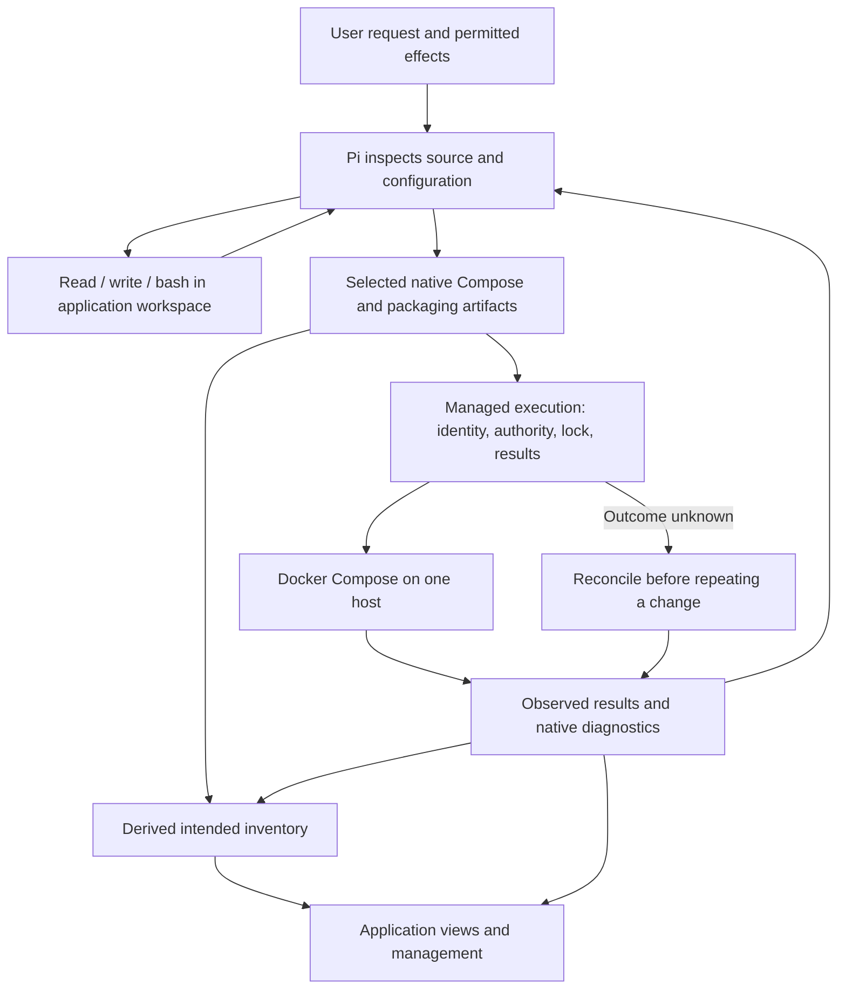

# Requirements-driven deployment with a small reusable core

10 September 2026. **Proposed design; not implemented.** Baseline: `ee396b2` on `origin/main`, including PRs #40 and #41. [Reviewed three times by Fable](requirements-driven-deployment-review.md). The third review approves the native-Pi/native-artifact direction and reverses the earlier custom-service-model recommendation. The review's concrete findings are incorporated below; these final edits have not had another review and are not implementation evidence. [Product](../../PRODUCT.md) owns supported scope; this document proposes the next implementation sequence, rather than claiming that scope is delivered.

## Decision in one sentence

Support applications through their declared requirements, with the smallest set of reusable capabilities that actually works.

A requirement describes what an application needs to run or be checked: an image or build, a process, a connection, a mount, an endpoint, or an observable outcome. A capability is something an existing tool can actually do with those requirements. Neither an application name nor a model's confidence establishes capability.

For example, a document application can require independently built API and worker services, a read-only shared input mount, a writable results mount, a PostgreSQL connection and an upload/process/download check. Pi determines those requirements from source, upstream configuration and the user's request. The same execution and inspection tools should handle another application with the same arrangement.

There is no separate requirements database, capability registry, workflow language or plugin runtime in this proposal. The proposed release retains the selected native deployment artifacts and their identity; source references and Pi's explanation describe why they were chosen. The current custom release plan remains a legacy input during migration. Existing operation records hold execution and observations.

The owner's central requirement is a toolbox of reusable primitives that the model combines. Prefer useful, observable actions such as inspect source, prepare a release, execute it, inspect a service, send a scoped request and inspect its result. Pi owns their order, choice and recovery. Do not introduce a fixed recipe for each application or encode Pi's reasoning in a new workflow language. Equally, do not split a coherent deployment mutation into tiny remote commands that lose its lock, authority, durable result or reconciliation boundary. A primitive should be the smallest action with an honest outcome and safe interruption semantics, not necessarily the smallest shell command.

**Further owner clarification: start from `bash`, `read` and `write`; those may provide most of the toolbox.** A specialized tool needs to earn its place through a concrete execution, credential or durability requirement. Do not wrap every command Pi can already run in a new product API. The preferred foundation is generic tools in an explicit execution environment, plus the few existing operations that own managed effects.

## Core architecture: native Pi plus application records

**Owner priority: HEAVILY lean on Pi and give it the tools to do the job.** Generalization should come primarily from Pi inspecting, reasoning, writing configuration and scripts, using native tools, learning from actual errors and choosing recovery. Do not constrain that problem-solving with prescribed service arrangements, application-name branches, fixed recipes, mandatory tool sequences or redundant validators. Prefer improving Pi's context, tool access and feedback over adding another orchestration layer. Available tools must represent real capabilities, not a narrow menu of preselected solutions.

Any restriction must justify itself with a concrete access boundary, user constraint, data guarantee or execution limitation. It must not exist merely because the original proof app or workflow needed it. Return native diagnostics to Pi and allow it to correct implementation details within the user's task without repeated approval. Enforcing whose resources may change and retaining what actually happened must not become an excuse to prescribe how Pi solves the application problem. The first workspace's restricted access is an incremental implementation boundary, not the desired permanent ceiling on Pi's powers.

**Pi does the reasoning and work. Server Guy gives it access to its native capabilities, the application's records and the authorized execution environment.** This owner clarification informed Fable's third review; the direction is reviewed, but the proposed capabilities are not claimed shipped.

Pi already implements `read`, `write`, `edit`, `bash`, `powershell`, `grep`, `find` and `ls`. Reuse those implementations; do not build Server Guy replacements or restrict general tools by legacy launch phases. The integration work is choosing where they execute and connecting their results to the current task. Skills or executable extensions are a separate access decision, not a reason to withhold the native tools.

Custom tools should primarily expose durable product records and the managed effects that need them:

| Need | Existing foundation and intended change |
| --- | --- |
| Record a decision | `propose_decision` already stages a requirement and saves it with the completed response. Reuse this record and source attribution; remove legacy naming/profile assumptions when broadening it. |
| Query decisions | `search_decisions` already lists/searches current decisions. Extend that interface only when a concrete query is missing. |
| Correct or override a decision | `propose_decision` already accepts `replaces`. Preserve the predecessor and return the new current decision; no parallel override mechanism is needed. |
| Remove a decision | Add an explicit removal operation so a withdrawn decision stops guiding Pi. Define retention separately: routine withdrawal should preserve why earlier actions happened; actual erasure must not silently reactivate a superseded predecessor or break references. |
| Read application state | Reuse `get_application_status`, operation history and release/inspection tools. Give Pi current records and their observation times, not another model-maintained copy of application state. |
| Record work and results | Reuse operation, attempt and observation records. Pi can record its choices and interpretation; a claim that a deployment or check succeeded must link to the execution's actual result. |

For example, the owner changes a budget. Pi queries the current decision, replaces it, reads the application's host and release state, inspects the repository with its native tools, and chooses the appropriate next action. If a tool returns a stale decision or invalid configuration, Pi reads the current information and corrects its action. There is no budget-change workflow or application-specific recipe in code.

Prompt Pi with the user's goal, current authority, relevant decisions and available capabilities. Let it choose commands, scripts, inspections and recovery steps. Keep custom tools small and direct: bind them to the current application, preserve record identity/history, protect private inputs, and return useful errors. Do not give the model arbitrary database writes or let a state-update tool turn an unsupported success claim into observed fact.

**Before adding a custom tool or orchestration layer, ask whether native Pi plus an existing record operation already solves the problem.** Add something only for a concrete missing capability, meaningful record operation or execution guarantee. Model intelligence should improve the product without a new hardcoded path for every application or failure.

## Scope and success

The target remains one application's Docker Compose stack on one Linux host: multiple web/API services, workers, existing scheduled commands, PostgreSQL, SQLite, files and Redis/Valkey where needed. Public images and independent repository builds are separate intake capabilities. Reuse application libraries and existing schedulers. Running a supplied image does not imply supporting its database's backup or upgrade semantics.

This design does not add MySQL/MariaDB, Kafka/RabbitMQ, clusters, failover, arbitrary Compose compatibility, a marketplace, or a general migration engine. Those are either outside current Product scope or separate unimplemented capabilities. PostgreSQL support can remain a concrete engine integration; pretending all databases share a lifecycle would increase risk and complexity.

Scheduled commands remain an explicit Product target and implementation gap: recorded job metadata does not install a schedule. The first slices can run an application's existing in-container scheduler; installing host timers or introducing managed one-shot migration jobs is deferred. Pi's workspace shell must not bypass this gap by installing unrecorded host timers. Private registry authentication and non-HTTP public protocols are also separate gaps; current image intake supports public Docker Hub/GHCR references, not every registry.

Success means a materially different in-scope application can deploy, update and demonstrate meaningful behavior without adding its name, image prefix, service-name template or a dedicated execution branch to core production code. We also record what remains unsupported. Removing an allowlist alone is not success.

## What exists, and what still constrains us

| Area | Verified code at the baseline | Consequence |
| --- | --- | --- |
| Service model | [Plan schema](../../src/server/deployment-types.ts) has a special `app`, optional special `postgres`, up to five companions and mandatory primary HTTP fields. [Layout](../../src/server/deployment-layout.ts) handles independent builds and shared mounts. | Builds/storage are reusable, but topology and HTTP assumptions still constrain otherwise ordinary stacks. |
| Connections | [Bindings](../../src/server/compose-plan.ts) support private inputs and fields of one managed PostgreSQL connection. | Other private service endpoints are manually assembled. They are not evidence that other managed database engines are supported. |
| Verification | Primary checks are GET/POST/DELETE, relative paths, JSON bodies and 2xx expectations; a GET content assertion beyond the health route is mandatory. Companion checks have another smaller shape. | A worker-only stack or authenticated asynchronous upload flow cannot naturally establish its useful behavior. |
| Pi tools | [Pi session construction](../../src/server/pi.ts) disables built-in tools with `noTools: "all"` and selects custom tools by phase. A repository command preview exists in preparation. | Giving Pi general file/shell tools is an implementation change; the current model does not already have this general access. |
| Authority | [Release scope](../../src/server/release-scope.ts) binds host/source/revision and protects current mounts, PostgreSQL and primary exposure. Initial deployment retains priced-recommendation approval. | Corrected updates can stay authorized; multiple endpoint effects are not yet represented. |
| Backups | [Capture planning](../../src/server/backup-capture-plan.ts) derives data, consumers and supported capture procedures. New policies no longer gate by application name. | Deployment support and recovery support can differ; unknown consistency is not made safe by changing a label. |
| Evidence | [Backup facts](../../src/server/backup-evidence.ts), [plugin evidence](../../src/server/backup-plugin-evidence.ts) and UI still include Grafana-specific results. Pi's operation description and backup UI still list the old supported stacks. | Core presentation is overfit and some guidance is stale even after backend generalization. |

Application-specific test fixtures are useful. Legacy readers for already recorded policies/receipts may also be necessary. Keep those exceptions explicit and out of new-plan admission and new generic evidence.

## Responsibility boundary

Native Compose/build/process errors go back to Pi. The UI reads the same recorded observations; it does not invent a different success state.

Do not duplicate Compose's complete validator. Retain checks that make our own records executable and unambiguous (unique identities, valid references, required private inputs), prevent unapproved effects or protect data. Resource/time/output bounds remain operational safeguards, with documented reasons and actionable errors. Remove topology limits such as five companions unless an executor constraint actually justifies them; do not replace them with unlimited output or execution.

## 1. Let Pi author native deployment artifacts; derive operational inventory

**Revised direction: prove native Compose plus small management records before designing another persisted service schema.** The earlier proposal made every process an entry in a custom `services` collection. That removed the special primary application but still required Pi to translate an application's configuration into our language before we translated it back into Compose. Native Pi tools make that extra language harder to justify.

A deployment artifact specifies what the runtime should execute. An operational inventory describes the resources Server Guy needs to identify, inspect and manage. They serve different purposes. A uniform service view can be useful without becoming the complete input language for deployment.

| Pi decides and prepares | Server Guy retains, derives or enforces |
| --- | --- |
| Compose services, builds, images, commands and dependencies | Application, host, release and attempt identities; the exact selected artifact bundle and resolved images |
| Native configuration and corrections following Compose/build errors | Permitted resource, network and data effects; target isolation and the existing execution lock |
| Which useful behavior to check and the script that checks it | Criterion, actual execution output, target identity, observation time and provenance |
| What persistent data needs protection and the proposed procedure | Explicit data identity, writers, consistency metadata and capture/restore evidence |

For example, an existing `compose.yaml` defines an API, two workers and shared files. Pi inspects it with its native tools, adjusts a build context or command where needed, and runs native validation. The managed operation applies the selected artifact bundle, then inspects the actual containers, images, networks and mounts. The API and workers keep their native configuration; no separate Server Guy service definition must reproduce every Compose field.

The smallest useful contract is attached to that execution, not a second executable topology:

- **Release artifact identity:** preserve the selected Compose files, packaging/configuration files, source/build identities and selected invocation inputs. Retain the canonical resolved configuration and resolver version as part of release identity; historical effect comparisons must use that retained snapshot rather than reinterpret old files with a newer resolver. Record private-input references and versions without copying secret values into model-visible artifacts. If resolution materializes private values, the executable snapshot needs protected storage and a redacted inspection view; a redacted view is not a substitute for the execution identity. A mutable image tag alone is not a reproducible release; retain the resolved image identities from preparation/execution.
- **Derived inventory:** obtain intended services, mounts and exposure from the retained resolved configuration; obtain actual containers, mounts, images and ports from runtime inspection. Label their source and observation time. Neither a parsed Compose file nor Pi's description proves what is running. Add only fields required by current inspection, authority, backup or UI consumers.
- **Additional operational records:** retain facts native configuration cannot establish, such as a SQLite file's location within persistent storage, network database writers, a consistency procedure, or a useful-behavior criterion. Reuse current protection and evidence records; do not create a generic metadata or plugin framework.

The native artifact is authoritative for desired configuration. Runtime inspection is authoritative for observed state. Pi's separately recorded interpretation does not overwrite either. The inventory is derived and is never round-tripped into a reduced Compose file that silently discards features. A field needed only for presentation must not become an admission requirement.

**Native configuration does not mean unrestricted host execution or universal Compose compatibility.** Use native validation for configuration correctness. Resolve the selected files, interpolation inputs and paths in a controlled execution context before comparing effects; apply that same selected configuration under the application lock. Do not validate one file and execute a changed file or inherit the controller's environment. Concrete host-affecting features such as bind mounts outside application-owned storage, host networking or privileged containers need an understood execution boundary and permitted effects. If the executor cannot establish those effects, return that specific capability gap to Pi before mutation. Do not silently drop the field, guess from its name, or turn every ordinary Compose option into a new approval.

Exposure comparisons must cover actual service identity, container/host ports, protocol, bind address and routing/firewall consequences. Current single-endpoint routing is an executor limit to implement or report, not a reason to invent a one-endpoint service language. Likewise, avoid a new five-service cap or mandatory HTTP endpoint. No-public-endpoint arrangements require the observed-versus-verified lifecycle changes in section 3 before production admission.

Keep managed PostgreSQL as a concrete credential/provision/dump integration. Explicitly associate it with the relevant native service and data identity; an image name alone cannot confer managed-database support. Preserve existing shared-volume identities, real read-only mounts and backup consumer information. Mount inspection identifies filesystem access but does not identify every writer to a network database, so protection metadata remains necessary.

**Decision still to prove:** whether the native artifact and derived facts can serve today's execution, update authority, inspection, backup and rollback consumers with less custom code. Fable's third review reverses his earlier preference for a normalized executable model: the guarantees require certain facts, not a custom input language. Prove the proposed replacement with one real application before committing to a new persisted format. Produce a consumer-fact ledger covering every current execution, authority, backup, rollback and UI dependency, with each fact sourced as derived, observed or explicitly recorded. Compare admission/renderer/validator code and special cases retired versus introduced; accept neither approach on prose alone. Unaccounted-for guarantees or a larger replacement framework stop the migration and require a simpler proposal.

## 2. Give Pi general file/shell tools before inventing check APIs

Prefer `read`, `write` and `bash` for source inspection, packaging files, native configuration validation and application-specific test scripts. Pi can use available programs or authorized dependencies to send requests, upload a fixture, inspect a result and compute a digest. These are normal commands the model can compose, not separate mandatory product tools. A generated check script is an operation artifact with recorded inputs/output, not an automatically installed plugin or a permanent per-application branch in Server Guy.

The execution location matters more than the spelling of the tool:

| Environment | Access and purpose | Boundary |
| --- | --- | --- |
| Disposable application workspace | Selected source snapshot, writable packaging/check artifacts, shell and authorized dependencies | No controller home, credential store, unrelated workspace, host Docker socket or provider credentials. A working directory alone does not enforce this. |
| Verification environment | Approved application's endpoints and disposable fixtures; narrowly supplied credentials when a check needs them | Treat checks as potentially mutating. Establish allowed network destinations and data access before supplying credentials; redacted logs are not an exfiltration boundary. |
| Managed host changes | Existing release/backup/rollback operations | Keep their application lock, authority, durable execution identity and reconciliation. Do not hand a preparation shell a root SSH key as a shortcut. |

The first shell slice must select and demonstrate an OS/container isolation boundary, filesystem mounts, network access and cancellation behavior. Reuse the existing isolated repository runner if it meets these requirements. Do not claim arbitrary shell code is constrained by a prompt, command regex, `cwd`, or a tool named `safe_bash`. If a command needs access beyond the environment, extend the authorized environment deliberately or use an existing managed operation. Repository edits in the disposable copy cannot silently become an application-code deployment; the existing owner-merged PR boundary remains.

The existing runner is one-shot, re-materializes source and performs `uv sync` for each command, and is coupled to a Python preparation profile. Reuse its isolation, bounds, execution records and cleanup; profile/image decoupling and a workspace shared by successive file/shell calls are new work. In the first slice, keep a disposable workspace for one Pi run only. Record each execution using the existing run records with its source/artifact identity; filesystem edits must be visible to the next call. On cancellation or loss, terminate the owned processes, retain selected artifacts and records, and report the interruption. Cross-run sessions, detached background jobs and automatic command replay are not required.

**Verification networking is a separate prerequisite, not present runner capability.** Today's workload network is internal-only, and its install-time allowlist proxy is removed before commands run. It cannot reach a deployed application. Two concrete options exist: scoped runner egress reusing that proxy pattern, or a check container beside the application's Compose network launched through existing managed-host machinery. Scoped runner egress can serve reachable declared HTTP endpoints. The target no-public-endpoint worker proof requires a managed-host check container or equivalent scoped host-side execution beside the private Compose network; that path is required for this case, not an optional fallback. Implement the path needed by the selected proof first, rather than making public HTTP a prerequisite again. Do not silently expose a private service to make a test reachable.

Before live checks receive any credential, their implementation slice must select and verify the path for the actual target: destination/port enforcement (including redirects and DNS changes), allowed credential use, output limits, cancellation and fixture cleanup. If scoped runner egress cannot enforce the required boundary simply, revise the choice to the managed-host check container; do not fall back to unrestricted network access or hand the script SSH/Docker credentials. The first workspace-only PR permits no external network access, supplies no verification credentials and makes no live-check claim. Neither Fable's code inspection nor this design proves those future networking properties.

Retain a small structured boundary for recording check criteria and runner-produced evidence. Shell exit status and stdout are observations, not a model-controlled success flag. Captured execution must be attached to the actual release/attempt and cannot be replaced with a fabricated result object. This is where a dedicated operation adds value; a bespoke `upload_document` or `query_grafana` tool does not.

End with one recorded criterion shape: intended outcome, target, scope of permitted fixture effects and the selected check artifact/execution reference. Primary HTTP checks and companion HTTP checks become legacy-reader inputs to that boundary, not two new-plan dialects alongside it. Scripts contain the concrete assertions; the generic record is not another program or interpreter. Preserve the legacy checks' historical meaning. The current schema's prescribed POST/capture/GET/DELETE sequence is exactly the kind of orchestration to return to Pi, while retaining its underlying fixture ownership and cleanup guarantees.

First remove the requirement for every application to prove itself with a primary HTTP GET. Separate container/process state, readiness, useful behavior, backup capture and restore verification. A missing useful-behavior check stays explicitly unverified; it must not silently weaken the current meaning of last verified runtime.

Use those general tools for the concrete missing actions: authenticated HTTP requests, a bounded fixture upload, downloading/hashing a result, and a later inspection of background progress. Allow a meaningful non-2xx expectation. Reuse current container readiness commands. Pi chooses and sequences calls in its existing run; do not add a JSON workflow DSL or embed another scripting interpreter in verification. Introduce a dedicated HTTP tool only if the actual runner cannot provide the needed credential/network boundary simply.

For the document example, Pi uploads a disposable fixture, observes a returned job/document identity, polls within an operation deadline, downloads the result and compares an expected digest or content. If processing fails, it reads logs and decides what to correct. It may not lower the acceptance criterion simply to declare success; changing the promised behavior is recorded and, when it changes the user's requirement, needs their decision.

Checks can write data. Fixture creation and cleanup must stay within the authorized application's task; use uniquely identified disposable data and record failed cleanup. A check is not made read-only by calling it verification. Auth comes from scoped private references. Requests target declared endpoints, do not follow redirects into undeclared destinations, and use bounded responses; do not create a general secret-bearing HTTP proxy. External service checks need an explicitly authorized target.

Persist criterion, target release/attempt, observed result, time and provenance through existing operation evidence. Start with a common check-result shape rendered as text/status plus expandable observations. No new database-wide evidence platform and no arbitrary HTML from a model. Old Grafana receipts retain their existing reader; new rich checks use the common shape. Specialized presentation may be extracted later when two real cases justify it.

## 3. Preserve authority and uncertainty during generalization

Applying a native artifact must not widen an existing permission. Compare effect-bearing endpoints and mounts against the authorized baseline. A correction to a build path is different from opening another public listener, removing a writer, changing a database engine/version or purchasing a host. Endpoint additions/exposure changes outside the approved task require a new decision; ordinary corrections inside it do not.

Continue to record immutable releases, separate attempts, exact running image observations and unknown remote outcomes. When a connection drops after execution starts, reconcile the recorded host outcome before repeating a change. Keep existing serialization and bounded attempts. This design does not add broad standing authorization or relax the initial spending approval as a side effect.

The UI should show deployed/running, readiness, useful behavior and protection separately when evidence differs. Today `lastVerified` also gates subsequent updates, which would trap a successfully started worker with no behavior check. Resolve that coupling before admitting worker-only/check-less plans:

- Record an observed runtime snapshot (release/attempt/host, exact images and deployed configuration identity) when execution/reconciliation establishes what is running. Derive it from existing host results and inspection; add the missing snapshot to lifecycle state, not a second deployment database. Behavior can be passed, failed or unverified independently.
- A new update scope can bind that observed snapshot even when behavior is failed/unverified. Preserve its current mounts, database and network effects. Revalidate that same observation under the existing application/host lock before execution. Unknown or mixed/unattributable runtime is not an eligible baseline; inspect/reconcile it first. This permits fixing a known broken release without calling it verified.
- Promote `lastVerified` only when runtime identity, applicable readiness and the recorded meaningful behavior criteria pass. No behavior criterion means no behavior verification. Missing evidence is not failure, and neither is success.
- Rollback targets still require historical verified images and the current compatibility assessment. A merely observed release is not a verified rollback target. Rolling back from an observed-but-broken current release may be authorized against its actual current configuration and data; a historical baseline must not conceal current effects.

These changes ship together with generalized verification and before the executor admits newly supported check-less/no-HTTP arrangements. The existing update/rollback/reconciliation paths must all use the same baseline rule; no partial migration that creates a deployed application the update path cannot service.

## Migration without two permanent executors

Do not commit to a new persisted service schema or a broad consumer rewrite before the native-artifact proof. Inventory the current consumers and identify exactly which facts they need. A read-side projection is useful where it removes duplicated access to current plans, but it is not a prerequisite to designing or accepting every native Compose field.

Keep existing release records, hashes and receipts unchanged. Their existing renderer can supply native Compose as a compatibility input to the managed execution path. Newly authored artifacts should reach that same path directly once the proof establishes identity, authority and recovery requirements. Version the release envelope only when its persisted representation actually changes; never recalculate historical release hashes from a derived inventory.

The compatibility path must preserve `app`/`postgres` service names, Compose project names, image identities/tags, volume names/paths, private-input references and exposure. Compare actual existing records and rendered configurations. Converting an input representation must not restart containers, rename data, broaden access or infer unrecorded verification.

Old backup schedules remain pinned to their recorded configuration and retain their readers; a later release still requires explicit schedule reconfiguration where required today. Old rollback targets retain their verified image mapping. Route consumers through the shared derived facts incrementally where demonstrated useful, keeping extra protection metadata explicit. Avoid parallel permanent legacy/native orchestration; retain only the compatibility readers/renderers required by historical records. Once the managed native path covers the supported intake, close new-application intake through the legacy custom plan rather than keeping two permanent authoring formats.

Classify the existing descriptive `RecordedStack` during this migration: its service/process/volume facts are replaced by the derived inventory for new observations, not maintained as another independent topology. Job and queue descriptions remain explicit operational records or attributed Pi interpretation where they add facts that native configuration/inspection cannot provide. Preserve historical readers; do not let a stale descriptive snapshot override current observations.

Implementation evidence for the first slice and initial comparison is recorded in [native Pi workspace checks](../testing/2026-09-10-pi-native-workspace.md) and the [consumer-fact ledger](native-compose-consumer-facts.md). The production executor still accepts the legacy plan; those checks do not claim the later native-artifact path is implemented.

## Small delivery slices and stop conditions

1. **General workspace tools.** Register native tools through a common task-wide path in both conversation and deployment-planning sessions, independent of legacy phase menus. They must not land as one more phase-only option. Use a disposable per-run workspace, reusing existing isolation and recording where applicable and removing mandatory profile setup. Verify write/read/execute continuity, no controller/host credential access, no external network in this first slice, bounded output and cancellation. No deployment schema, runtime promotion or persistent-session framework changes. This work remains useful under either artifact design.
2. **Native Compose design proof, before a schema migration.** Start with one real recorded application and its native Compose. Pi adapts it in the workspace. Produce the consumer-fact ledger above and compare the resolved native configuration with the current legacy renderer's output for the same application. Pin the resolver used for this comparison. This first proof makes no host, executor, schema or persistence changes; native Compose validation must have an actual execution path, not a model-predicted result. Record unavailable capabilities explicitly. Use the comparison to design the smallest managed-execution change, then test deploy/update/protection/rollback when that path exists. Evaluate facts preserved and custom code retired versus added; do not call a file comparison a deployment proof or add a second service language to force agreement. Stale application-name guidance can be corrected independently.
3. **Agent-directed behavior checks and truthful baselines.** Implement and verify the explicit network path above; use general tools for checks and common evidence rendering. Ship observed-versus-verified update/rollback baseline semantics together. Keep the existing operation/Pi loop. Provide the managed-host check path for the no-public-endpoint worker target; public HTTP egress alone cannot satisfy that acceptance case. This precedes production admission of check-less/no-HTTP applications; the design proof must expose rather than work around that dependency.
4. **Managed native-artifact execution.** Based on the proof, retain the exact artifact bundle in a versioned release envelope and enforce its permitted effects under the existing lock. Feed old records through the compatibility renderer and new artifacts directly into the same execution/inspection path. Add routing or other missing capabilities when required by the selected application; do not confuse accepting YAML with implementing those effects. Schedules and unsupported registry/protocol features remain explicit gaps until implemented.
5. **Full product proof at each capability boundary.** Exercise the selected real application through Server Guy/Pi on the managed host: useful behavior, an update preserving data, correction of a configuration error within scope, capture/restore evidence, compatible rollback and reconciliation after a lost reply. Then try a materially different in-scope arrangement without adding its name or changing a custom topology schema. Early workspace/prototype slices do not claim this result.

Each slice must reduce an identified restriction or special case. No plugin SDK, capability negotiation protocol, independent requirements object or new orchestration layer is needed to begin. A proposed abstraction needs two concrete consumers or a present correctness requirement, and must remove more branching than it adds.

## Acceptance evidence

Use a compact matrix, not a combinatorial test suite:

- Existing SQLite and PostgreSQL stacks: old records still execute/project consistently; mounts and verified rollback images retain identity; backups/restores retain their existing guarantees.
- Independent frontend/API/worker builds and shared read/write mounts: meaningful work succeeds, read-only writes fail, a release preserves data, and multiple endpoints reach the intended service.
- A no-public-endpoint worker arrangement: no fake web service or fake successful HTTP check is needed. This proof depends on the managed-host check path in slice 3; public HTTP egress alone is insufficient. Its actual processing result supplies behavior evidence.
- A previously untested real application with authenticated asynchronous behavior: a fixture completes through Pi's tools, update preserves it, one known configuration failure is corrected within scope, and a lost reply triggers inspection before another mutation.
- Authority/evidence negative cases: new public exposure is not silently authorized; fixture cleanup failure remains visible; a started process or model narrative cannot promote a failed behavior check to verified.

Reuse existing Docker/operation tests and add only coverage for these new boundaries. Handle tests locally; delegate to Opus only when the owner explicitly requests it. Local Docker remains useful but cannot substitute for the final remote/Pi proof. No implementation or test changes are part of this design-only task.

**Implementation status (10 September 2026):** releases now execute Pi-selected native Compose through the managed path, with observed-versus-verified baselines; initial intake remains the legacy plan and the private check path is not built. Evidence and limits: [execution plan](../plans/native-compose-execution.md).

## Review questions (addressed in Fable review 3; retain for the proof)

1. Revisit the earlier recommendation to retain a normalized executable service model: can native Compose artifacts, derived inventory and the existing protection records preserve the same guarantees with less code? Identify a concrete missing fact or execution guarantee rather than assuming a complete custom schema is necessary.
2. For the selected real Compose application, exactly which additional facts do execution, scope comparison, backup, rollback and UI need? Which can be derived, which must be recorded, and which proposed field or tool is unnecessary?
3. Are we accidentally turning application knowledge, generic evidence, or managed PostgreSQL into another framework?
4. What would make migration, exposure comparison, useful-behavior promotion or unknown-outcome handling unsafe or dishonest?
5. What is the smallest first implementation PR, and what should explicitly wait?
6. Given the owner's preference for `bash`/`read`/`write`, which dedicated tools can disappear or be avoided? Which managed-effect boundaries must remain, and can the existing repository runner supply general tools without a new sandbox framework?
