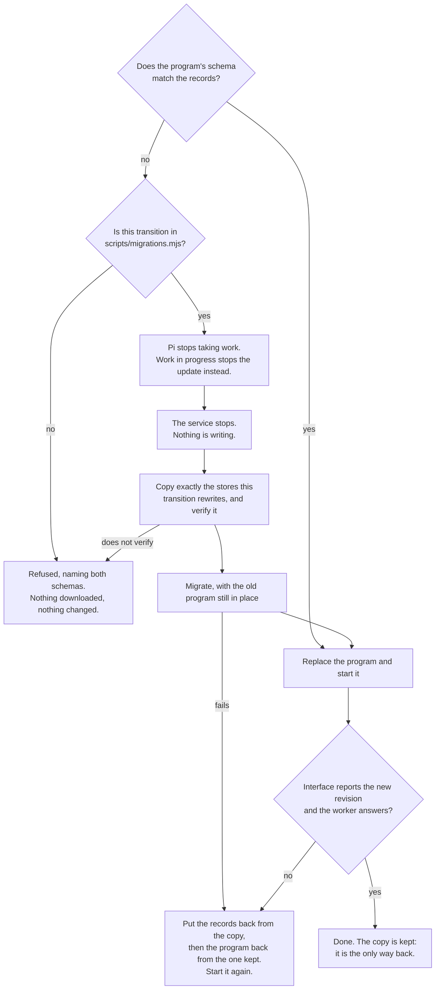

# Upgrading records, and getting them back

Two ways of upgrading, one list of migrations, and one order of operations.
The order is the safety: everything that can refuse does so while the old
program is still in place and still serving.

The last edge is the one worth stating on its own. **Restoring the old program
is not a rollback once its database has been migrated under it**: it would meet
a schema it does not know and refuse to open it, correctly. So the records go
back first, from a copy made before anything was touched, and the recovery is a
file copy that needs no program to be intact.

A transition declares which stores it rewrites, and only those are copied.
Nothing so far touches Pi's conversation histories, recorded evidence, sealed
credentials or the deployed applications' own data — an unchanged file needs no
rollback, and copying credentials nothing is going to write would only be a
second place for them to leak from.

Owned by [Installing Hallvi](../installation.md#update); the list itself is
[scripts/migrations.mjs](../../scripts/migrations.mjs).
