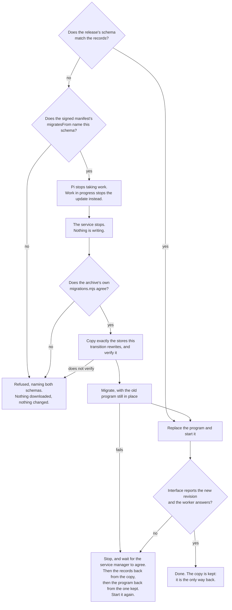

# Upgrading records, and getting them back

Two ways of upgrading, one list of migrations, and one order of operations.
The order is the safety: everything that can refuse does so while the old
program is still in place and still serving.

Two edges are worth stating on their own.

**The question is asked of the release, not of the program reading it.** A
migration from one schema to the next is written in the version that
introduces the new schema, so the installation deciding whether to download it
is by definition too old to know the migration exists. The claim is signed
with the rest of the manifest and checked again, from the unpacked archive's
own list, once it is on the machine.

**Restoring the old program is not a rollback once its database has been
migrated under it**: it would meet
a schema it does not know and refuse to open it, correctly. So the service is stopped
and confirmed gone first — a start that failed can leave one loaded and being
retried — then the records go back from a copy made before anything was
touched, and then the program. The recovery is a file copy that needs no
program to be intact.

A transition declares which stores it rewrites, and only those are copied.
Nothing so far touches Pi's conversation histories, recorded evidence, sealed
credentials or the deployed applications' own data — an unchanged file needs no
rollback, and copying credentials nothing is going to write would only be a
second place for them to leak from.

Owned by [Installing Hallvi](../installation.md#update); the list itself is
[scripts/migrations.mjs](../../scripts/migrations.mjs).
