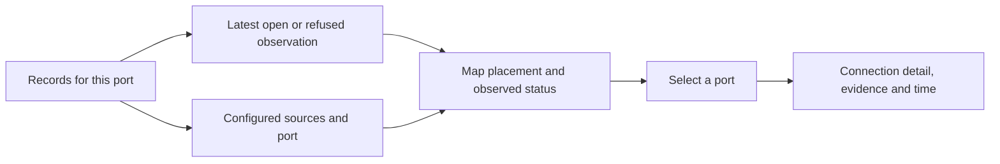

# Security: access map and selected connection

The selected Security design pairs an access map with detail for one port.
Configured access and an observed connection remain distinct. A successful
public website is not itself an incident; an unchecked port remains unknown.

No named ports means no empty map. Refused connections sit outside the rings;
unexamined ports have a separate neutral list. The provider firewall is shown
separately, rather than used as proof about every individual port.

The selected prototype remains on `prototype/security-round-two`. This change
uses application records on the real Security route and leaves Domains alone.
