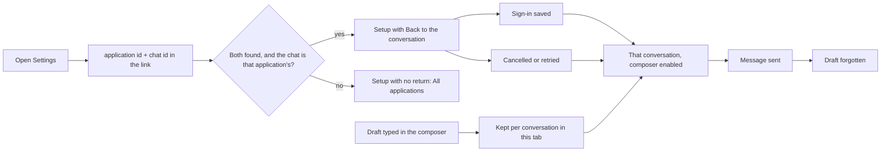

# Leaving a conversation to connect, and coming back to it

The composer says "Connect ChatGPT to chat" and points at Settings. Until
this change it pointed nowhere in particular: the whole composer was dead, so
the question could not even be written down, and setup ended on the
applications list with no idea which application the reader had come from.

Two things stay out of the link. The **draft** never travels: it is held in
this browser under the conversation it belongs to, and dropped the moment the
message is sent. The **destination** is never a URL: the link carries two
record ids, both looked up on the server, with the chat required to belong to
the application — so nothing typed into that query string can send a reader
off this controller.

Writing and sending are now separate. A reader can put their question into
words before the connection exists; only Send waits. If the connection is made
in another tab, the composer enables when this one is looked at again, without
a reload.
