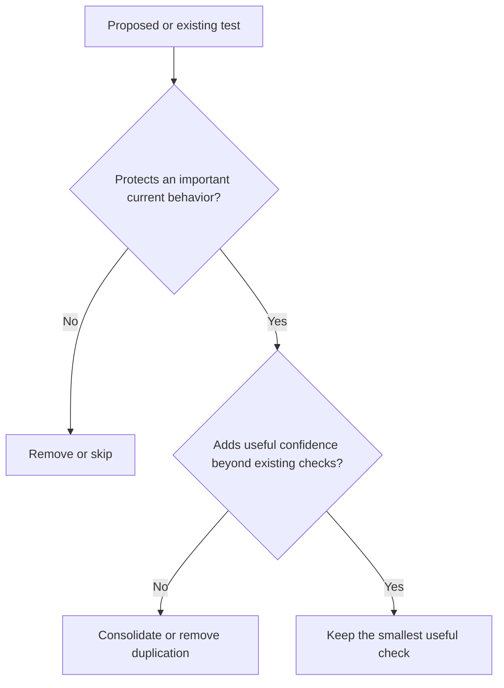

# Select tests by the behavior they protect

Use the [testing guideline](../../tests/README.md#the-8020-bar). An uncertain
judgment about the only coverage of an important behavior deserves one concrete
owner question, not a new testing framework.
