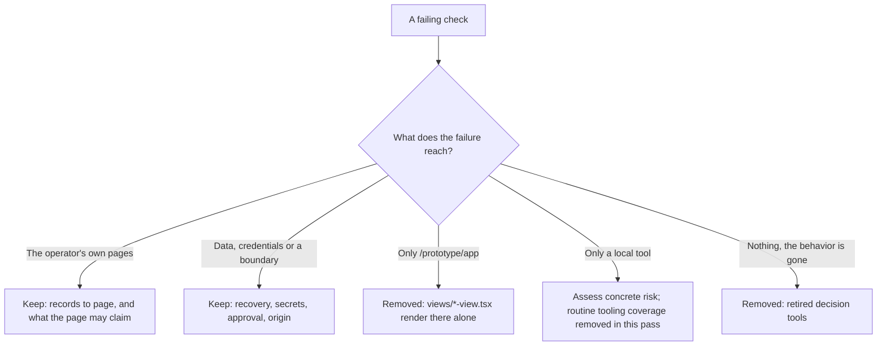

# Where a check belongs, and where it does not

The 80/20 pass asked one question of every suite: which surface does this
failure reach? This pass removes coverage of reference-only layouts, retired
behavior and local tooling outside current product acceptance. That is a scope
choice, not a claim that local tools cannot cause consequential failures.

A real application's destination is a `*-page.tsx` reading records, so its
coverage is the projection behind it and the claims it is allowed to make. The
`views/*-view.tsx` layouts are the reference shell's, and a wrong word there is
a wrong word in a design sample. See the
[testing guideline](../../tests/README.md#the-8020-bar) and
[test selection](test-selection.md).
