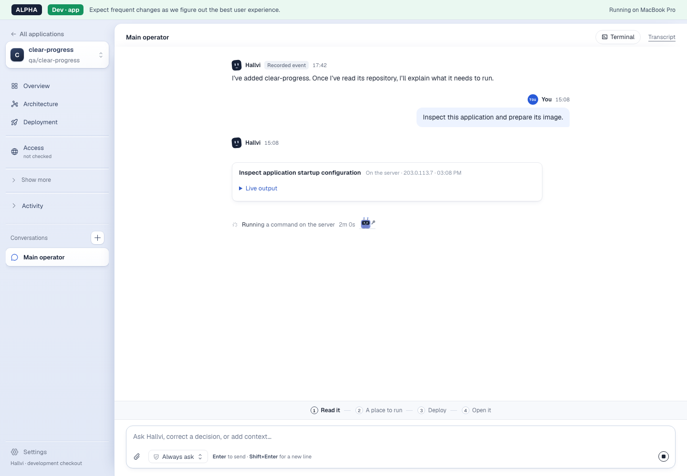
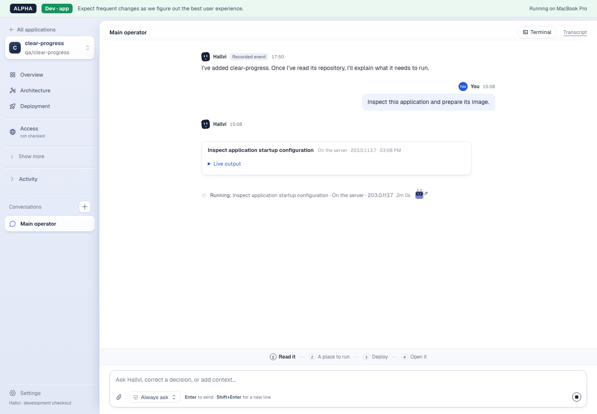
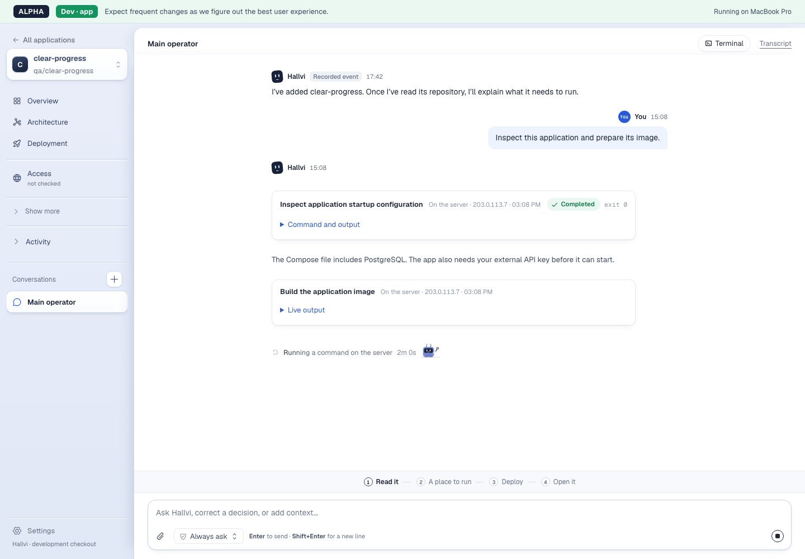
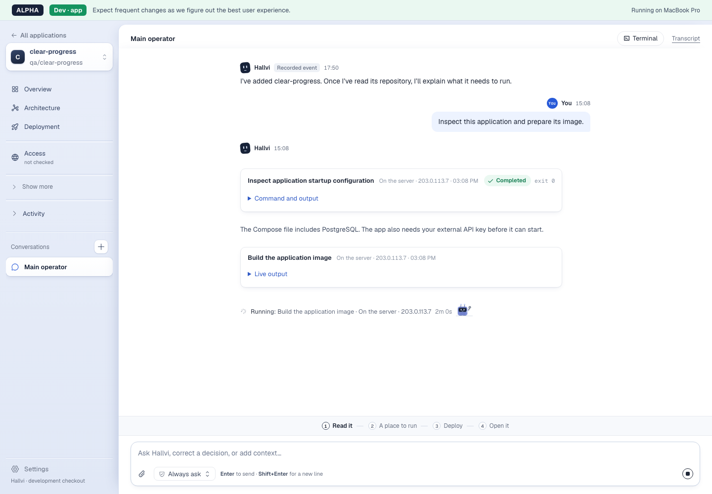
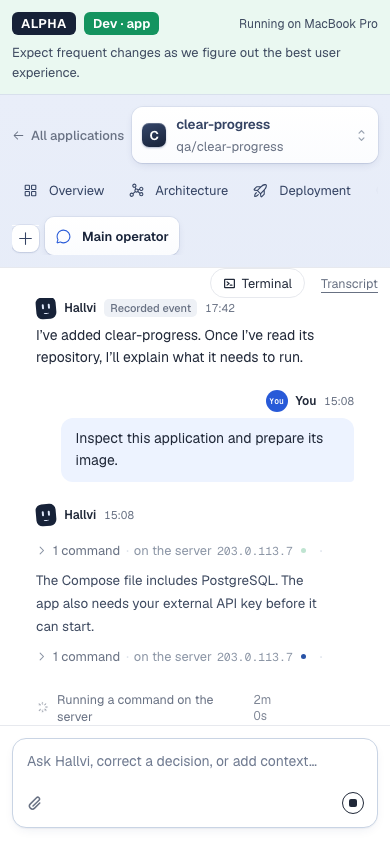
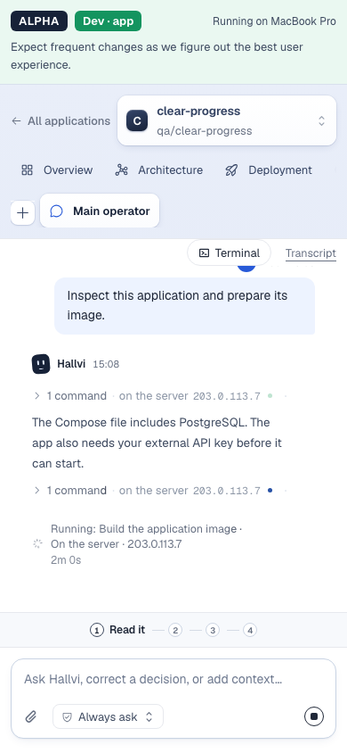
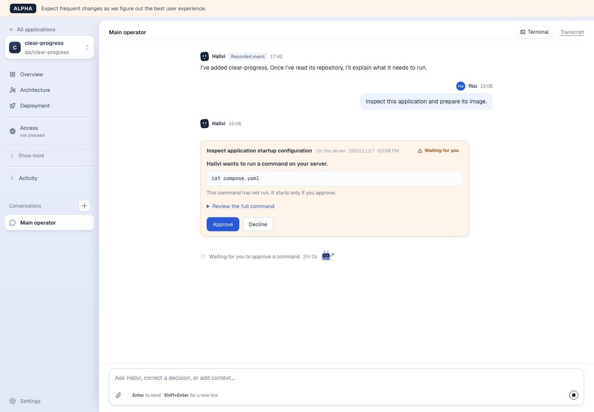
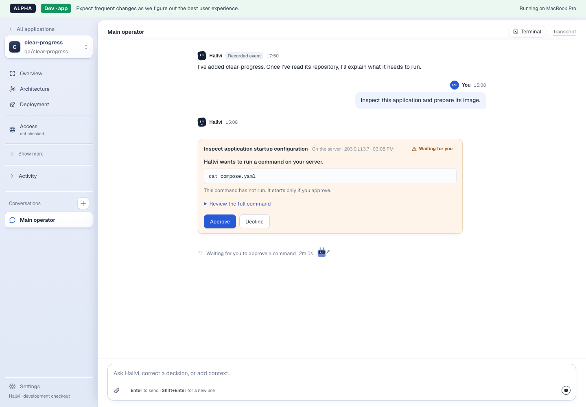
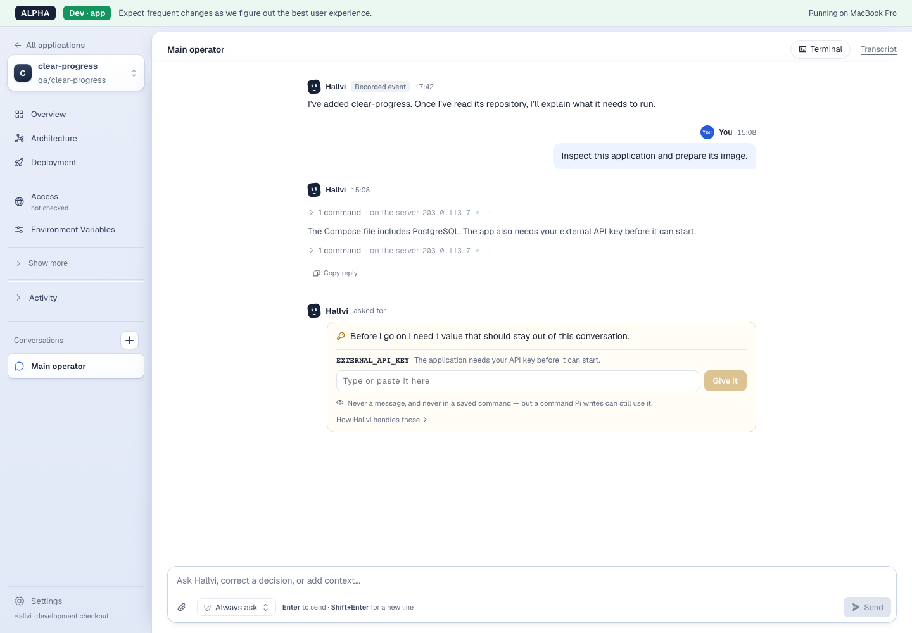
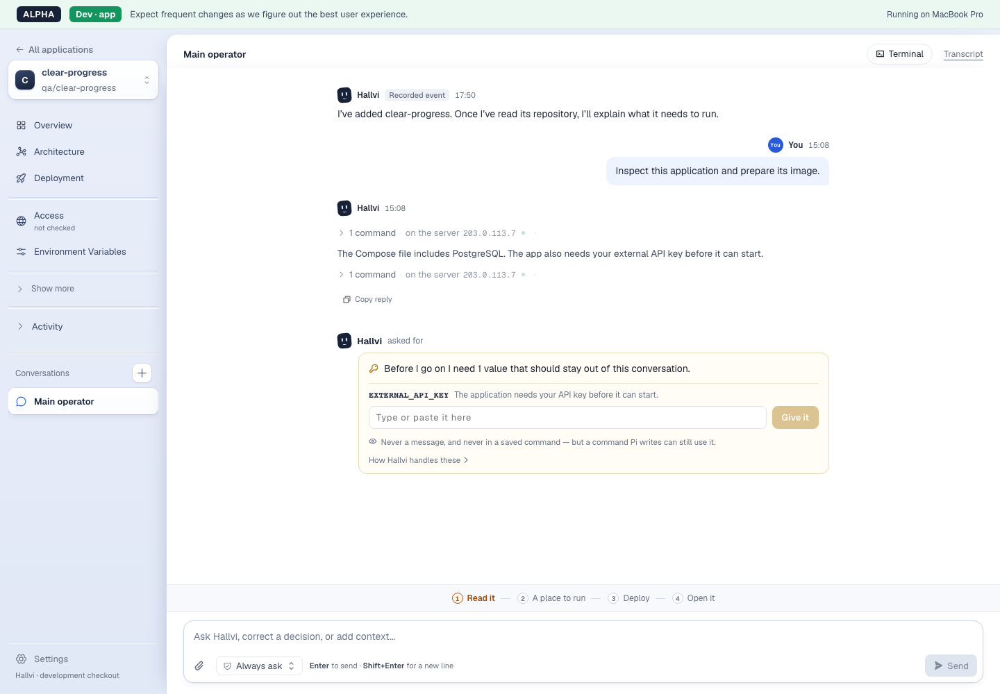

# Clear progress: increment 1 review

The running line now uses the active reply's recorded command intent and host.
Pi's guidance asks for useful evidenced findings before lengthy work. Approval
and private-input cards keep their existing behavior.

## Revisions and capture method

- Baseline product: `a81b6953ed3d3929393382662640e56a1ca5cd7c` (includes #252).
- Original tested candidate: `59b01a1d7e615c9d2d036c9df5e0c451a9855406`. Captured
  from the working tree that became this commit; `49fac0db` added the original
  review artifacts.
- Later integration merged main `bb4819701b4fe52ce17016e2f0974a5dfb7ea87b` into
  code revision `cef37a04f9ad53a30d6337750cd8baf15b829e9f`, preserving #253's
  feature/feedback separation and #250's development Transcript-link removal.
  These historical captures predate that unrelated shell change; the final shell
  is not pixel-identical. No additional real-Pi trial was performed.
- Chromium, Node 22.23.2; desktop 1440 × 1000 and narrow 390 × 844. Both use the
  same synthetic application, commands, finding, target, Always ask permission
  mode and fixed elapsed clock. Incidental greeting times and loading of the
  development badge differ. Narrow captures scroll the work line into view and
  assert it is above the composer. The baseline's split timer is genuine.
- The fixture scripts approvals and tool results. Each command goes from
  awaiting approval to running to succeeded. The finding follows the first
  result and precedes a separate approval/build, then a private-input request.
  This establishes rendering and transitions, not actual approval execution,
  a deployment, model judgment, or faster findings.

## Matched captures

| State | Baseline | Candidate |
| --- | --- | --- |
| Current action and target |  |  |
| Useful finding between commands |  |  |
| Finding after refresh, narrow |  |  |
| Approval after refresh |  |  |
| Private input after refresh |  |  |

[Additional candidate check: quiet elapsed phrase at 390px](candidate/quiet-narrow.png).
Both `2m 0s` and `6m 40s · quiet for 3m 50s` stay together without horizontal
page overflow.

[Baseline recording](baseline/journey.mp4) · [Candidate recording](candidate/journey.mp4).
Actual browser recordings, with only blank startup trimmed and H.264 encoding;
no reordered frames or playback speed change. State transitions and elapsed
ages are scripted and accelerated, so these are not latency measurements.
PNG captures provide the full-resolution text; the recordings are 800 × 554.

## Verification

- After main integration at `cef37a04`: the same 4 focused browser checks and
  TypeScript passed. Four existing developer-dashboard tests passed during
  integration; `/features` and `/feedback` returned HTTP 200 with valid anchors,
  consistent votes/statuses and a collapsed Archive containing 3 entries. Other
  entries/counts were preserved. Formatting and diff checks passed. GitHub's
  `Hallvi checks` workflow is `disabled_manually`; local checks are the evidence.
  This follow-up did not repeat the real-Pi trial or replace the historical media.
- `npm test -- tests/application/unit/run-activity.test.ts tests/application/unit/execution-text.test.ts`:
  44 tests passed. Covers action/target, neutral missing or malformed intent,
  exclusion of another reply's evidence, authoritative approval, and existing
  elapsed/model/failure behavior.
- `HALLVI_E2E_PORT=3380 npm run test:e2e -- tests/browser/clear-progress.spec.ts tests/browser/still-working.spec.ts tests/browser/pi-transcript.spec.ts`:
  4 tests passed on the captured candidate, including ordered text once, refresh,
  waiting/input states, narrow visibility and a long quiet timer.
- `npx tsc --noEmit`, `npm run lint`, `npm run format`, `git diff --check` passed.
  Lint reported 35 warnings in unchanged files. Impeccable's targeted detector
  reported no findings. Two initial fixture type errors were fixed before this
  final verification (unsupported option and a scratch TypeScript copy).
- Credential-free whoami snapshot: older history and intermediate text rendered
  through the worker and persisted after refresh; new chat correctly required
  login. No schema or Pi-format change.
- #252's notification and asynchronous database paths are unchanged. The browser
  fixture emits the existing explicit change notifications; no poll, progress
  store, extra worker or refresh model call was added. Performance was not
  rebenchmarked.

## Real Pi: bounded read-only check

Exclusively attached retained **whoami**, schema 18, Pi 0.87.1. The current
configured model was OpenAI Codex `gpt-6-sol`, high reasoning. The development
page confirmed this checkout and the whoami database; permission mode stayed
`pi-decides`. Used `apps → exec → wait → inspect` on the local controller.

- Application `9e518df0-9eef-47e6-8fd6-dab193079a62`, conversation
  `7692fe2a-1dad-4b8e-b4fe-a468c4c55947`.
- Request and operation `4f34343c-a3c4-4b2f-b6cd-76d8bbaf05f4`, completed
  2026-09-29 14:48:25.929–14:49:00.674 UTC (34.745 seconds).
- Execution `7ac43ab4-2617-46d1-843c-1e90446b6b66`: read only Compose service,
  image and port fields and the matching running container; succeeded, exit 0.
- Execution `78298570-cc20-471c-8c18-850eafb99264`: GET the existing `/api` with
  `X-Hallvi-Verification: clear-progress-20260929`; recorded succeeded, with no
  numeric exit code supplied by the workspace tool. Its output established
  HTTP 200, name `hallvi-dev`, and the echoed header. No omitted or truncated
  evidence. The inspected commands performed reads only.
- Independent GET with `clear-progress-independent-20260929` also established
  HTTP 200, `hallvi-dev`, and the matching echoed header. Saved-record JSON projections were
  identical before and after. The final reply appeared
  once and survived browser refresh.

**Limit:** the real operation produced two tool calls followed by its final
reply, with no intermediate finding. It confirms the bounded application check,
not earlier findings or a UX benefit. No unfamiliar-owner comprehension test,
comparative model trial, merge, or deployment was performed. The images' early
finding is synthetic; prompt adherence remains unproven by this run.

Whoami was cleanly detached with its history and attach backup retained. The
snapshot was removed, generated `next-env.d.ts` changes restored, fixture and
preview processes stopped, and ports 3380, 3390, 5147, 4317 and 4983 confirmed
closed. This directory keeps only reviewed screenshots, recordings and this
report; raw local inspection data remains outside Git.
