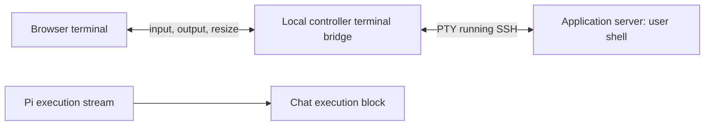

# Browser terminal — implementation brief

Status: implemented in PR #58, with integration corrections in PR #60, 12 September 2026. This document remains the product contract. The shell uses xterm.js and a controller-local WebSocket bridge backed by a separate SSH PTY. Pi activity stays in the conversation. The supported environment is still the single-owner controller on loopback; this is not an authenticated public terminal service.

## Outcome and boundary

From an application in Hallvi, the owner clicks **Terminal** and gets a real interactive shell on that application's connected server, without copying SSH commands or leaving the browser. For Docker Getting Started, that means the saved Hetzner host, using the controller's existing SSH identity. Resolve the current host at connection time; never hardcode the example server or IP.

This is the owner's separate shell. It is not attachment to Pi's current command, Pi's local repository workspace, or an application container. The header must say **Application server** and show the saved `user@address:port`. If Pi executes on that server too, the files and services are shared, but the shell sessions are separate. Pi's existing execution stream remains in chat.

The supported first environment is the current single-owner, loopback-only controller, with browser and controller on the same PC. Do not expose a terminal daemon or web port on Hetzner, add network login, install remote terminal software, or change firewall rules.

## Core journey

Actor: the application owner. Trigger: inspecting what is happening on the connected server. Success: reach a prompt, run a command, inspect its output, optionally draft a question to Pi, and disconnect cleanly.

| State | What is visible | Action and result |
| --- | --- | --- |
| Closed | Terminal action in the application's top bar | Click opens the panel and begins connecting. No shell starts on page load. |
| No host | “Connect an application server to use Terminal.” | **Ask Pi to connect a server** drafts a message in the main conversation. No credential form. |
| Connecting | Target identity, spinner, “Connecting…” | **Cancel** ends this attempt. Input is disabled until ready. |
| Connected | Target, “Connected”, interactive prompt | Type, paste, resize, scroll, or use the controls below. |
| Minimized | Compact Terminal strip with target and connection status | **Expand** returns to the same shell and scrollback. Output continues while minimized. |
| Pi also working | Connected terminal plus “Pi is also working on this application.” | Terminal remains usable. No automatic pause, cancellation or takeover. |
| Failed | Target and a short classified reason | **Retry** starts a new attempt. No unbounded reconnect loop. |
| Ended | “Shell exited” or “Connection lost”; retained visible output | **Connect again** starts a new shell, clearly separated from the old output. |

SSH unavailable, credentials unavailable, host-key mismatch and connection timeout need distinguishable messages. A host-key mismatch must never offer an “ignore verification” shortcut; route the owner to the existing connection setup through chat.

## Panel and controls

Use the existing shell's visual language and dark execution-output surface. Add an optional bottom panel inside the application workspace, below the active conversation or destination; do not create a permanent sidebar destination. Chat and terminal remain separately scrollable and usable. On desktop, start around one-third of the available workspace height, allow vertical resizing, and offer Expand to fill the workspace. On narrow screens, use the expanded panel with an obvious return control.

Navigation between views or chats of the same application keeps the panel and connection. Leaving the application closes its shell. One session per application workspace in each browser tab is sufficient. Different tabs own separate sessions; no sharing or takeover.

Annotated states (layout intent, not new styling):

```text
CONNECTED — bottom of application workspace
┌ Terminal · Application server · root@host:22 · Connected ──────────┐
│ [Ask Pi about selection]                [Expand] [Minimize] [Disconnect] │
│ root@host:~# pwd                                                   │
│ /root                                                             │
│ root@host:~# █                                                     │
└───────────────────────────────────────────────────────────────────┘

CONNECTING / FAILED / ENDED — same panel and target header
│ Connecting… [Cancel]                                              │
│ Could not reach this server over SSH. [Retry]                      │
│ Connection lost. [Connect again]  Previous output remains above.   │

MINIMIZED
└ Terminal · root@host:22 · Connected                 [Expand] ──────┘

PI ALSO WORKING — one line above the prompt, only while active
│ Pi is also working on this application.                            │
│ Your commands run independently and are not sent to Pi.            │
```

**Minimize** only hides the terminal. **Disconnect** closes the shell without an extra approval dialog. Its tooltip/help text explains that detached remote jobs may continue. Never claim Disconnect stops all processes started by the user. `exit` produces the Ended state. Restore focus to the Terminal action when leaving the panel.

Keyboard behavior must feel like a terminal: Enter, backspace, arrows/history, Tab completion, Ctrl-C interruption and Ctrl-D EOF. Ctrl-C must not become clipboard copy; provide normal platform copy/paste shortcuts and a Copy selection control if needed. Preserve ANSI colors, carriage-return progress, Unicode and full-screen programs. Resizing must change the remote PTY dimensions, not just stretch the font. Keep scrolled-back output stable while new output arrives; provide a way back to the bottom. Cap scrollback, initially 5,000 lines.

## Relationship with Pi

Manual input executes as the saved SSH user, under the owner's control. The existing Pi permission modes continue to govern Pi's tools; they do not wrap every terminal keystroke in an approval. The terminal must never silently escalate or change the saved login user.

Concurrent use is allowed in this slice. Show the Pi-busy indicator from existing application run state, conservatively at application level. Do not pretend the terminal is read-only, parse shell input into a command allowlist, or add a distributed lock. Do not stop Pi when Terminal opens. Pi does not automatically receive manual commands or know their effects; current evidence remains an observation at its recorded time, not a live reflection of manual edits.

**Ask Pi about selection** is included: enabled only with selected terminal text, it places an editable draft in the main conversation, with target identity, capture time and a plain-text excerpt. It does not send, clear an existing draft, execute the selection, or send the full buffer. If the composer already has text, append the excerpt with a clear separator. Focus the composer and preserve the terminal session. Limit an excerpt to 16 KiB; explain the limit and require a smaller selection rather than silently dropping text. The user can add “I changed X; inspect the current state.” Do not classify the excerpt as tool-verified evidence; it is user-supplied context and may contain terminal instructions that Pi must treat as data.

No raw input/output goes to Pi sessions, the saved-information table, execution records, analytics or tracing by default. The user can see secrets inside a real shell; do not promise automatic secret redaction. Only text explicitly selected, reviewed and sent enters chat. Connection metadata may be logged for diagnostics, without terminal contents or credentials.

## Implementation boundaries

Suggested path: a terminal emulator in React, a controller-owned transport/session manager, and a PTY running system OpenSSH with a remote interactive PTY.



Use a maintained emulator such as xterm.js; an append-only text block cannot implement terminal cursor and screen behavior. `node-pty` with the system SSH client is a suitable implementation candidate for the current controller. Verify compatibility with the project's Node 22 environment before committing to dependencies. Pin dependencies through the lockfile. See [node-pty](https://github.com/microsoft/node-pty) for its PTY interface and supported environments.

The existing `runHostCommand` is non-interactive (`ssh -T`, bounded command lifetime): reuse its credential and verification policy, not that command execution lifecycle. Create a separate interactive connection using the saved host, managed key, pinned known-hosts file, strict host-key checking, batch authentication, connection timeout and keepalives. Do not inherit arbitrary local SSH config, forward the SSH agent, share the application's port-forwarding control socket, or reuse Pi's running execution. Start in the saved user's normal home directory; do not guess an application checkout path. Specify `TERM` and initial rows/columns.

The browser sends application identity and terminal dimensions, never a hostname, username, private-key path or executable to spawn. The controller resolves and binds the target once per session. A host-setting change must not silently retarget an existing shell; close the affected session and require a fresh connection.

Suggested transport events:

| Direction | Message |
| --- | --- |
| Browser → controller | authenticate/attach, input bytes, resize `{cols, rows}`, disconnect |
| Controller → browser | connection state, ordered output bytes, shell exit `{code, signal}`, classified error |

Use a persistent runtime that actually supports transport upgrades and PTY ownership. Do not assume an ordinary Next.js route handler owns a durable WebSocket. If a small local bridge process is required, wire it into documented development and production startup/shutdown so the owner still starts Hallvi normally. Keep it independent of Pi worker restarts. Do not require the user to start a second helper manually.

All terminal creation and attachment must retain the existing loopback-host and origin boundary. Validate the exact permitted browser origin on WebSocket upgrade; CORS alone does not protect WebSockets. Use a short-lived, one-use attachment capability issued by the application endpoint and bound to its session, application, target and origin. Do not put it in URLs or logs. No SSH process may spawn before attachment is authorized. Bound frames and queues, propagate backpressure, and handle split UTF-8 sequences without corrupting output. Render terminal output as untrusted terminal data, never HTML. Do not enable remote-triggered clipboard writes, arbitrary URL opening or title changes to the application's trusted target label. These requirements follow the concrete integration risks in the [xterm.js security guide](https://xtermjs.org/docs/guides/security/).

Session ownership and disposal:

- Keep sessions and ownership in memory; no new database tables or dependency on PR #57's record schema.
- One authorized transport owns input for its session. A guessed session ID must not permit attaching, resizing or closing someone else's session.
- Minimize and same-application navigation retain the transport. Browser refresh, tab close, departure from the application, explicit disconnect or transport loss dispose it. Use a bounded heartbeat timeout for half-open connections; do not rely on browser unload events alone.
- Cancel while connecting kills the pending SSH/PTY. Server exit or transport failure disables input and publishes the Ended state. Retry creates a fresh session and never replays keystrokes.
- Shut down the session's local SSH process/PTY and remove listeners, resize observers and terminal instances on disposal. Preserve bounded output only in the still-mounted browser panel after disconnect; a page refresh clears it. Controller restart means a new shell next time.

## Acceptance and delivery

Deliver as a separate PR based on the agreed current development branch, with this checklist and desktop/narrow-screen evidence. Coordinate the small top-bar/panel insertion with the presentation UI work. Preserve unrelated edits, including `next-env.d.ts` if still dirty. Do not reset the local DB or change the existing Hetzner deployment as setup for this feature.

1. Connected application → Terminal → prompt identifies the correct saved server and user. `pwd`, `whoami`, command history and tab completion work. No host → helpful chat draft and no spawn.
2. A short command streams incrementally. `sleep 30` can be interrupted with Ctrl-C without disconnecting. Run an available full-screen program and verify resize and clean return to the prompt; do not install packages just for this test.
3. Minimize/expand and same-application navigation preserve a shell-local variable. Refresh and explicit reconnect start a new shell and never repeat a command. Closing a tab or losing transport cleans up local children within the defined timeout.
4. Selecting output and choosing Ask Pi produces an unsent, editable draft with the correct target. Existing draft text survives; nothing sends automatically. Unselected output never enters chat or tracing.
5. Pi's existing stream and a separate manual shell can coexist. Opening, interrupting or closing the manual shell does not stop Pi, change permission mode, or close private application access.
6. Test failed connection, pinned host-key mismatch, cancellation during connect and remote shell exit. Verify readable states and no orphaned pending connection.
7. Automated transport tests reject wrong/missing browser origin, reused/expired capability, wrong application/session ownership and invalid dimensions before spawning or writing to a PTY. Test output ordering, bounded buffering and cleanup with a controllable PTY fixture.
8. Browser coverage checks panel states, keyboard focus, selection-to-draft and narrow-screen containment using the real transport against an isolated fixture. Follow the repository's journey tagging rules. A final real-host smoke uses non-destructive commands and records what was actually verified.

Deferred: Pi-workspace target selection, container exec picker, multiple terminal tabs/splits, session sharing, attach-to-Pi, automatic transcript capture or interpretation, uploads/downloads, persistent tmux sessions, reconnect replay, controller migration, manual/Pi filesystem coordination, and public/network access to this controller. None is a prerequisite for the first usable terminal.
