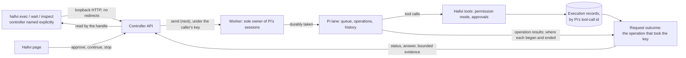

# Working from a terminal

`hallvi apps`, `exec`, `wait` and `inspect` send work to an application that a
running Hallvi controller already has, and read back what was recorded. They
are for three kinds of caller:

- a coding agent checking a deployed application without driving Hallvi's page;
- a script or agent building a workflow on Hallvi, and later an MCP adapter,
  which uses the same interface
  ([`controller-client.mjs`](../scripts/controller-client.mjs));
- a person operating an application from a terminal.

A request goes to the application's main conversation, as an ordinary message,
and meets the same Pi, permission mode, approvals and evidence as one typed in
the page. The commands create no applications, set nothing up, hold no
conversation of their own and reach no controller on another machine. The
service commands (`start`, `stop`, `status`, `logs` and the rest) are
[unchanged](installation.md#the-service), and the request commands do not read
the installation's state or settings.

## Choosing the controller

Every command names its controller: `--controller <url>`, otherwise
`HALLVI_CONTROLLER_URL`, otherwise nothing is contacted and the command says
so. Hallvi never infers the installed service, looks for a controller, starts
one or tries another. The address is a loopback origin such as
`http://127.0.0.1:4747`; anything else is refused before any connection. The
commands use the controller's existing HTTP API, whose Host and origin checks
are unchanged, and a redirect is refused rather than followed. Every result
names the controller it came from, which matters most when a development
checkout and an installation run side by side.

Loopback is a local trust assumption, not a login. Anything running on the
machine can reach the controller, as it can the page; a request's origin label
says where it was written and grants nothing.

## Commands

```sh
export HALLVI_CONTROLLER_URL=http://127.0.0.1:4747

hallvi apps                                   # IDs, names, recorded state
hallvi exec <app> "Check the site answers"    # send, then follow until settled
hallvi exec <app> - < request.txt             # the request from stdin
hallvi exec <app> "…" --background            # or --bg: return once Pi has it
hallvi exec <app> "…" --request-key <uuid>    # choose the key, to retry safely
hallvi wait <handle>                          # follow a request already sent
hallvi wait <handle> --timeout 0              # read its state once
hallvi inspect <app>                          # recorded state and evidence
hallvi inspect <app> --execution <id>         # one execution in full
```

`<app>` is an ID `hallvi apps` prints. Every command takes `--json`. `exec` and
`wait` take `--timeout <seconds>`, which limits how long they watch, every read
included, and never the work; `0` reads the state once, and without a timeout
they watch until the request settles. `--background` does not watch, so it
takes no timeout. A request is limited as the page's are, to
5,000 characters.

`apps` and `inspect` read recorded state only: no model call and no look at a
server. `inspect` is bounded: the 25 newest records Pi presented and the 20
newest executions, with counts of the rest.

## Sending and following

`exec` makes the request key first, fetches the main conversation, and sends
the request as a follow-up (`next`), never as a steer. It says the request is
accepted only once Pi has durably taken it. If the controller's answer is lost,
it sends the same request again under the same key, a few times; Pi never takes
one key twice, so this cannot duplicate the work, and the same key with
different text is refused. A refusal settles it only when nothing was sent
before it: after a lost answer, a refused retry says nothing about the first
send. If no attempt settles it, whether Pi has the request is not known, and
the result says that and keeps the handle and key: sending again with
`--request-key` is how to find out. A prompt is never sent again under a new
key.

The handle is the address the request's outcome is read from:

```text
http://127.0.0.1:4747/api/applications/<app>/chats/<conversation>/requests/<key>
```

It names the controller, application, conversation and request key and holds
no credential, so a fresh process can follow the request with no job file of
its own. `wait` only reads: it never sends, retries work or continues Pi. A
controller named beside a handle must be the handle's own, or nothing is
contacted.

A timeout or Ctrl-C stops only the command. Pi keeps the request, and the
command prints the handle and says so. A read that fails is never taken for
idle, finished or cancelled: a controller or worker that is restarting is asked
again for about fifteen seconds, and then the command stops with the state not
known. Time that runs out while reads are failing is reported the same way
(exit 1), not as the last state that was read.

## What a request becomes

The result is that of the Pi operation that took the request, identified by
Pi's own records of where each operation began and ended in the conversation.
When Pi reads several waiting messages inside one operation, each of those
requests gets that operation's result, whole: its final answer and all its
evidence, and `operation.requestKeys` lists them. A later request, or another
application's, is never read into it.

| Status | Means | Exit |
| --- | --- | --- |
| `queued` | Pi holds it and has not read it yet. | 3 if the wait ended |
| `working` | The operation that took it is running. | 3 if the wait ended |
| `waiting-for-approval` | A call is waiting for the owner's decision and has not run. | 2 |
| `waiting-for-input` | The operation ended asking the owner for something through one of Hallvi's cards, and that card is still open. A card opened after the asking call returned belongs to later work. | 2 |
| `completed` | Pi finished answering. | 0 |
| `failed` | Pi could not finish. | 1 |
| `cancelled` | Stopped in Hallvi, or dropped by Stop before Pi read it. | 4 |
| `interrupted` | The worker went away mid-operation, or with the request unread. Nothing runs until someone chooses Continue or Stop in Hallvi. | 4 |

Other exit codes: 0 for `--background` once accepted and for `apps` and
`inspect`; 1 for a validation, transport or refusal failure, or acceptance not
known; 130 for Ctrl-C.

**Completed is not success.** It means Pi finished answering, not that a
deployment or repair worked, and a completed reply can say the objective was
not achieved. Read the answer and the evidence; there is no `verified` flag.

An approval or input wait carries the reason and the Hallvi page to act on. The
commands never approve, change the permission mode or continue interrupted
work; after approving in Hallvi, `wait` follows the same request on.

## Output

Readable output puts progress on stderr — the state as it changes and each call
as it ends — and a compact result on stdout: the status, Pi's answer, the
recorded calls and the handle. With `--json`, stdout carries exactly one JSON
object and nothing is written to stderr.

`exec` and `wait`:

```jsonc
{
  "controller": "http://127.0.0.1:4747",
  "applicationId": "…",
  "chatId": "…",           // the main conversation
  "requestKey": "…",
  "handle": "http://127.0.0.1:4747/api/applications/…/requests/…",
  "accepted": true,        // false: refused; null: not known
  "status": "completed",   // null when not known, and with --background
  "timedOut": false,
  "stoppedByUser": false,  // Ctrl-C
  "background": false,
  "operation": {
    "id": "…",             // Pi's own operation id
    "status": "completed", // open, completed, failed, aborted
    "startedAt": "…",
    "endedAt": "…",
    "requestKeys": ["…"]   // every request this operation took
  },
  "answer": "…",           // Pi's final words, once the operation ended
  "answerTruncated": false,
  "failure": null,         // why Pi could not finish, as advice
  "attention": null,       // { kind, reason, page, executionId? }
  "evidence": [],          // the operation's calls, below
  "evidenceOmitted": 0,
  "error": null            // { code, message } when the command failed
}
```

Each evidence item is one tool call as recorded, never interpreted:
`toolCallId`, `executionId` (null for a call the executor does not record),
`tool`, `target`, `input` (redacted, first 2,000 characters), `status`,
`exitCode` (only where a server command reported one), `startedAt`,
`finishedAt`, `output` (redacted, last 2,000 characters), and `inputTruncated`
and `outputTruncated`. An answer carries the operation's last 40 calls.
`inspect <app> --execution <id>` returns one execution of that application in
full, as far as the executor kept it (the last 100,000 characters), redacted
again on the way out.

`apps` returns `{ controller, applications }`, each with `id`, `name`,
`source`, `condition`, `stack`, `address`, `permissionMode` and `mainChatId`.
`inspect` returns `{ controller, applicationId, application, condition,
conversations, main, attention, deployment, records, recordsOmitted,
executions, executionsOmitted }`, where `main.status` is null when no worker
answered. When `exec` or `wait` fail once the request is identified, the result
above carries `error` beside whatever was known; any other failure is
`{ controller, applicationId, error: { code, message } }`, with null for what
was not chosen yet. Error codes include `usage`,
`controller-missing`, `controller-invalid`, `controller-conflict`,
`handle-invalid`, `unreachable`, `redirected`, `not-hallvi`, `not-found`,
`request-not-found`, `refused`, `worker-unavailable`, `acceptance-unknown` and
`stopped` (Ctrl-C before anything was handed over).

## Where it is shown

A request sent this way is labelled **CLI** in the conversation instead of
**You**. The label travels with the message into Pi's history, so it survives a
reload, and is never shown to the model. An adapter for another agent can add
its own label in the same way. It is provenance, not an identity.



## From a development checkout

A checkout checks its work against a really deployed application from the
[development environment](development-environment.md): it attaches one, which
runs that application's Hallvi in the checkout, and names that controller.

1. `npm ci`, with Node 22.
2. `node scripts/retained-application.mjs status` lists the applications, who
   holds each, and the Pi and schema they record. Take a free one. `whoami` has
   nothing to lose; `uptime-kuma` keeps its own data.
3. In one terminal, `node scripts/retained-application.mjs attach <name>`. It
   takes a verified copy of the records first, then prints the controller's
   address — `Attached … http://127.0.0.1:5148. Ctrl-C detaches.` — and stays in
   the foreground. When it refuses because the histories were written by
   another Pi, look at a snapshot with this checkout first (below); if it reads
   them, attach again with `--accept-format`.
4. In a second terminal, name that controller and work:

   ```sh
   export HALLVI_CONTROLLER_URL=http://127.0.0.1:5148
   node scripts/cli.mjs apps
   node scripts/cli.mjs inspect <app>
   node scripts/cli.mjs exec <app> "Report … without changing anything"
   node scripts/cli.mjs inspect <app> --execution <id>
   ```

5. `node scripts/retained-application.mjs detach <name>`, or Ctrl-C in the first
   terminal, when done. It lets Pi finish before letting go.

These applications are really deployed, on a host they share. Ask for
read-only work unless changing that application is the task, and say which one
you took. A result is about the application you meant when its `controller`
and `applicationId` are the ones you named. `completed` means Pi finished
answering: what happened is in the evidence, and anything that matters can be
looked at again independently.

**A snapshot needs no attaching.** `node scripts/retained-application.mjs
snapshot <directory> <name>` copies an application's records and histories
without keys, secrets or logins and prints the one line that runs them on a
port of its own. `apps`, `inspect` and `wait` read it. `exec` is refused there,
because a snapshot cannot start a turn. It is also where a new Pi is tried on
recorded histories before `--accept-format`: a conversation that reads as it
did, with its requests found and nothing rewritten, is the evidence.

## Limits

- **Input waits are recognised only from Hallvi's own cards**: where to run,
  DNS access for a domain, how to deploy, and a secret value. A question Pi
  asks in prose reads as `completed`; its answer carries the question. Once the
  owner answers a card, the work goes on in a new operation that Hallvi's
  message starts, and the original handle keeps reporting its own.
- **A waiting request that Stop drops leaves no record in Pi.** A command that
  saw it waiting reports it `cancelled`; a fresh `wait` finds nothing and says
  it was never accepted or was dropped.
- Repository workspace commands record no numeric exit code; a failure there is
  `failed` with its output.
- Following is a poll about once a second. Streaming JSON events, name lookup,
  an interactive conversation (`attach`) and explicitly continuing interrupted
  work (`resume`) are not built; those two names are kept for them.
- An MCP adapter is not built. It would call the same client and add its own
  origin label.
