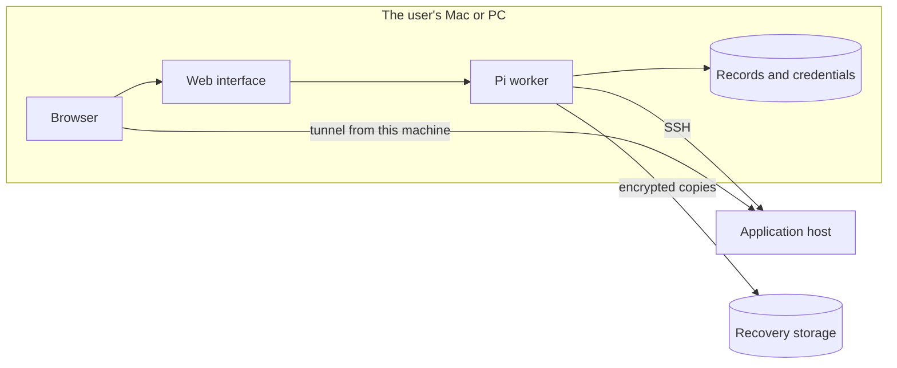
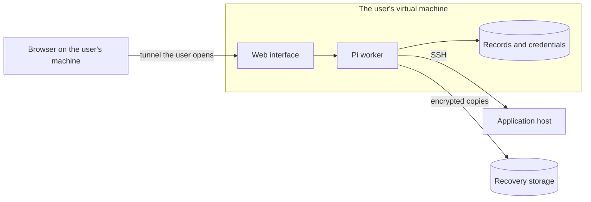
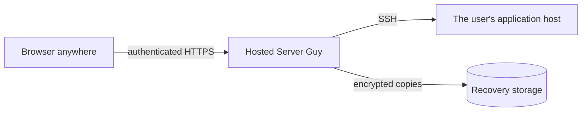

# Always-on Server Guy: a ladder of placements

A concept note, updated 17 September 2026 to the owner's decision that
morning. Nothing here is implemented. It describes where Server Guy itself
runs — the web interface, the Pi worker, and the records, credentials and
native sessions they keep — and what each place means for care that continues
when nobody is looking.

Placement is a ladder the user climbs, not a recommendation we make. Each rung
adds a use case and removes none of the earlier ones.

Two different things are reached, and they must not be confused:

- **Reaching Server Guy**: opening its interface and talking to Pi.
- **Reaching a private application**: the application is bound to loopback on
  its host and reached through an SSH tunnel that Pi opens
  (`open_server_port`). That tunnel ends on the machine running the
  installation, so wherever the installation runs is where the private link
  works.

## Rung 1: the user's own Mac or Linux PC

The first supported case. The installation and the browser are on the same
machine, so no remote access is needed: the interface binds to loopback, and
there is nothing new to authenticate.

Its honest limit is that care runs while the machine is awake. A closed lid
pauses scheduled work and drops tunnels until the machine wakes, and losing the
machine means rebuilding Server Guy from its recovery kit while the
applications keep serving.

## Rung 2: a virtual machine the user provides

The installation runs on a machine that stays on, and the user reaches it
through a tunnel they open from their own machine. Remote access is the user's
decision and the user's setup: the product does not pick a tunnel, a VPN or a
public login for them, and it keeps binding to loopback so that whatever the
user chooses is the only way in.

Care now continues while the user's laptop sleeps. The private application
link ends on the virtual machine, so the user reaches it through the same
tunnel they already opened. Keeping that machine updated and protected is part
of what the user takes on at this rung.

## Rung 3, later: a hosted service we run

We run the installation for the user. This rung needs what the first two
deliberately avoid — a real login, and custody of other people's credentials
and records — so it comes after them, not instead of them.

## A caution: running it on the application server

Nothing stops a user placing the installation on the same host as the
application it manages, and it saves a machine. It couples the two failures
the recovery work exists to separate: losing that host loses the application,
Server Guy and the credentials at once, leaving the recovery kit as the only
way back. It also makes reaching Server Guy a public login problem immediately,
and puts a compromised application one hop from the credentials that manage
it. This is a caution to explain to the user, not a rule to enforce.

## Failure cases side by side

| Event | Rung 1: own Mac or PC | Rung 2: user's VM | Rung 3: hosted | On the application server |
| --- | --- | --- | --- | --- |
| User's laptop sleeps | Care pauses; tunnels drop | Unaffected | Unaffected | Unaffected |
| Connection lost mid-command | Unknown outcome; Pi reads the host later | Unknown outcome; Pi reads the host later | Unknown outcome; Pi reads the host later | Local; unaffected |
| Application host lost | App down; Server Guy intact and recovers it | App down; Server Guy intact and recovers it | App down; Server Guy intact and recovers it | App, Server Guy and credentials lost together |
| Machine running Server Guy lost | Rebuild from kit; apps keep serving | Rebuild from kit; apps keep serving | Our incident; apps keep serving | Same host as the app |
| Reaching Server Guy | Same machine, no login | The user's own tunnel | Login we must build | Public login needed at once |
| Reaching a private app | Tunnel ends on the Mac or PC | Tunnel ends on the VM, then the user's tunnel | Needs a design of its own | Direct on the host |

## Packaging

Rungs 1 and 2 ship the same thing: a background service installed from the
command line, launchd on macOS and systemd on Linux, serving the web interface
on loopback. The service keeps the worker running, restarts it after a crash
and survives a reboot, which today takes two terminals.

A packaging spike comes next, and should settle:

- an installer script, a single binary or a container image;
- how the two native modules, `node-pty` and `better-sqlite3`, are built or
  shipped for each platform;
- whether Docker stays a requirement. Pi's repository workspace is a local
  container today; it could instead move to the application host over the SSH
  connection Server Guy already holds.

A desktop wrapper is worth building only if the Mac rung turns out to need
one.
