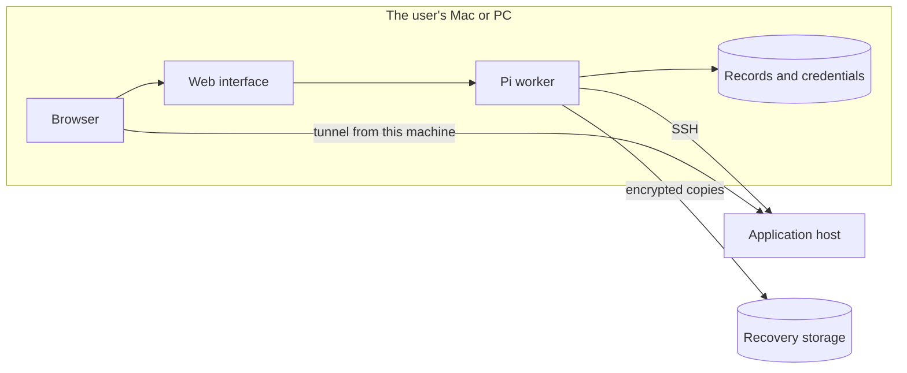
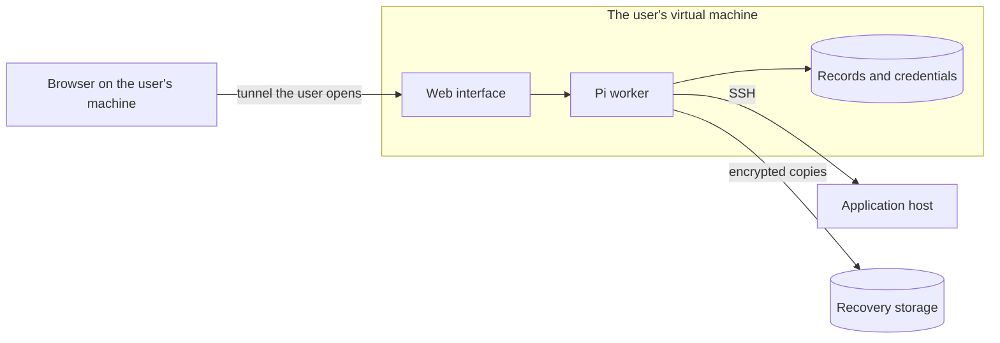
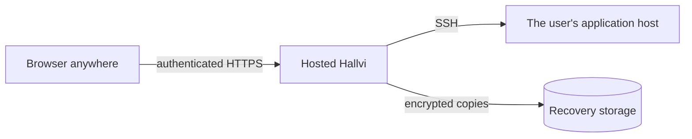

# Always-on Hallvi: a ladder of placements

A concept note, updated 17 September 2026 to the owner's decision that
morning. It describes where Hallvi itself runs — the web interface, the Pi
worker, and the records, credentials and native sessions they keep — and what
each place means for care that continues when nobody is looking.

Rungs 1 and 2 are implemented as an installed background service;
[Installing Hallvi](../installation.md) is the practical account and the
owner of every path, port and command. Rung 3 is not implemented. Nothing here adds monitoring, scheduled care or
public access: an always-on installation is where such work could later run,
not that work.

Placement is a ladder the user climbs, not a recommendation we make. Each rung
adds a use case and removes none of the earlier ones.

Two different things are reached, and they must not be confused:

- **Reaching Hallvi**: opening its interface and talking to Pi.
- **Reaching a private application**: the application is bound to loopback on
  its host and reached through an SSH tunnel that Pi opens
  (`open_server_port`). That tunnel ends on the machine running the
  installation. When the browser is on another machine, reaching the interface
  does not reach the application: the link's port has to be carried to the
  browser as well.

## Rung 1: the user's own Mac or Linux PC

The first supported case. The installation and the browser are on the same
machine, so no remote access is needed: the interface binds to loopback, and
there is nothing new to authenticate.

Its honest limit is that care runs while the machine is awake. A closed lid
pauses scheduled work and drops tunnels until the machine wakes, and losing the
machine means rebuilding Hallvi from its recovery kit while the
applications keep serving.

## Rung 2: a virtual machine the user provides

The installation runs on a machine that stays on, and the user reaches it
through a tunnel they open from their own machine. Remote access is the user's
decision and the user's setup: the product does not pick a tunnel, a VPN or a
public login for them, and it keeps binding to loopback so that whatever the
user chooses is the only way in.

Care now continues while the user's laptop sleeps. The private application
link ends on the virtual machine, and a page names it as
`http://127.0.0.1:<port>`, so forwarding the interface alone opens nothing. An
installation therefore keeps every loopback port a page can name fixed — the
interface, the browser terminal and a small range for private links — and
`hallvi remote` prints the SSH configuration that forwards them all to the
same numbers. One connection the user opens carries everything, and links work
in the user's browser as written. Signing in to ChatGPT and GitHub uses device
codes, so neither needs a port of its own. Keeping that machine updated and
protected is part of what the user takes on at this rung.

## Rung 3, later: a hosted service we run

We run the installation for the user. This rung needs what the first two
deliberately avoid — a real login, and custody of other people's credentials
and records — so it comes after them, not instead of them.

## A caution: running it on the application server

Nothing stops a user placing the installation on the same host as the
application it manages, and it saves a machine. It couples the two failures
the recovery work exists to separate: losing that host loses the application,
Hallvi and the credentials at once, leaving the recovery kit as the only
way back. It also makes reaching Hallvi a public login problem immediately,
and puts a compromised application one hop from the credentials that manage
it. This is a caution to explain to the user, not a rule to enforce.

## Failure cases side by side

| Event | Rung 1: own Mac or PC | Rung 2: user's VM | Rung 3: hosted | On the application server |
| --- | --- | --- | --- | --- |
| User's laptop sleeps | Care pauses; tunnels drop | Unaffected | Unaffected | Unaffected |
| Connection lost mid-command | Unknown outcome; Pi reads the host later | Unknown outcome; Pi reads the host later | Unknown outcome; Pi reads the host later | Local; unaffected |
| Application host lost | App down; Hallvi intact and recovers it | App down; Hallvi intact and recovers it | App down; Hallvi intact and recovers it | App, Hallvi and credentials lost together |
| Machine running Hallvi lost | Rebuild from kit; apps keep serving | Rebuild from kit; apps keep serving | Our incident; apps keep serving | Same host as the app |
| Reaching Hallvi | Same machine, no login | The user's own tunnel | Login we must build | Public login needed at once |
| Reaching a private app | Tunnel ends on the Mac or PC | Tunnel ends on the VM; the user's SSH connection forwards the fixed link ports | Needs a design of its own | Direct on the host |

## Packaging

Rungs 1 and 2 ship the same thing: a background service installed from the
command line for one user, a launchd agent on macOS and a systemd user unit
with lingering on Linux, serving the web interface on loopback. The service
keeps the interface and the worker running as a pair, restarts them after a
crash and survives a reboot, which used to take two terminals.

The packaging spike settled on the smallest thing that works:

- **An installer script over an archive**, not a single binary or a container
  image. The archive holds the built interface, the worker bundled to plain
  JavaScript and the schema; nothing at run time compiles or uses `tsx`,
  `drizzle-kit` or `next dev`. A container image remains a possible format for
  the virtual machine rung; it was not needed to get there.
- **Node.js is downloaded into the program directory**, checksum-verified, so a
  service never depends on a shell's version manager and the native modules are
  built against the Node that loads them.
- **`node-pty` and `better-sqlite3` are installed on the target machine** from
  the packed lockfile. `node-pty` compiles, so installation needs a compiler.
  Prebuilt per-platform archives would remove that and need a release pipeline
  this repository does not have yet.
- **Program and state are separate directories.** Upgrade and uninstall replace
  or remove the program and never touch state.

Neither rung needs local Docker. Pi's repository workspace runs directly on
the user's machine by default, in a scratch folder holding the repository copy,
under two hygiene rules that are not a sandbox: anything Pi runs starts from a
minimal environment without Hallvi's tokens, and Pi's file tools refuse paths
outside the folder, which keeps them off Hallvi's configuration and credential
files. Docker is an optional isolated workspace, chosen in Settings →
Workspace, for people deploying software they do not trust. When it is chosen
and unavailable, the workspace tools are withdrawn with a plain reason, never a
silent fallback. Hallvi itself never runs inside that container; a container
image stays a possible packaging format for the virtual machine rung.
[Installing Hallvi](../installation.md#pis-workspace) describes both modes,
and [Architecture](../architecture.md#repository-workspace-architecture) draws
the boundary. Application servers keep their own Docker and Compose
requirement; only the machine running Hallvi dropped it.

A desktop wrapper is worth building only if the Mac rung turns out to need
one.
