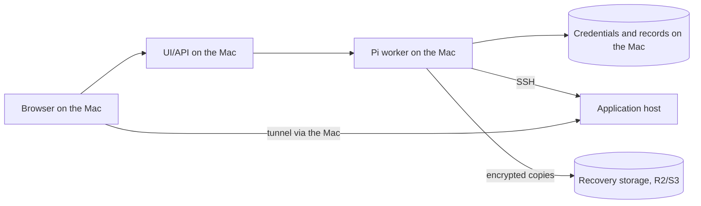
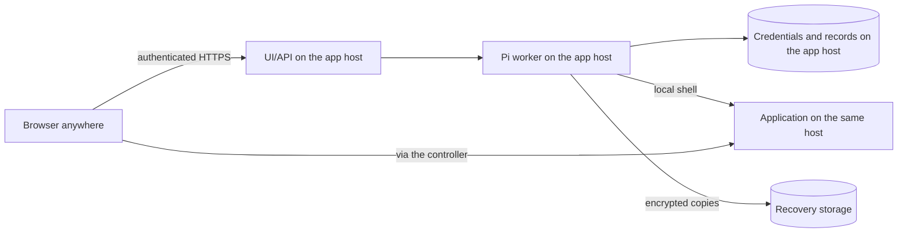
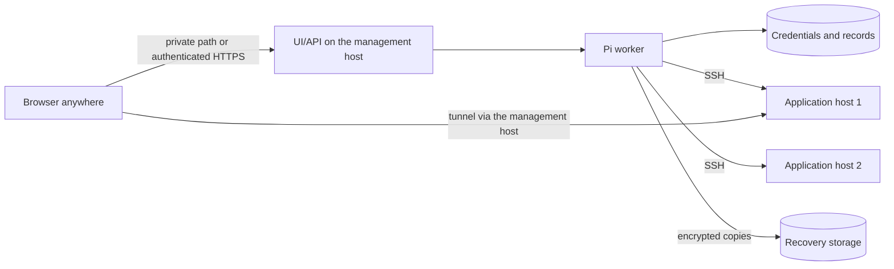

# Always-on Server Guy: where the controller lives

A concept note, 17 September 2026. Nothing here is implemented or provisioned.
It compares three placements for the controller (the Next.js UI/API plus the
Pi worker, their SQLite records, credentials and native sessions) and asks
what each one means for care that continues when nobody is looking. The
[product](../../PRODUCT.md) already allows the controller on the application
host or separately; this note is about choosing.

Two different things are reached, and they must not be confused:

- **Reaching Server Guy**: opening the controller's UI and talking to Pi.
- **Reaching a private application**: the application is bound to loopback on
  its host and reached through an SSH tunnel that Pi opens
  (`open_server_port`). Today that tunnel ends on the machine running the
  controller, so wherever the controller lives is where the private link works.

## Placement 1: the owner's Mac, with managed background processes

Today's shape, made durable: the web and worker processes run under launchd
instead of two terminals, restart after a crash, and reopen tunnels after wake.

Nothing new to authenticate: the controller binds to loopback and the browser
is on the same machine. Failures: a closed lid stops care, scheduled backups
and any heartbeat until the Mac wakes; a lost connection ends running commands
with unknown outcomes, which Pi already handles by reading the host; losing
the application host loses the application, and recovery runs from the Mac;
losing the Mac loses the controller, recoverable from the R2 kit. Always-on
means always-on while the Mac is awake, which is not always-on.

## Placement 2: co-located on the application server

The controller runs on the same host as the application it manages.

Cheapest: no second machine, no tunnel for the private application because
the controller is already inside. Care continues while the host is up.
Failures couple: losing the host loses the application, the controller and
the credentials at once, and the recovery kit in R2 becomes the only way back.
Reaching Server Guy now means a public, authenticated URL, which is a product
capability that does not exist yet (login, session, rate limits, exposure of
the Pi runtime). A compromised application is one hop from the credentials
that manage it.

## Placement 3: a separate management host

A small always-on machine runs the controller for one or several
applications; application hosts stay as they are.

Care continues independently of both the laptop and any one application
host. Failures stay separate: an application host can be rebuilt from the
controller; the controller can be rebuilt from its kit while applications keep
serving. The costs are a second machine, the same remote-access story as
placement 2 (a private path such as an SSH tunnel or a VPN can defer the public
login), and the controller host's own updates and protection become
first-class work.

## Failure cases side by side

| Event | Mac with launchd | Co-located | Management host |
| --- | --- | --- | --- |
| Laptop sleeps | Care pauses; tunnels drop | Unaffected | Unaffected |
| Connection lost mid-command | Unknown outcome, read the host later | Local, unaffected | Unknown outcome, read the host later |
| Application host lost | App down; controller intact, recovers it | App, controller and credentials all lost together | App down; controller intact, recovers it |
| Management host lost | The Mac is the host: rebuild from kit | Same host as the app | Apps keep serving; rebuild controller from kit |
| Reaching Server Guy | Loopback, no login | Public login required | Private path first, login later |
| Reaching a private app | Tunnel ends on the Mac | Direct | Tunnel ends on the management host, then to you |

## Provisional recommendation

Aim at placement 3 for always-on care, reached over a private path first, and
keep placement 1 as the development and single-owner default until the
management host exists. Placement 2 is the tempting shortcut and the one to
avoid as a default: it saves a machine by coupling the two failures the
self-backup work exists to separate, and it forces the public login problem
immediately.

The strongest drawback of the recommendation is that it makes the controller
host a second thing the product must keep healthy, updated and backed up, and
it adds a recurring cost per user or per account. A successful recovery test
of a hosted controller does not prove hosting is safer; it proves the kit
works.

## Decisions the owner needs to make

1. Is always-on care worth a small dedicated machine, and is it one per
   account or one per application?
2. Which remote access path comes first: a private tunnel or VPN to the
   management host, or a public authenticated URL with a real login story?
3. Does the laptop placement remain a supported product mode or become
   development-only once a hosted mode exists?
4. Who updates and protects the management host: Pi itself, under the same
   permission modes, or a fixed installer script outside Pi's reach?

## Cheapest useful next experiment

After discussion, run the existing controller under launchd on a machine the
owner already has (the retired Mac mini qualifies), bound to loopback, reached
from the laptop through an SSH tunnel, against the fixture application only.
That answers whether care continues when the laptop sleeps, how tunnels behave
from a machine you are not sitting at, and whether the self-backup runs
unattended, with no billed host, no public exposure, no new login and no owner
data. If it works, the next question is the access path, not the placement.
