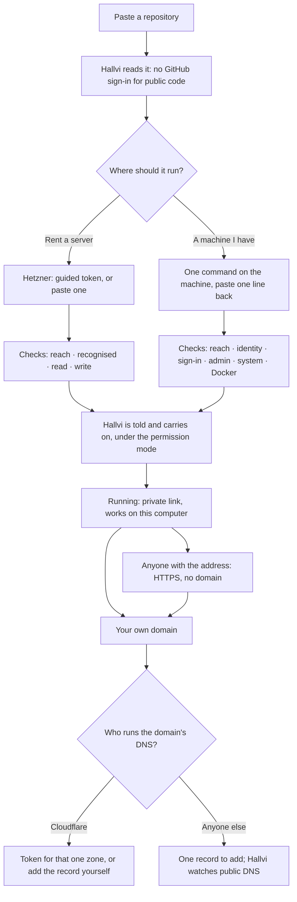

# Onboarding: from a repository to a working address

**Status, 18 September 2026: wired into the conversation, not yet proven on
a real provider or machine.** The owner chose the recommended answers to
decisions 1 and 2 below; 3 and 4 are implemented as recommended and await
review in [PR #135](https://github.com/lustoykov/hallvi/pull/135).

What runs in the product: the cards in `src/components/hallvi/onboarding/`,
drawn in the main conversation by `connection-requests.tsx`; Pi's
`request_connection` and `request_domain_access` tools; the controller checks
in `src/server/connection-checks.ts` and `connectCloudflareForZone`; the
request store in `connection-requests.ts`; the reworked Add application screen.
`/prototype/onboarding` keeps the scripted conversation with simulated
providers, because no record produces its failure states on demand.

To look at the scripted journey: `npm run dev -- --port 3300`, then
<http://127.0.0.1:3300/prototype/onboarding>. The dark panel chooses the
permission mode, what each provider answers next, and jumps between chapters;
"Reload the page" shows what survives leaving and coming back.

## The person and the problem

Someone found an application and wants it running. They may have written it;
they have not necessarily rented a server, made an API token or edited DNS.
Today the conversation sends them to Settings › Connections, where a password
field asks for "a Hetzner Cloud API token with read and write in the project".
A better-looking field would fail the same way: they do not know what belongs
in it, where it comes from, what it grants, or how to get back.

## The shape of the answer

**Requests are turns in the conversation.** The product already draws a secret
request as a turn at the point Pi asked (`secret-request.tsx`). Connecting an
account or a machine is the same kind of moment, so it gets the same frame: who
asked, an amber body while it waits for the owner, a grey receipt once done.
No wizard, no modal, no trip to Settings. The task stays visible above it.



1. **Intake is a welcome, then one field.** Little Server greets, says in
   three sentences what Hallvi is, and follows the form: a wave, a box once a
   repository is typed, the wrench while it is read, a worried look when it
   could not be. Three drawings say how it goes from here (read, choose where,
   open). The field stays above the fold; the name is derived and can change
   later. GitHub is a quiet link for private repositories, and the typed
   address is kept across that trip. ChatGPT, if missing, is asked for in the
   conversation after the request is saved; preferences wait.
   After it, the conversation is not an empty page: **Little Server stays
   above the transcript with a four-stop rail** (read it, a place to run,
   deploy, open it). Each stop is read from a record (a request, an attached
   host, a deployment record, an access record), never from a timer. While Pi
   works the current stop carries a travelling band and the bubble repeats
   the turn's own status line; when something waits for the owner the stop
   turns amber and Little Server points at it; on arrival it celebrates, and
   on later visits the rail is gone. Before the first message it offers "Get
   it running", so nobody has to guess what to type.
2. **"Where should it run?" is one card with two whole journeys.** Pi's
   recommendation is marked, not imposed. A connected Hetzner account collapses
   that side to one button.
3. **Every grant says what it is a key to, before the hand-off**, in the
   provider's own words, and says what the *selected* permission mode will do
   next. "Every change asks for your approval" was only true of one mode.
4. **Guided steps remember their place and nothing else.** The open step is
   the only state kept; a credential lives in a password field until it is
   posted, and is never in a URL, storage, the conversation or a log.
5. **Checks are a list, not a badge.** A network failure leaves the token in
   the field and says it was never judged. A token that cannot see a zone is
   told which zones it can see. What cannot be proven without changing
   something is written "not proven yet", never drawn green.
6. **Finishing a request tells Hallvi, so the owner does not have to.** Today
   the owner must type "carry on". The continuation is an ordinary message;
   it approves nothing.
7. **The hand-over is a ladder of who can open it**, and every address says
   where it works. Domain setup continues from an application that already
   works.
8. **Reconnecting is the same card** with "I have a token" first, raised by Pi
   in the conversation where the saved token failed. Settings › Connections
   should host the same cards rather than the bare forms.

## Patterns borrowed, and why

| From | Observed behaviour (first-party docs) | Used for |
| --- | --- | --- |
| [Coolify](https://coolify.io/docs/knowledge-base/server/openssh) | It generates the key; a named **Validate server** step checks reachability, OS and Docker; three named failures (publickey, timeout, refused); "do not close your session until it connects". | The machine card's re-runnable check list and one diagnosis per failure. |
| [Cloudflare Tunnel](https://developers.cloudflare.com/cloudflare-one/connections/connect-networks/get-started/create-remote-tunnel/) | One command to paste on the machine; the command can be shown again later; "never connected" and "connected then dropped" are different states. | One command, always re-openable. |
| [Stripe CLI](https://docs.stripe.com/cli/login) | The grant is scoped on the provider's page at the moment of consent; a pending login can be completed later; pasting a key stays available. | Scope chosen on Cloudflare's own page; a request that waits; "I have a token". |
| [Vercel](https://vercel.com/docs/domains/working-with-domains/add-a-domain) | Every deployment has a URL first; the domain comes later, instructions branch on the name, status is live. | The ladder; DNS lookup before any credential; the record watch. |
| [Coolify domains](https://coolify.io/docs/knowledge-base/domains) | With no domain, an sslip.io name is generated from the server IP. | The middle rung. |

## Technical facts, verified 18 September 2026

**Hetzner.** Project API tokens only; no OAuth. Console
<https://console.hetzner.com/>, **Security** → **API tokens** → **Generate API
token**, **Read** or **Read & Write**, shown once
([docs](https://docs.hetzner.com/cloud/api/getting-started/generating-api-token/)).
A token reaches everything in its project and nothing outside it, so a project
used only for Hallvi is the one real way to narrow it. 64 characters. An
invalid token answers `401 unauthorized` (reproduced). No endpoint reports a
token's permission: a Read token is only discovered by a write answering
`403 forbidden`. No first-party deep link to a project's token page exists
without the project id, so the guide links to the Console and names the path.
The label of the "new project" control was not verified and is described, not
quoted.

**Cloudflare OAuth** is generally available with Authorization Code + PKCE and
a device grant for public clients
([docs](https://developers.cloudflare.com/fundamentals/oauth/create-an-oauth-client/)).
It is **not the recommended path now**: a client anyone can authorise must be
registered under a Hallvi-owned Cloudflare account and made public through a
DNS-verified publisher domain, permanently; consent is documented per account,
not per zone, which is *broader* than a zone token; the DNS scope names and
loopback redirect rules could not be verified without an authenticated call.
None of that can be proven from this repository, so it is not called
supported. Revisit once Hallvi has a publisher domain.

**Cloudflare token template links** are documented
([docs](https://developers.cloudflare.com/fundamentals/api/how-to/account-owned-token-template/)):
`permissionGroupKeys` pre-fills DNS edit and zone read and a name. The link
cannot choose the zone; the owner picks it, then **Continue to summary** →
**Create Token**. `/user/tokens/verify` reports active or not and nothing about
permissions; `GET /zones` lists only what the token can see. DNS *edit* cannot
be proven without a write. `cfk_…` or 37–45 hex characters is a Global API Key
and is refused by shape.

**What the current checks prove.** `connectHetzner` reads one server: not write
access. `connectCloudflare` asks whether the token is active: not zone or DNS
access. The form also asks for R2 and an account id, which pointing a name at a
server does not need.

**Where tokens are kept.** `hetzner-connection.json` and
`cloudflare-connection.json` are plaintext, mode 0600, in the controller's
config directory. Pi and the remote host never receive them. "Stored on this
controller only" is not accurate: `controller-protection.ts` copies every
`*.json` in that directory into Hallvi's encrypted self-backup once backup
storage is connected. The cards say exactly this.

**HTTPS without a domain.** Let's Encrypt IP-address certificates are generally
available ([January 2026](https://letsencrypt.org/2026/01/15/6day-and-ip-general-availability)),
but Caddy refuses public-IP subjects
([caddy#7399](https://github.com/caddyserver/caddy/issues/7399)). An
`<ip-with-dashes>.sslip.io` name works with ordinary HTTP-01 in any proxy
today. It is a third-party service on the path to that address; the rung says
so.

## Decisions for the owner

**1. The first address (changes stated policy).** Recommended: keep *private by
default* and add a rung.

- First success stays the private link: `http://127.0.0.1:<port>`, **this
  computer only, while Hallvi runs**. It exposes nothing while the owner claims
  the application's first account; Uptime Kuma and many self-hosted
  applications give administrator to the first visitor.
- New: **"Anyone with the address"**, one click from the hand-over, no domain
  and no other account: `https://203-0-113-9.sslip.io`, **public**. A click on
  that button is the explicit request the policy requires. It is withheld while
  the first account is unclaimed. Pi verifies sign-in *through that address*
  before calling it usable; plain `http://<ip>` is not offered because
  applications that set Secure cookies or need a secure context break on it.
- On a home-network machine the rung is **"Devices on your network"**:
  `http://192.168.x.x:<port>`, **LAN only, unencrypted**. Hallvi does not yet
  make a home machine public, and says so.
- The policy change: public access no longer needs a domain, and the product
  offers it rather than waiting to be asked. Operator-design's "Default
  application access" and Pi's prompt would gain the direct-address rung; the
  default stays private.
- The alternative, public by default, reaches a shareable link one click
  sooner and publishes every unclaimed first-run page. Not recommended.

**2. Proving Hetzner write access.** Recommended: on "Check and connect" the
controller registers the application's public SSH key in the project. It is
free, the server needs it, it is disclosed beside the button, and it is the
only way to catch a Read token before a purchase fails. It is a controller
action the owner clicked, not a Pi tool call, so permission modes are
untouched. The alternative is to leave write unproven until the server is
created.

**3. One command for an existing machine.** Recommended as drawn: the command
installs the key and prints user, port, host-key fingerprint, system and
addresses; the owner pastes that line into a plain field (it holds nothing
secret). Fingerprint verification stays mandatory and is no longer something
the owner must understand. New controller checks are needed: passwordless
sudo, OS and architecture, Docker, memory and disk.

**4. Domains without Cloudflare.** Recommended: look the name up first and let
any DNS provider work through one hand-added record that Hallvi watches for.
A Cloudflare token is asked for only when the zone is at Cloudflare and the
owner wants Hallvi to write the record.

**5. No "run it on this computer" path (owner's question, 18 September).**
Recommended: not now. Deployed on the owner's laptop an application has no
address anyone else can reach, stops when the lid closes, and shows none of
what Hallvi is for; it is `docker compose up` with more steps, and it would
need a second executor beside SSH. The worry behind the question is paying
before seeing anything work, and the honest answer to that is already true:
Hetzner bills by the hour, so a day of trying costs cents and deleting the
server stops the bill. The host card now says so. A Linux computer at home is
already covered by "a machine I already have".

## What is wired, and what proves it

```mermaid
sequenceDiagram
  participant Pi
  participant C as Controller
  participant O as Owner, in the conversation
  participant P as Provider or machine
  Pi->>C: request_connection(needs, estimate, recommended)
  C-->>Pi: waiting, so the turn ends
  C->>O: card at the asking message (kept across reloads)
  O->>C: token or machine line, in one same-origin body
  C->>P: read, then the write probe / pin the host key, sign in, check the system
  P-->>C: what was established
  C-->>O: check list, or one named problem; saved only when all of it held
  O->>Pi: "Hetzner is connected… please carry on" (an ordinary message)
  Pi->>P: continues under the permission mode
```

- **Verified against live services, without credentials:** a made-up Hetzner
  token comes back `rejected` from the real API and nothing is saved; a made-up
  Cloudflare token likewise; the DNS lookup names Cloudflare-hosted, other and
  unregistered domains from public DNS; a cross-origin post is refused.
- **Verified in the browser:** the Add application screen creates an
  application from a public repository with no GitHub sign-in; a host request
  written in the tool's format renders in the real main conversation at the
  asking message and survives reload; every simulated state in the prototype.
- **Unit tests** (`connection-checks.test.ts`): a network failure is never a
  bad token; a Read token and a rejected one are told apart and neither is
  saved; a token is saved only after the write probe and never returned; a
  zone outside a token's scope is reported as hidden, with what is visible,
  and nothing is saved; key shapes and the machine line.

## Live run, 18 September 2026

One real journey on the owner's Default Hetzner project (empty beforehand) and
Cloudflare zone, with existing credentials reused and never printed. The
server is a labelled, registered development fixture.

- **Hetzner path, end to end.** "Get it running" sent the first message; Pi
  read the repository, read live prices and called `request_connection` by
  itself; the card appeared with Pi's own estimate; "Use my Hetzner account"
  settled it and the continuation message was sent without the owner typing;
  Pi rented a CX23 (€5.99 a month), installed Docker, started Uptime Kuma
  2.5.5 on loopback, proved the data survives a container replacement, and
  opened a private link. From this computer the link answered (302 to the
  application's setup page) and port 3001 did not answer from the internet.
  The rail went from "Read it" to "Open it" from records alone.
- **Existing-machine path.** The card's one command was run on that server
  and printed its line; pasting the line passed every check (host key pinned,
  key sign-in, root, Ubuntu 24.04 x86_64, Docker present), folded the card
  into a receipt, and resumed Pi unprompted.
- **Publishing guard.** Asked for the direct address, Pi found Uptime Kuma's
  unclaimed setup page and asked for an administrator password through the
  secure field instead of publishing. That value is the owner's to type, so
  the sslip.io address and the domain stop here until they do.
- **Domain lookup.** Public DNS named Cloudflare for the owner's zone, and the
  existing connection is reported by Cloudflare as able to edit its DNS, so
  the card offers "Let Hallvi add the record" and asks for no token.

What the run changed: a request whose estimate overran its own schema was
written and then dropped on read, so the card never appeared (now clamped on
write); the shortcut receipt claimed a write check that had not run; the
Pi-decides line promised a prompt before renting and Pi rented without one;
Cloudflare's zone listing reports permissions, so DNS edit is read rather
than called unprovable; a machine reports Docker's bridges among its
addresses, so only the one signed in to is offered first; a Cloudflare
connection made earlier is used instead of asking again. The repository
workspace image is amd64 and failed on this arm64 Mac; Pi worked from the
server instead. That is outside this change and worth its own fix.

**Not exercised live:** pasting a Hetzner or Cloudflare token (needs the
owner's hands; a read-only and a read-write Hetzner token are the useful
pair), a home-network machine, the sslip.io certificate, and a domain record.

## Still to prove or build

- A fresh journey on a **real Hetzner project** and on a **real machine**
  (VPS and home), including Pi actually calling `request_connection`, the
  write probe with a real Read & Write token and a real Read token, and the
  continuation message resuming the turn.
- The **direct address** on a real server: sslip.io resolution, Caddy's
  certificate, sign-in through it. Pi's prompt carries the procedure; nothing
  has exercised it. Whether Let's Encrypt rate limits bite on a shared
  sslip.io suffix is unknown.
- One domain by each path, Cloudflare token and hand-added record.
- The ladder's "first account unclaimed" state is "unknown" in the product:
  Pi does not record it yet, so the ladder cautions rather than withholds.
- Settings › Connections still uses the bare token forms (with corrected
  wording): the write probe needs an application's key, which that page does
  not have. `provider-token-form.tsx` therefore stays.
- ChatGPT sign-in inside the conversation is drawn only in the prototype; the
  product still uses the existing setup-return trip.
- Keyboard order, screen-reader output, contrast at zoom and widths under
  640px were not audited. Backups are out of scope and can reuse the card.
- Developed on Node 26 because Node 22 is not installed on this machine; the
  `terminal-transport` suite fails there on `node-pty`'s binary and is
  unrelated to this change.
