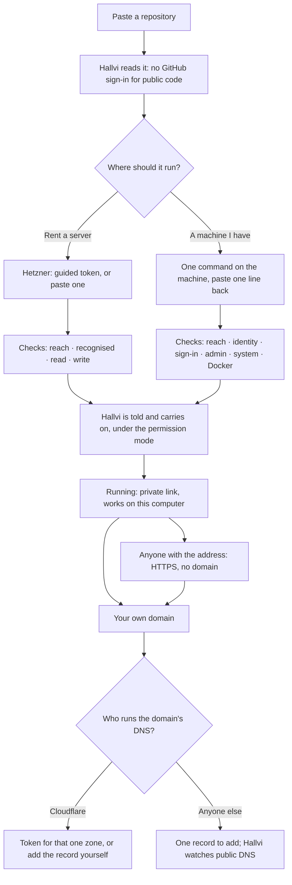

# Onboarding: from a repository to a working address

**Status: proposal, 18 September 2026. Not shipped.** The cards in
`src/components/hallvi/onboarding/` are written to ship; today they run only in
`/prototype/onboarding`, against a scripted conversation and simulated
providers. Nothing here has been proven against Hetzner, Cloudflare or a real
machine. The [decisions](#decisions-for-the-owner) below need the owner's
direction before anything is wired into the product.

To look at it: `npm run dev -- --port 3300`, then
<http://127.0.0.1:3300/prototype/onboarding>. The dark panel chooses the
permission mode, what each provider answers next, and jumps between chapters;
"Reload the page" shows what survives leaving and coming back.

## The person and the problem

Someone found an application and wants it running. They may have written it;
they have not necessarily rented a server, made an API token or edited DNS.
Today the conversation sends them to Settings › Connections, where a password
field asks for "a Hetzner Cloud API token with read and write in the project".
A better-looking field would fail the same way: they do not know what belongs
in it, where it comes from, what it grants, or how to get back.

## The shape of the answer

**Requests are turns in the conversation.** The product already draws a secret
request as a turn at the point Pi asked (`secret-request.tsx`). Connecting an
account or a machine is the same kind of moment, so it gets the same frame: who
asked, an amber body while it waits for the owner, a grey receipt once done.
No wizard, no modal, no trip to Settings. The task stays visible above it.

1. **Intake is one field.** The name is derived and can change later. GitHub is
   mentioned only if the repository cannot be read anonymously, and then the
   typed address is kept. ChatGPT, if missing, is asked for in the conversation
   after the request is saved, with the recommended model; preferences wait.
2. **"Where should it run?" is one card with two whole journeys.** Pi's
   recommendation is marked, not imposed. A connected Hetzner account collapses
   that side to one button.
3. **Every grant says what it is a key to, before the hand-off**, in the
   provider's own words, and says what the *selected* permission mode will do
   next. "Every change asks for your approval" was only true of one mode.
4. **Guided steps remember their place and nothing else.** The open step is
   the only state kept; a credential lives in a password field until it is
   posted, and is never in a URL, storage, the conversation or a log.
5. **Checks are a list, not a badge.** A network failure leaves the token in
   the field and says it was never judged. A token that cannot see a zone is
   told which zones it can see. What cannot be proven without changing
   something is written "not proven yet", never drawn green.
6. **Finishing a request tells Hallvi, so the owner does not have to.** Today
   the owner must type "carry on". The continuation is an ordinary message;
   it approves nothing.
7. **The hand-over is a ladder of who can open it**, and every address says
   where it works. Domain setup continues from an application that already
   works.
8. **Reconnecting is the same card** with "I have a token" first, raised by Pi
   in the conversation where the saved token failed. Settings › Connections
   should host the same cards rather than the bare forms.

## Patterns borrowed, and why

| From | Observed behaviour (first-party docs) | Used for |
| --- | --- | --- |
| [Coolify](https://coolify.io/docs/knowledge-base/server/openssh) | It generates the key; a named **Validate server** step checks reachability, OS and Docker; three named failures (publickey, timeout, refused); "do not close your session until it connects". | The machine card's re-runnable check list and one diagnosis per failure. |
| [Cloudflare Tunnel](https://developers.cloudflare.com/cloudflare-one/connections/connect-networks/get-started/create-remote-tunnel/) | One command to paste on the machine; the command can be shown again later; "never connected" and "connected then dropped" are different states. | One command, always re-openable. |
| [Stripe CLI](https://docs.stripe.com/cli/login) | The grant is scoped on the provider's page at the moment of consent; a pending login can be completed later; pasting a key stays available. | Scope chosen on Cloudflare's own page; a request that waits; "I have a token". |
| [Vercel](https://vercel.com/docs/domains/working-with-domains/add-a-domain) | Every deployment has a URL first; the domain comes later, instructions branch on the name, status is live. | The ladder; DNS lookup before any credential; the record watch. |
| [Coolify domains](https://coolify.io/docs/knowledge-base/domains) | With no domain, an sslip.io name is generated from the server IP. | The middle rung. |

## Technical facts, verified 18 September 2026

**Hetzner.** Project API tokens only; no OAuth. Console
<https://console.hetzner.com/>, **Security** → **API tokens** → **Generate API
token**, **Read** or **Read & Write**, shown once
([docs](https://docs.hetzner.com/cloud/api/getting-started/generating-api-token/)).
A token reaches everything in its project and nothing outside it, so a project
used only for Hallvi is the one real way to narrow it. 64 characters. An
invalid token answers `401 unauthorized` (reproduced). No endpoint reports a
token's permission: a Read token is only discovered by a write answering
`403 forbidden`. No first-party deep link to a project's token page exists
without the project id, so the guide links to the Console and names the path.
The label of the "new project" control was not verified and is described, not
quoted.

**Cloudflare OAuth** is generally available with Authorization Code + PKCE and
a device grant for public clients
([docs](https://developers.cloudflare.com/fundamentals/oauth/create-an-oauth-client/)).
It is **not the recommended path now**: a client anyone can authorise must be
registered under a Hallvi-owned Cloudflare account and made public through a
DNS-verified publisher domain, permanently; consent is documented per account,
not per zone, which is *broader* than a zone token; the DNS scope names and
loopback redirect rules could not be verified without an authenticated call.
None of that can be proven from this repository, so it is not called
supported. Revisit once Hallvi has a publisher domain.

**Cloudflare token template links** are documented
([docs](https://developers.cloudflare.com/fundamentals/api/how-to/account-owned-token-template/)):
`permissionGroupKeys` pre-fills DNS edit and zone read and a name. The link
cannot choose the zone; the owner picks it, then **Continue to summary** →
**Create Token**. `/user/tokens/verify` reports active or not and nothing about
permissions; `GET /zones` lists only what the token can see. DNS *edit* cannot
be proven without a write. `cfk_…` or 37–45 hex characters is a Global API Key
and is refused by shape.

**What the current checks prove.** `connectHetzner` reads one server: not write
access. `connectCloudflare` asks whether the token is active: not zone or DNS
access. The form also asks for R2 and an account id, which pointing a name at a
server does not need.

**Where tokens are kept.** `hetzner-connection.json` and
`cloudflare-connection.json` are plaintext, mode 0600, in the controller's
config directory. Pi and the remote host never receive them. "Stored on this
controller only" is not accurate: `controller-protection.ts` copies every
`*.json` in that directory into Hallvi's encrypted self-backup once backup
storage is connected. The cards say exactly this.

**HTTPS without a domain.** Let's Encrypt IP-address certificates are generally
available ([January 2026](https://letsencrypt.org/2026/01/15/6day-and-ip-general-availability)),
but Caddy refuses public-IP subjects
([caddy#7399](https://github.com/caddyserver/caddy/issues/7399)). An
`<ip-with-dashes>.sslip.io` name works with ordinary HTTP-01 in any proxy
today. It is a third-party service on the path to that address; the rung says
so.

## Decisions for the owner

**1. The first address (changes stated policy).** Recommended: keep *private by
default* and add a rung.

- First success stays the private link: `http://127.0.0.1:<port>`, **this
  computer only, while Hallvi runs**. It exposes nothing while the owner claims
  the application's first account; Uptime Kuma and many self-hosted
  applications give administrator to the first visitor.
- New: **"Anyone with the address"**, one click from the hand-over, no domain
  and no other account: `https://203-0-113-9.sslip.io`, **public**. A click on
  that button is the explicit request the policy requires. It is withheld while
  the first account is unclaimed. Pi verifies sign-in *through that address*
  before calling it usable; plain `http://<ip>` is not offered because
  applications that set Secure cookies or need a secure context break on it.
- On a home-network machine the rung is **"Devices on your network"**:
  `http://192.168.x.x:<port>`, **LAN only, unencrypted**. Hallvi does not yet
  make a home machine public, and says so.
- The policy change: public access no longer needs a domain, and the product
  offers it rather than waiting to be asked. Operator-design's "Default
  application access" and Pi's prompt would gain the direct-address rung; the
  default stays private.
- The alternative, public by default, reaches a shareable link one click
  sooner and publishes every unclaimed first-run page. Not recommended.

**2. Proving Hetzner write access.** Recommended: on "Check and connect" the
controller registers the application's public SSH key in the project. It is
free, the server needs it, it is disclosed beside the button, and it is the
only way to catch a Read token before a purchase fails. It is a controller
action the owner clicked, not a Pi tool call, so permission modes are
untouched. The alternative is to leave write unproven until the server is
created.

**3. One command for an existing machine.** Recommended as drawn: the command
installs the key and prints user, port, host-key fingerprint, system and
addresses; the owner pastes that line into a plain field (it holds nothing
secret). Fingerprint verification stays mandatory and is no longer something
the owner must understand. New controller checks are needed: passwordless
sudo, OS and architecture, Docker, memory and disk.

**4. Domains without Cloudflare.** Recommended: look the name up first and let
any DNS provider work through one hand-added record that Hallvi watches for.
A Cloudflare token is asked for only when the zone is at Cloudflare and the
owner wants Hallvi to write the record.

## Promotion plan, after direction

Small, reviewable steps; no workflow framework.

1. A `request_connection` tool beside `request_secret`, persisted the same way
   and drawn at the asking message; completion posts the continuation message.
2. Controller routes behind `OnboardingTransport`: Hetzner check with the write
   probe and distinct outcomes; machine check wrapping `connectServer` plus the
   new checks; NS lookup; Cloudflare check with the zone listing.
3. Replace the intake screen; host the cards in Settings › Connections; correct
   the storage wording; delete `provider-token-form.tsx`.
4. Pi's prompt and operator-design: raise the host request instead of naming
   Settings; the direct-address rung if decision 1 is accepted.
5. Proof: one fresh Hetzner journey and one machine journey on real hosts, the
   direct address verified from outside, one domain by each path. Tests: the
   token never reaches a URL, storage, a message or a log; a network failure is
   never reported as a bad credential; a worker restart replays nothing.

## Limits of what exists today

Simulated UI proof only. No live provider, machine, DNS or deployment was
exercised. The sslip.io rung, the sudo/Docker checks, the NS lookup and the
continuation message are designed, not built. Keyboard order, screen-reader
output, contrast at zoom and widths under 640px were not audited. Backups are
out of scope; they can reuse the same card when asked for.
