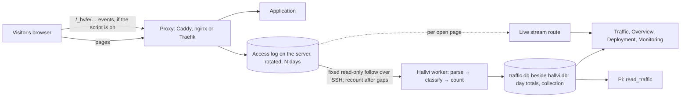

# Traffic: who uses the application, and how it is doing

**Status, 29 September 2026: agreed with the owner, being built on
`claude/traffic-v1`.** This document owns the design. The shared contract every
part is written against is [`src/server/traffic/contract.ts`](../../src/server/traffic/contract.ts);
[Product](../../PRODUCT.md#what-the-modes-cover) owns the collection rule.

## What it is for

Once an application is live, Hallvi says almost nothing about its use. Overview
follows the last five minutes of requests and keeps nothing; Monitoring shows
one day, and only when Pi is asked to read it. Nobody can answer "is anyone
using this, and is it growing?", and the usual answer — a third-party analytics
service with an account, a script and visitor data leaving the server — cuts
against owning the software.

Hallvi already sits in front of every request and knows every deploy. So the
owner sees, without asking and without setting anything up beyond one choice:

- **Their users:** who is on the site now, which pages, where they came from,
  which countries and devices, over 24 hours, 7 days and 30 days.
- **How the application is doing:** requests, errors and how many visitors hit
  them, response times, and what changed after each release.

It shows itself in the views where it belongs, from stored totals, without a
model call. Pi reads the same totals to explain them. It should feel like
Hallvi: light, calm, a little delightful — not a dashboard of zeros.

## Scope of v1

| Area | In v1 |
| --- | --- |
| Live | Arrivals as they happen (country · page · source), a light world map, "N open right now" with the script, "about N estimated visitors in the last 5 minutes" from the log alone |
| History | 24 h (hourly), 7 d and 30 d (daily): estimated visitors, page views, requests, errors and visitors affected, bots, response time |
| Breakdowns | Pages, sources and campaigns, countries, devices, browsers, operating systems |
| With the script | Page changes inside single-page applications, pages served from a CDN cache, time on page, open right now, goals, page speed (LCP, INP, CLS) and JavaScript error counts per page |
| Operations | Deploy markers on every chart, a before/after line on each release, Monitoring's traffic numbers from the same totals |
| Sources of truth | Caddy, nginx and Traefik access logs; Hallvi's script through the same log |
| Pi | `read_traffic` over the totals (main and side conversations); `traffic_setup` and `traffic_script`, read-only text for setting the log and the script up |

Later, because each needs something else first: revenue (a Stripe connection),
alerts that wake Pi (the deferred heartbeat), CDN cache statistics (the CDN's
analytics API).

## How it works

### Where the numbers come from

The proxy's access log is the collector. Each supported format is parsed into
one normalized request line (`TrafficLine`); everything after the parser —
classification, counting, storage, pages, Pi — never knows which proxy wrote
it. A parser boundary, not a plugin framework.

| Proxy | Format | What Pi configures |
| --- | --- | --- |
| Caddy | `caddy-json` (Caddy's own JSON access log) | The `log` directive to a rotated file readable by Hallvi's SSH user (`mode 0640`, or read through `sudo -n`); `regexp` filters that remove the query string from `request>uri` and from the `Referer` header; `log_append` fields for the kept query keys |
| nginx (and Nginx Proxy Manager, SWAG, OpenResty) | `hallvi-json` | A `log_format hallvi escape=json` emitting Hallvi's line — path and referrer without their query strings, kept keys as fields — and an `access_log` of its own beside any the owner already has |
| Traefik | `traefik-json` | JSON access log to a file, keeping the headers Hallvi needs; Traefik cannot rewrite fields, so its raw log keeps full URLs and the query strings are dropped when read |

Anything else is shown as unavailable. A proxy the owner already had keeps its
own log untouched: Hallvi adds its own beside it.

Every source must support three operations, or it gives live data and no
history: **list** the retained log files oldest first with the time each
covers, **read** a time range, and **follow** new lines. File sources cover
Caddy's own rotation (`access-<UTC ms>-size|time|manual.log.gz`) and logrotate's
(`access.log.1`, `access.log.2.gz`); container sources use
`docker logs --since/--until`. Commands stay fixed in Hallvi's code; a record
supplies only closed-shape values (a path, a container name, a time).

### Recount, never add

A day's numbers are a function of that day's log lines and nothing else.

- **Finished days** are recounted from the retained files once the day is over
  (after a short grace for requests still being written) and stored as final,
  with their coverage. A recount replaces a stored day only when it covers at
  least as much of it.
- **Today** is recounted from the log whenever the collector starts or
  reconnects, then kept current in memory from the follow and written as
  provisional every few seconds.
- Nothing is ever added to a saved number, so a restart cannot count twice. A
  glitch in the live follow only touches today's provisional numbers and is
  corrected when the day is recounted.
- Visitor estimates are made in memory during one pass. Hallvi stores no
  address, no user agent, no hash and no salt.

**Coverage is measured, not assumed.** The oldest line actually retained
decides how far back a recount can reach — Caddy keeps its file count *or*
its age limit, whichever runs out first — and a day that could not be read in
full says which part is missing and why (Hallvi was off, the log had rotated
away, the log was unreadable). Charts draw a gap as a gap, never as zero.

### Counting

- **A view** is a real browser navigation: `GET`, 2xx or 304, `Sec-Fetch-Dest:
  document`, not a prefetch or prerender (`Sec-Purpose`/`Purpose`). Without
  fetch metadata, an HTML response to a browser-shaped request.
- **Bots and scanners** — known crawler agents, self-declared bots, browser
  agents that a modern browser's fetch metadata gives away as imitations, and
  probes for `/wp-login.php`, `/.env` and the like — are counted as their own
  line and never as visitors. Tools and API clients (`curl`, libraries, SDKs)
  are requests: neither bots nor visitors. `classify.ts` holds the rules.
- **Hallvi's own requests** (its access check, `/_hv/s.js`, the `/_hv/e/`
  events themselves) are never requests or views.
- **A visitor estimate** is a distinct browser (address and user agent) within
  one day. It is always labelled an estimate: shared connections merge
  visitors, changing networks split them, headless browsers look like people.
- **Countries** come from the address, looked up on Hallvi's machine in DB-IP
  Lite (CC BY 4.0; the Traffic page links to DB-IP), or from a CDN's country
  header when there is one. Only the country is kept.
- **Sources** come from the referrer's host (named for the common ones: Google,
  Hacker News, X, Reddit, GitHub, LinkedIn, ChatGPT…), overridden by
  `utm_source`; no referrer is "Direct". Campaigns come from `utm_campaign`.
- **Devices, browsers and systems** come from the user agent (and the screen
  width the script reports).

### The arithmetic

- Requests, views, errors, bot requests, goals and script errors add up over
  any range.
- **Visitor estimates exist per day only.** 7 d and 30 d show the daily series
  and "about N a day"; they never add days into a number presented as unique
  people. The 24 h chart shows hourly estimates; its headline is today's.
- **Response times** are stored as a fixed-bucket histogram per hour
  (`LATENCY_BUCKETS_MS`); a range's percentile comes from the merged
  histogram, never from averaging percentiles. Page speed works the same way.
- Top lists are stored per day with enough entries (and an "other" row) that a
  range merges them exactly for everything shown.
- Days are cut in the controller's time zone, recorded with each day.

### The script

A small script the proxy serves on the application's own domain at
`/_hv/s.js`. It sends events as requests to `/_hv/e/1/<payload>`, which the
proxy answers with `204` and logs like any other request; the payload is
base64url JSON in the **path**, so stripping query strings never touches it and
every proxy records it. No collector service, no endpoint of Hallvi's on the
internet, no cookies and nothing stored in the browser.

- **Events:** `view` (including single-page route changes), `ping` (every 30 s
  while the tab is visible — what "open right now" counts), `leave` (visible
  time on the page), `goal` (`hv('signup')` or `data-hv-goal`), `vital` (LCP,
  INP, CLS) and `error` (a count, never the message). Each carries a random id
  for that one page view, so a `leave` joins its `view` without identifying
  anyone.
- **Installing it:** Pi's read-only `traffic_script` tool returns the file,
  its sha256, the proxy's serving snippet and the include line per stack
  ([`script.ts`](../../src/server/traffic/script.ts)); Pi writes the file and
  the proxy change through its server tools, under the permission modes.
- **Getting it into the application:** a one-line pull request that puts
  `` in the layout every page shares,
  through Hallvi's existing operability pull requests; for software the owner
  does not change, its own code-injection setting (Ghost has one). **Never** by
  rewriting HTML at the proxy: that changes what the application serves
  without the owner merging anything, which the
  [operating boundary](../../PRODUCT.md#operating-boundary) rules out.
- **Offered, not pushed.** Nothing is said about the script during deployment
  unless the owner asks for analytics then. The Traffic page offers it, once,
  when the evidence says the log misses something: the application changes
  pages in the browser (in-page requests name pages, in their referrer, that
  were never loaded as a document), a CDN caches its pages (a `cdn` record
  with `caches-pages`), or the owner opens something only the script measures
  (time on page, goals, page speed). Otherwise at most a quiet link.
- **No double counting.** The log and the script are never added together.
  Each application has one switch point, the first script event Hallvi
  counts: before it, views and visitors come from the log; after it, only from
  the script. Requests, errors, response times and bots always come from the
  log. The chart marks the switch. If events stop while browsers are still
  being served pages, the page says "script silent since …" rather than
  quietly falling back.

### Collection is a standing choice

Turning on **Keep traffic history** is the owner's decision, like choosing
automatic deploys, and stays on until they turn it off.

- **Setting it up** — JSON logging, retention, stripping the query string,
  serving `/_hv/` — is Pi's work on the server and goes through the
  [permission modes](../../PRODUCT.md#permission-modes). No new approval type.
- **While it runs,** the worker follows the log with a fixed read-only command
  and the Traffic page says so: collecting since when, the last line seen, how
  far back the server's log reaches.
- **Turning it off** stops the follow at once. Stored totals remain until the
  owner deletes them; the server's logs keep their own retention; Hallvi
  changes nothing on the server by itself.
- **Removing the application** removes its totals.

### Privacy, in the words the product uses

"Hallvi keeps totals on this computer. The server keeps its access log for N
days, as web servers do; Hallvi removes query strings — from the address asked
for and from the referrer — before the line is written, and keeps only
campaign tags." Behind Traefik, whose log cannot be rewritten, the page says
the server's log keeps full addresses. Hallvi makes no claim about consent: it says
what it collects and leaves that judgement to the owner.

The query string is where password-reset links, sign-in codes, invitations and
search terms live — and a same-site `Referer` carries the previous page's, so
`/reset?token=…` reaches the log through the next request's referrer. Pi reads
server logs when it investigates, so removing both at the source also keeps
them out of Pi's context and execution evidence. The
kept keys are `utm_source`, `utm_medium`, `utm_campaign`, `utm_term`,
`utm_content`, `ref`, and a page key for an application that routes by query
string (WordPress's `p`, for example) when Pi knows it.

### CDNs

Cloudflare does not cache HTML by default, so page views still reach the
origin and are counted; the visitor's address and country come from
`CF-Connecting-IP` and `CF-IPCountry` in the log. Where a CDN caches pages, only
the script counts those views — its events are never cached. Cloudflare's raw
request logs are Enterprise-only, so CDN logs are not how visitors are counted.
When Pi sets up caching it records whether pages are cached — the fact
`caches-pages`, "yes" or "no", on the `cdn` subject — so the Traffic page can
say what the log cannot see.

### If a machine is lost

- **The application server:** totals live with Hallvi, so history survives.
  Only traffic Hallvi had not yet counted is lost with the log.
- **The machine running Hallvi:** `traffic.db` travels in
  [Hallvi's own backup](../../ROADMAP.md) with `hallvi.db`; anything newer is
  recounted from what the server's log still holds.
- Raw logs are not copied off the server: that would put visitor addresses in
  a second place to cover a rare case.

### Setting up the log

Tested on Caddy 2.11.4, nginx 1.30.5 and Traefik 3.7.13 over real SSH as
root, a sudo user and a user without sudo. This is what Pi's instructions say:
the rules are in its system prompt ([`pi.ts`](../../src/server/pi.ts)), and the
exact configuration, steps, checks and record for each proxy come from its
read-only `traffic_setup` tool (`LOG_SETUP` in
[`pi-tools.ts`](../../src/server/traffic/pi-tools.ts)), so the long text is read
only when a log is being set up. Change the tested text there.

- **The record** points at the **host** path:
  `{kind:'access-log', proxy, format, source:{type:'file', path}, hosts, pageKey?, retainDays}`.
  `hosts` lists every name the application answers on (lower case, no port),
  so one proxy can serve several applications. A file source is preferred:
  `docker logs` history ends when the container is recreated. A proxy in a
  container bind-mounts the host directory at the same path. Hallvi's SSH user
  must be root, have passwordless sudo, or be able to read the files; reads
  fall back to `sudo -n` and otherwise say which file is unreadable.
- **Caddy:** a `log hallvi` of its own beside the owner's, imported into each
  counted site, writing `/var/log/caddy/hallvi/access.log` with
  `roll_interval 24h`, `roll_keep 1000`, `roll_keep_for 30d`, `roll_size 100MiB`,
  `mode 0640`, `dir_mode 0755`; a `format filter` with
  `request>uri regexp \?.*$ ""` and `request>headers>Referer regexp [?#].*$ ""`
  wrapping json; `log_append hv_<key> {query.<key>}` for each kept key, and
  `hv_page` only where the application routes by a query key. Rotated names
  carry the reason (`access-<UTC ms>-size|time|manual.log.gz`), rotation is
  lazy, and `.zst` is not read.
- **nginx:** Hallvi's log in **its own directory** (`install -d -m 0755
  /var/log/nginx/hallvi` first), a `conf.d/hallvi-log.conf` with maps that cut
  `$request_uri` and `$http_referer` at `?`/`#` and pick each host's page key,
  `log_format hallvi escape=json` emitting the `hallvi-json` line, and an
  `access_log … hallvi;` in every `server` block that already has its own
  (such a block inherits none from `http`). Retention in
  `/etc/logrotate.d/hallvi-nginx` (root-owned, 0644): daily, 30 kept,
  compress + delaycompress, `nodateext`, `create 0640 root adm`, and a
  postrotate USR1 to nginx — without it nginx keeps writing into the renamed
  file.
- **Traefik:** JSON access log to `/var/log/traefik/access.log` with header
  mode `drop` except User-Agent, Referer, Sec-Fetch-Dest, Sec-Fetch-Mode,
  Sec-Purpose, Purpose, Content-Type, CF-Connecting-IP and CF-IPCountry; the
  same logrotate block with a USR1 to Traefik.

What went wrong when it was tried, so Pi does not repeat it: a Hallvi file
inside `/var/log/nginx/*.log` duplicates Debian's own logrotate entry and makes
logrotate skip the owner's whole nginx configuration; logrotate ignores a
configuration not owned by root; nginx's `$uri` is rewritten by `try_files`
(an SPA route was logged as `/spa/index.html`), so the path comes from
`$request_uri`; Caddy without `mode`/`dir_mode` writes files only root can read;
Caddy still writes a failed request's error entries, **with the full query
string**, to its default logger (stderr, `docker logs`), which Pi may read; a
single-file bind mount goes stale when the file is replaced.

## Where it shows

All of it reads stored totals immediately; none of it waits for Pi.

- **Traffic** (new destination, listed once collection is on or totals exist):
  the live map and arrivals, the range switch, the charts with deploy markers
  and gaps, the breakdowns, errors with visitors affected, coverage, the
  script offer and the DB-IP credit.
- **Overview:** a small tile — today's estimated visitors against a usual day,
  a live pulse, errors visitors hit only when there are some.
- **Deployment:** on each release, what changed in the two hours after it
  against the two before — "errors on /checkout 0 → 14, about 9 visitors" —
  and nothing when nothing changed.
- **Monitoring:** requests, errors and response times from the same totals,
  instead of asking Pi to read a day.

**The look.** Light surfaces, soft motion, few words; visits land on the map
as soft dots. Little Server stops by for nice moments — a first visitor, a new
country, a record day — briefly, then leaves. Amber and red only for what
needs the owner ([calm by default](../../src/components/hallvi/DESIGN.md)).
Treatments are chosen from `?variant=` prototypes on the real pages.

## Proof

1. **Collection experiment** on a real Caddy application: stop Hallvi, send
   known traffic, rotate the log, delete a file, restart twice; stored totals
   equal an independent count of the raw files, nothing changes across
   restarts, and the deleted stretch reads as a gap.
2. **A Caddy site, an existing nginx setup, and a single-page application
   behind a Cloudflare "cache everything" rule.**
3. **The development applications seeded through the real pipeline:** a
   generator writes realistic history into each application's log and sends
   live traffic; the numbers on screen come from the counting code. Nothing is
   written into the databases directly.
4. **No double counting:** page loads with the script, in-app route changes and
   `curl` requests produce exactly the expected views and requests.
