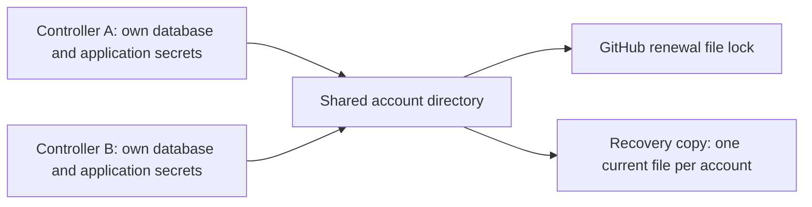

# Developing Hallvi

## Run locally

To use Hallvi rather than develop it, install it as a background service:
[Installing Hallvi](installation.md). `npm run package` builds the
archive, and `npm start` runs the same production pair in the foreground against
this checkout's `.hallvi` state. This guide is for development.

Development runs locally on the owner's MacBook; the Mac mini is retired from development.
Before creating or removing a branch, local runtime or cloud test resource,
read [development resource ownership and cleanup](development-resources.md).
Four applications are really deployed on a shared host, each with its
conversation and data kept between tasks in a state directory of its own:
the [development environment](development-environment.md). Look there
before building a fixture, and read that document before changing one.
Build in a worktree, which runs its own Hallvi with its own state and fixtures
and shares only the account-level logins. When a change needs a real
application, attach one — `node scripts/retained-application.mjs attach
whoami` — and the worktree runs that application on its own port until it
detaches; a second checkout is refused, and so is anything else that tries to
open the directory. Never copy a connection between checkouts; the
[development environment](development-environment.md#one-application-one-owner)
says what is shared and what is not.

Use Node.js 22, the checked-in CI baseline, with the locked dependencies. Pi is bundled; a separate Pi CLI installation is unnecessary. By default, the account level — the ChatGPT login and model preferences, and the GitHub, Hetzner and Cloudflare connections — lives in `~/.config/hallvi/pi`, so every checkout and preview port on this machine reuses the same logins and none of them copies one (a copied GitHub login dies when either copy renews). Application databases, executions, SSH keys and secrets remain local to each controller. Set `HALLVI_PI_CONFIG_DIR` to choose another account directory. An explicit `HALLVI_CONFIG_DIR` isolates the account level too unless `HALLVI_PI_CONFIG_DIR` is also supplied, which is what keeps test fixtures apart. Disconnecting or changing anything at the account level affects every controller using that directory. Configure the supported ChatGPT subscription in Settings and connect GitHub explicitly through the [GitHub App setup](integrations/github.md).

On an installed controller's next start, legacy GitHub, Hetzner and Cloudflare
connections move from its config directory into the selected account directory,
only where no account file already exists. A saved disconnect (`null`) counts
as existing. The launcher finishes this before starting the interface or worker;
`--check-installed` changes no credentials. Existing shared files win and any
conflicting legacy files remain untouched. Development checkouts do not import
legacy connections automatically.

GitHub renewal takes a file lock in that account directory. A second controller
waits, then reads the rotated token instead of spending the same refresh grant.
Recovery copies include the authoritative shared files once, under the restored
controller's config directory, and exclude stale controller copies.



```sh
npm ci
npm run db:push
npm run dev
```

Open the app and developer dashboard at the two addresses printed by `npm run dev` (normally <http://127.0.0.1:3000> and <http://127.0.0.1:4317>). They link to each other. Each worktree gets its own pair on free local ports; the dashboard runs checks and reports for that checkout. An explicit `PORT`, including a retained application's own port, is kept exactly and must be free. `HALLVI_DASHBOARD_PORT` similarly pins a dashboard port when needed.

That one command starts four processes: the application, the Pi worker that carries its conversations, a Drizzle Studio on the same database, and the local developer dashboard. The launcher loads `.env` and `.env.local`, resolves the database path, controller directory, Pi account directory and diagnostics directory once, and hands the children the same values, so they cannot disagree about which database and which ChatGPT connection they are using. `HALLVI_DB_PATH` overrides the default `.hallvi/hallvi.db`. The Studio takes the first free port from 4983 or from `HALLVI_STUDIO_PORT`, and the application is told which port it chose.

The worker stays a separate process, the only one that opens Pi's sessions; the app reaches it over a socket beside the database ([what the launcher does when it stops](architecture/development-start.md)). If it exits unexpectedly, the launcher says so and starts it once more; if it exits again, the launcher stops the children it started and exits non-zero rather than leaving the application unable to accept a message. A worker that finds another one already serving this database steps aside, and the launcher leaves that running worker alone. For debugging, `npm run worker` still starts one on its own from the same checkout.

Messages are accepted only after the running worker has saved them in Pi. When no worker is available, sending fails visibly and the composer keeps the draft. After a restart, Pi keeps unfinished work until the owner chooses Continue or Stop. The current controller binds to loopback and rejects arbitrary Host headers; public deployment of the controller still needs authenticated setup.

### Private application access

Pi defaults to loopback-only application ports on the remote server and a local SSH tunnel. Open the `http://127.0.0.1:<port>` link Pi supplies on the PC running Hallvi. Public web access requires an explicit request. If the tunnel stops or the PC restarts, ask Pi to reopen private access; there is no automatic tunnel supervisor. The `open_server_port` tool verifies local HTTP status but does not change remote listeners or firewalls.

### Data and migrations

Stop the web process and worker before applying schema changes. Schema 18 uses
three current tables: applications, conversations and saved information.
Initialize a fresh development database with `npm run db:push`; upgrade an
existing schema 15 database with `npm run db:upgrade`. Other transitions are
not supported. Keep environment and account configuration separate from any
application-data reset. [db-schema.ts](../src/server/db-schema.ts) owns the
schema and [migrations.mjs](../scripts/migrations.mjs) owns supported upgrades.

To read the rows, use the **Database** link in the application top bar in development. It addresses the Drizzle Studio that `npm run dev` started on this database (`https://local.drizzle.studio/?port=<port>`), which is the point: SQLite is a file rather than a service, and a Studio started by hand serves whichever database its own working directory resolves, so one left running in another checkout will show that checkout's rows. Studio takes `host`, `port`, `vendor` and `themeId` from its URL and has no address for a table or a row, so the link opens the whole controller database — find the application by its ID once inside. The link is absent when no Studio was started beside the application.

Native conversation histories live beside the database in `pi-sessions/<application-id>/<chat-id>/`, in Pi's own session format; a `<chat-id>.jsonl` beside that directory is the untouched history from before the upgrade. For a consistent offline controller backup, stop both processes and preserve SQLite, native sessions, configuration and execution/credential material privately. Restoring SQLite alone cannot restore missing native history. This developer procedure is not the planned automated application-backup feature.

### Diagnostics

Server commands show a live output block inside their chat message. The block follows new output until you scroll back; **Follow latest** resumes following, and **Copy** copies the command and recorded output. Completion keeps the block open and shows the exit code. Output remains redacted and limited to the most recent 100,000 characters by the existing execution recorder.

For a live, read-only view of Pi's full recorded conversation, run this in another terminal using Node 22:

```sh
npm run inspect:conversation
```

Open <http://127.0.0.1:3001>. The viewer opens on the newest application's main conversation, and the **Application** and **Conversation** menus in its bar switch to any other without a restart. The choice is the address — `?application=<id>&chat=<id>` — so a conversation can be linked to directly: in development the application top bar carries a **Transcript** link that opens the conversation you are reading. Startup flags still choose the first view: `-- --application <id> --chat <id> --port 3001`. It respects `HALLVI_DB_PATH` and `HALLVI_CONFIG_DIR` when exported in that terminal.

Recorded messages, reasoning and tool results refresh automatically. The current response text and running-command output update from the controller's saved state about every 750 ms. This is not a raw model-network capture: reasoning appears when Pi saves the assistant message. **Follow latest** scrolls to new content; turn it off to read earlier entries, or **Pause updates** to freeze the view. The inspector reads SQLite, native history and execution files without invoking Pi or running commands. Keep it local: conversation exports can contain private application data.

Local metadata-only diagnostics write rotating `diagnostics/replies.ndjson` and `diagnostics/spans.ndjson` beside the database, unless `HALLVI_LOG_DIR` overrides it. Settings exposes their paths and optional trace export. Product outcomes must remain understandable without a tracing account. Implementation: [local diagnostics](../src/server/diagnostics.ts) and [trace configuration](../src/server/tracing-config.ts).

## Verify

These are available checks, not a requirement to rerun every suite for every change. Select checks proportionate to the implementation stage; documentation-only edits need document/link checks rather than deployment proofs.

```sh
npm test
npm run lint
npm run build
npm run test:e2e:smoke
```

[tests/README.md](../tests/README.md) describes full browser journeys, synthetic fixtures, Docker checks and opt-in real-model evals. `npm run dev` starts the local testing workbench beside the app; `npm run test:dashboard` can still run it alone on <http://127.0.0.1:4317> when that port is free. Synthetic tests are not provider or deployment evidence. See the [testing index](testing/README.md) for acceptance coverage and known limits.
