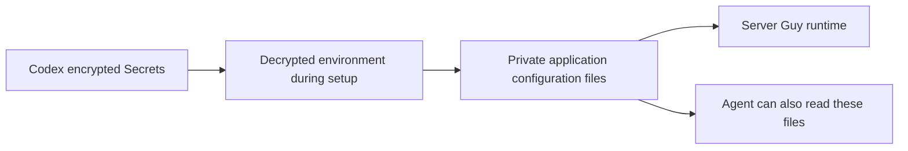

# Codex cloud environment

Use the `server-guy` Codex environment for implementation, pull requests, browser
checks and authorized provider API work. During beta, the owner trusts the cloud
agent with dedicated development credentials. Use the existing **Default**
Hetzner project; a separate cloud project is not required.

## Setup

In Codex environment settings, select `lustoykov/server-guy`, the universal
image and **Node.js 22** under preinstalled packages. Enable container caching.

Use these commands once the scripts are on the repository's default branch:

```sh
# Setup script
bash scripts/codex-setup.sh
```

```sh
# Maintenance script
bash scripts/codex-maintenance.sh
```

Codex builds the cache from the default branch before checking out the task
branch. Until these scripts are merged, paste their bodies into the corresponding
settings fields, omitting the line that changes directory relative to the script.
The live environment currently uses inline scripts for this reason.

Setup enforces Node 22, runs `npm ci`, installs Chromium and its system libraries,
and initializes the development database. Maintenance installs dependencies only
when the lockfile changes or `node_modules` is missing, ensures the matching
Chromium is available, and applies the checked-out branch's database schema.
A populated database with an incompatible retired schema causes setup to fail;
the script does not erase it.

| Environment variable | Value |
| --- | --- |
| `CI` | `1` |
| `NEXT_TELEMETRY_DISABLED` | `1` |
| `SERVER_GUY_CONFIG_DIR` | `/tmp/server-guy` |
| `SERVER_GUY_DB_PATH` | `/tmp/server-guy/server-guy.db` |
| `SERVER_GUY_LOG_DIR` | `/tmp/server-guy/diagnostics` |
| `SERVER_GUY_TRACING` | `0` |
| `NODE_USE_ENV_PROXY` | `1` |
| `CLOUDFLARE_ACCOUNT_ID` | The Cloudflare account ID (public configuration) |

GitHub App IDs and slugs are public configuration, but do not establish an
authenticated GitHub connection. Do not copy the laptop's `.env.local`, provider
connection files, model keys or backup credentials into this environment.

## Secrets and runtime access

[Codex environment documentation](https://developers.openai.com/codex/cloud/environments)
distinguishes two mechanisms:

- **Environment variables** are available during setup and the agent phase.
- **Secrets** are encrypted in storage and injected into setup; they are removed
  from the environment before the agent phase.

Add `HETZNER_API_TOKEN`, `CLOUDFLARE_API_TOKEN`, `R2_ACCESS_KEY_ID` and
`R2_SECRET_ACCESS_KEY` under **Secrets**, not ordinary
environment variables. Set `R2_BUCKET` and optionally `R2_ENDPOINT` as ordinary variables for backup
tests. The setup script verifies each supplied provider API token through a
read-only provider request, then saves it where Server Guy already reads it:

| Secret | Runtime location |
| --- | --- |
| `HETZNER_API_TOKEN` | `$SERVER_GUY_CONFIG_DIR/hetzner-connection.json` |
| `CLOUDFLARE_API_TOKEN` | `.env.local` in the checkout |
| `R2_ACCESS_KEY_ID`, `R2_SECRET_ACCESS_KEY` | `$SERVER_GUY_CONFIG_DIR/backup-destinations/default-credentials.json` |

Both files use owner-only permissions (600). Cloudflare setup preserves unrelated
`.env.local` settings. Tokens are optional: credential-free application tests
still work without them. Invalid supplied tokens fail setup with a generic
message, without logging the credential.



Codex removes the original secret environment variables before the agent phase;
it does not erase files our setup deliberately wrote. This protects storage and
keeps tokens out of ordinary settings and Git, but does not hide them from an
agent running as the same user. Treat setup code, dependencies and the working
agent as trusted under this beta configuration. Keep shell tracing disabled;
never print credentials or include them in test evidence or PRs.

To revoke access, revoke the token at the provider. Update the Codex Secret and
reset/rebuild the cache to replace persisted copies. Codex invalidates the cache
when secrets or setup settings change, but provider revocation is what makes an
old credential unusable.

Stronger separation is deferred: a credential-holding execution service could
keep raw credentials outside the coding environment. That service is not
implemented here, and a reviewing model is not a substitute for that boundary.

## Provider scopes

Existing development credentials can be reused for the beta cloud environment;
dedicated cloud tokens are optional, useful for independent revocation. Inspect
existing permissions before creating replacements. Keep Hetzner in **Default**.
The previously created empty cloud project is unused; this setup does not delete
it or move resources.

[Hetzner tokens](https://docs.hetzner.com/cloud/api/getting-started/generating-api-token/)
are project scoped. The intended beta token is **Read & Write** in Default. This
permits creation, modification and deletion across that entire project, including
existing development servers. A token cannot be scoped to one server. Resources
are billed; permission to access the provider is not permission to create or
delete resources without task-specific instructions.

Cloudflare access should cover the features being developed, including DNS and
R2 backups. The existing local Cloudflare token was verified to authenticate,
list the zone and list R2 buckets. That read-only check does not prove write
permissions or a backup round trip.

Backup data uses R2's S3 API with an Access Key ID and Secret Access Key; the
Cloudflare management API token is a different interface. Existing local backup
credentials are present and may be used for authorized beta tests. Setup saves
the selected destination through the same function as Settings; this validates
configuration but does not upload, delete or restore anything.

Ensure the token permits any bucket management the task needs and that the S3
credentials permit the required backup/restore operations. Do not omit R2 merely
to make permissions narrower. Use an explicitly selected test prefix for test
objects so that backup verification does not overwrite existing backup data.
See [R2 token permissions](https://developers.cloudflare.com/r2/api/tokens/).

Token creation and installation must be verified in the provider and Codex UIs;
these repository changes alone do not establish that live access is configured.

## Network and verification boundaries

Provider work needs `api.hetzner.cloud` and `api.cloudflare.com` in the agent's
domain allowlist, alongside dependency domains and `fonts.googleapis.com` /
`fonts.gstatic.com`. R2 backup operations also need the selected S3 endpoint
(e.g. `<account-id>.r2.cloudflarestorage.com`) in the allowlist. Write operations
require allowing HTTP methods beyond GET,
HEAD and OPTIONS. The environment-wide method setting also applies to the other
allowed domains, so keep the domain list bounded. These changes must be applied
in the Codex UI; documentation alone does not enable them.

Set `NODE_USE_ENV_PROXY=1` in environment settings so Node's HTTP clients and
`fetch` use the supplied proxy configuration during the agent phase. This needs
Node 22.21 or later in the Node 22 line; the observed cloud runtime was 22.22.2.
See [Node 22.21 release notes](https://nodejs.org/en/blog/release/v22.21.0).

[Codex documentation](https://developers.openai.com/codex/cloud/environments)
says all outbound traffic passes through an HTTP/HTTPS proxy. Ordinary SSH uses
its own TCP protocol, typically on port 22, and does not automatically use that
proxy. An HTTPS API request that creates a VM therefore does not prove that
`ssh user@server` can reach it. A read-only probe on 2026-09-14 reached the same development server's SSH
banner from the owner's Mac, while the Codex cloud setup container returned
`OSError [Errno 101] Network is unreachable` for TCP port 22. An unauthenticated
HTTPS request reached Hetzner with HTTP 401. Node fetch failed without
`NODE_USE_ENV_PROXY=1` and returned the expected HTTP 401 with it. This verifies
the direct-network restriction for that container and target, not every possible
SSH transport. Full deployment verification still needs a reachable execution
host or a separately tested supported transport.

The probe used no provider tokens, SSH keys or server mutations. Its terminal
markers were `NETWORK_PROBE_BEGIN` / `NETWORK_PROBE_END`, on Node 22.22.2. This
was the environment setup-test container, not an end-to-end deployment task.

See [agent network controls](https://developers.openai.com/codex/cloud/internet-access).

## Checks and evidence

```sh
npm test
npm run lint
npx tsc --noEmit
npm run build
npm run test:e2e:smoke
```

These checks use disposable databases and synthetic provider responses. Preserve
the tested commit, exit statuses and relevant browser artifacts in task evidence.
Browser traces, failure screenshots and reports are written under
`tests/results/`; link or attach the relevant evidence before the task ends.
They are local artifacts and must not be committed.

There are no model credentials or authenticated GitHub App connection here.
The Docker workspace test requires a reachable Docker engine. Real model,
provider, SSH and backup proofs need separate authorization and infrastructure.
[tests/README.md](../../tests/README.md) lists those checks, and
[AGENTS.md](../../AGENTS.md) tells the cloud agent to report only what it verified.

[Architecture](../architecture/codex-cloud.md) shows these boundaries.
