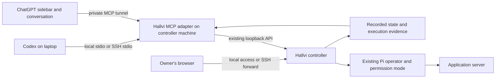

# Use Hallvi from Codex and ChatGPT

This proof of concept connects a coding conversation to an **existing Hallvi
controller**. Hallvi can run on your Mac or another machine. Codex doesn't
need its own Hallvi installation when the controller is remote: SSH starts
the small adapter on the controller machine.

The adapter lists applications, reads recorded evidence and the main
conversation, submits a request to the application's existing Pi operator and
follows its result. Its panel is a compact Hallvi: it opens on an overview of
the application (what needs you, its condition, deployment, traffic and
setup), with the operator's conversation one tab away and each part one link
from its page in Hallvi. It neither creates applications
nor replaces Pi. Approvals, missing input, Continue and Stop remain in the
Hallvi page. Requests use the existing CLI origin label, so the adapter also
works with controllers that predate this plugin.

## Build

Use Node.js 22 in this checkout, then:

```sh
npm ci
npm run plugin:build -- --controller http://127.0.0.1:4747
```

Use the actual controller port. This creates `dist/hallvi-plugin/` containing
a bundled `server.mjs`, a self-contained `panel.html`, a product skill and
local plugin metadata. Building contacts no controller and copies no state,
keys or logins. The adapter needs Node 22, but no `node_modules` or repository
checkout at runtime. The controller needs the `apps/exec/wait/inspect` HTTP
API described in [Working from a terminal](cli.md).

## Codex on the same machine

The build prints an exact `codex mcp add` command using the current Node binary
and absolute bundle path. Run it to register the adapter in Codex. Equivalent
configuration in your Codex `config.toml` is:

```toml
[mcp_servers.hallvi]
command = "/absolute/path/to/node22"
args = ["/absolute/path/to/dist/hallvi-plugin/server.mjs", "--controller", "http://127.0.0.1:4747"]
startup_timeout_sec = 20
tool_timeout_sec = 60
```

Start a new Codex chat to load its tools. Ask:

> Use Hallvi to list my applications. Inspect whoami and report its recorded
> state without running anything on the server.

Then, for a fresh check:

> Ask Hallvi to check whether whoami answers correctly. Read-only: no
> redeployment, restart, configuration changes or data changes. Follow the
> request and show the evidence.

`hallvi_open` supplies the optional panel to compatible MCP Apps hosts.
Tools work without the panel. Each panel revision's Codex check is recorded in
its pull request, including what it could not establish; native ChatGPT
rendering remains unverified.

To install the skill and tools together as a local plugin:

```sh
codex plugin marketplace add /absolute/path/to/dist
codex plugin add hallvi@hallvi-poc
```

This installs and enables Hallvi in the active Codex profile. For daily use,
copy the generated marketplace to a stable location outside the worktree
before registering it. For a remote controller, replace the generated
`hallvi-plugin/.mcp.json` connection with the SSH command below before
installing. The controller must already be running; installation does not
start Hallvi. The desktop may retain an existing MCP session after installation. Check
that Hallvi actually opens from the sidebar and follow the update procedure
below; successful installation and tool discovery alone do not verify that UI. Choose either this route or the direct MCP configuration
to avoid duplicate tools. The generated local manifest uses the build
machine's Node path; it is not a public distribution package. Preserve the
bundle directory while that connection is configured.

## Codex on your laptop, Hallvi on another server

1. Have Hallvi running on the server with your application already connected.
2. Copy **only `server.mjs` and `panel.html`** from the bundle to a directory
   such as `/opt/hallvi-plugin/` owned by your SSH account. Use an account
   already authorized to reach that Hallvi controller.
3. Confirm noninteractive SSH to the host using its established host key and
   your normal SSH configuration. The remote Node executable must be Node 22.
4. Add this connection to Codex, replacing the host, paths and ports:

```toml
[mcp_servers.hallvi]
command = "ssh"
args = ["-T", "-o", "BatchMode=yes", "hallvi-host", "/usr/bin/node /opt/hallvi-plugin/server.mjs --controller http://127.0.0.1:4747 --ui-url http://127.0.0.1:8474"]
startup_timeout_sec = 30
tool_timeout_sec = 60
```

Those example remote paths contain no spaces. If your paths do, quote them
for the remote shell inside the final argument. SSH authenticates the channel;
no provider credential passes through MCP. Don't disable host-key checking.
The remote shell must leave stdout clean for MCP messages.

A `.local` SSH hostname depends on the local network's name discovery; it is
not an internet address. If the laptop leaves that network, both plugin tools
and the panel can become unavailable before MCP initialization. Check the SSH
connection first: a name-resolution failure is not a UI-resource cache problem.
Reconnect to the server's network or use an already configured private route
and verified SSH address. Keep host-key verification enabled. The browser's
local SSH forward must also be restored before copied Hallvi addresses work.

For approvals and other actions that still need Hallvi's page, keep an SSH
forward open in your laptop terminal:

```sh
ssh -N -o ExitOnForwardFailure=yes -L 127.0.0.1:8474:127.0.0.1:4747 hallvi-host
```

Open `http://127.0.0.1:8474`. The Codex desktop app answers an HTTP open-link
request as if it had opened it and does nothing, and the panel's frame may not
open windows, so for HTTP addresses the panel shows the address with **Copy**
and says where it leads. Paste it into your browser; keep the SSH forward
running. If clipboard access is denied, the panel selects the address for
manual copying. HTTPS addresses open in Codex's browser, with the same copy
fallback if the host reports a failure. For changed panel HTML, follow the UI
update procedure below.

`--ui-url` controls browser links only; the
adapter still talks exclusively to the server's local controller. Request
handles contain that remote loopback address: pass them back to `hallvi_wait`,
not to a browser or an HTTP client on your laptop. Use a different MCP server
name for a second controller so each connection remains explicit.

## Updating the installed plugin

With dependencies installed (`npm ci` under Node 22), run from the checkout
whose plugin revision you want to install. The updater uses Node 22, selecting
an existing Homebrew Node 22 automatically if your default Node is newer:

```sh
npm run plugin:update
```

This builds the plugin, updates the existing local marketplace at
`~/.local/share/hallvi-plugin-marketplace`, updates the adapter over its existing
SSH connection when applicable, and reinstalls `hallvi` through Codex. It keeps
`.mcp.json` byte-for-byte, including controller, UI address and SSH options.
It does not restart Codex, Hallvi or any application. If adapter code changed,
restart Codex once and reopen Hallvi from the sidebar. Compare the panel's UI
version with the command's expected version; installation success alone does
not prove the open panel refreshed.

Use `-- --dry-run` to build and check the existing installation without changing
installed files. `-- --marketplace-dir /absolute/path` selects another existing,
registered local marketplace; `-- --bundle /absolute/path/to/hallvi-plugin`
installs an already built bundle instead of building. The command does not
fetch source changes, set up a first installation, or upgrade the controller.

The supported connections are the direct Node and SSH commands above. SSH
uses the existing options and host, requires an absolute adapter path and
Node 22, and rejects shell expressions or paths with spaces. Unsupported
connections fail before installed files change. A failed SSH preflight leaves
all installed files alone. Updates stage both remote files before replacing
them individually and verify their hashes; a later failure can leave some
copies updated. Fix the reported failing step and rerun the same command.
No application state or credentials are copied.

## Updating only the plugin UI

Each HTML revision gets a content-addressed URI:
`ui://hallvi/applications-<sha256-prefix>.html`. Tool metadata, resource reads
and the available UI version returned by application discovery agree. The menu
shows the version of the document actually rendered by the host; it may be older. The build prints
the expected resource URI. A URI retains its
original bytes within a running stdio connection; it keeps up to eight revisions.
The stateless HTTP transport serves only the current revision per request.
Expired resources fail instead of returning different HTML under an old URI.

For HTML, CSS and panel JavaScript changes:

1. Replace `panel.html` beside the **running adapter** (on the remote host for
   an SSH connection). Use a temporary file and rename for an atomic update.
   Keep the marketplace's source copy up to date for future installs too.
2. Choose **Check for a panel update** in the panel's `⋯` menu, or ask Codex
   to call `hallvi_reload_ui`.
   This reads the new file and emits standard MCP tool/resource list-change
   notifications on the existing connection. It does not restart any process.
   The result says what the adapter serves, not what the host has rendered.
3. Read the persistent **Panel update** notice. It compares the rendered and
   available versions, even when `changed: false` means another caller already
   refreshed the adapter. Application discovery and host tool-result notifications
   also reveal a mismatch without a manual check. This comparison reflects the
   adapter's last loaded resource; only the explicit check rereads `panel.html`.
4. Copy any unsent message before leaving. In Codex, open Hallvi in a new chat.
   An already rendered iframe does not replace itself; reopening Hallvi in the
   same chat retained the old version in the September 2026 desktop build.
   If the version remains old, reconnect the Hallvi plugin in the host app.
   Other hosts may replace the panel on close/reopen; verify rather than assume.
5. Compare the version in the **newly rendered panel's** `⋯` menu with the
   available version. A successful reload-tool response or a fresh standalone
   adapter check alone does not prove that the native host refreshed.

The panel check stops waiting after 15 seconds, restores **Check again** and
explains that the host may still finish the request. Retrying only reloads the
panel resource; it cannot submit or repeat operator work. The result remains
visible after the menu closes and can be dismissed. A matching version says
only that the rendered panel matches the installed UI, not that adapter code
has restarted.

**Refresh** rereads application records; **Check for a panel update** checks the installed
panel file. Failed UI reads preserve the last working resource and tools.
The reload tool cannot download updates, run shell commands, change the
controller, or load new adapter code.

Adapter-code, tool-schema and plugin-manifest updates still need an MCP
connection refresh. Version 0.1.1 first introduces this UI reload mechanism,
so an older running adapter must reconnect once before it can offer it.
Do not describe a fresh standalone Codex app-server check as proof that the
already-running desktop connection refreshed. Host-specific verification is
recorded in the PR; native ChatGPT behavior is still unverified.

The Codex app-server protocol also exposes `config/mcpServer/reload` (no
parameters). A persistent app-server test verified that this discovers a changed
UI URI without restarting that app-server process. This is a client integration
API, not a shell command to run against a second app-server: that second process
cannot refresh the desktop's existing connection. The running desktop in this
setup has no app-server control socket exposed to the CLI proxy. Its plugin
reconnection and refreshed native rendering must be tested through the host UI.

## ChatGPT sidebar and conversation panel

The same server exposes an MCP Apps HTML resource. `hallvi_open` declares both
`global` and `thread` entrypoints through the new OpenAI Plugin Extensions.
The panel opens on the chosen application's overview, read from
`hallvi_inspect`: anything the operator needs from you, its condition, the
running release, the last day's traffic and its setup, each linking to its
page in Hallvi. The Operator view is its main conversation, and its tab says
what the operator is doing from either view. A message goes
through `hallvi_exec` exactly as a model's would, as a follow-up while Pi
works. The latest turns come from `hallvi_conversation`, whichever surface
wrote them, and are re-read about every 1.5 seconds while Pi works and every 8
seconds otherwise, never while the panel is hidden. The panel shares the
selected application and what its operator is doing with the host model, so
"ask Hallvi to…" in the Codex conversation goes to the same application.

The panel never approves, declines, continues or stops. An MCP host cannot
show the adapter that a person rather than the model pressed a button, so
those decisions stay in Hallvi's page, which the panel opens (HTTPS) or offers
to copy (HTTP). [The panel design](../plugins/hallvi/DESIGN.md) describes its
states.

For private developer-mode testing, use OpenAI's
[Secure MCP Tunnel](https://developers.openai.com/api/docs/guides/secure-mcp-tunnels).
Run its `tunnel-client` on the machine that can reach Hallvi. Its stdio command
can launch this adapter directly with the explicit controller argument.
Alternatively start the adapter's private HTTP transport:

```sh
node /opt/hallvi-plugin/server.mjs --controller http://127.0.0.1:4747 --http 4748
```

Configure the tunnel client's MCP server URL as
`http://127.0.0.1:4748/mcp`. This listener binds only to loopback and rejects
foreign Host and Origin headers. It has the same **local trust** assumption as
Hallvi, not a new login system. Do not publish it through an unauthenticated
public tunnel or reverse proxy.

In ChatGPT developer mode, create a plugin using the **Tunnel** connection
and select your configured tunnel. Tunnel creation, workspace association,
runtime credentials and developer-mode access are account-level setup, not
performed by this build. Native ChatGPT rendering must be tested there; a
local MCP Apps test host is only a protocol and visual check.

A public directory release would require a stable HTTPS service with user
identity and authorization. That service and public submission are outside
this private proof of concept.

## Tools and outcomes

| Tool | Behavior |
| --- | --- |
| `hallvi_apps` | List applications and recorded condition. No live probe. |
| `hallvi_inspect` | Read identity, permission mode, attention, how it deploys, bounded evidence and the last day's stored traffic totals; under `saved`, the running and latest release and the current way in by the Deployment page's rules, read from the records the conversation read carries. Optionally one execution in full. |
| `hallvi_conversation` | Read the latest turns of the main conversation: requests, each reply's calls, words, records and status. Pass a previous `revision` as `known` to learn only whether it changed. |
| `hallvi_exec` | Send one bounded request with a caller-supplied UUID key; return its handle after acceptance. Also the panel's composer. |
| `hallvi_wait` | Read that handle, optionally waiting up to 20 seconds. Never restart or resend work. |
| `hallvi_open` | Read the application list and attach the versioned panel resource. |
| `hallvi_reload_ui` | Reread installed panel HTML, publish a content-versioned resource and notify the existing MCP connection. No Pi work or controller restart. |

An MCP send has a 40-second observer deadline. Acceptance can be unknown if a
reply is lost; keep the handle and retry the exact message with the same key
when necessary. Retries under a new key can duplicate work. Disconnecting
Codex or stopping a wait does not stop Pi. The controller, not the adapter,
retains work and determines outcomes.

`completed` means Pi finished answering. It is not verified success. Read the
answer, evidence, omission flags and pending attention. A failed outcome read
is unknown, never healthy or idle. The adapter cannot approve calls, change
permission modes or continue interrupted work.

## Connection boundary



This adds no operational state store, approval system, autonomous scheduler
or second Pi session. Runtime files are self-contained; the host UI exchanges
MCP messages rather than fetching the controller directly.

## Verification and removal

Run `npm test -- hallvi-plugin controller-client` for real MCP HTTP and stdio
round trips against a disposable controller stand-in. The tests exercise lost
acceptance, same-key retries, approval waits, completed-but-unsuccessful
answers, unavailable workers, foreign handles, invalid IDs and browser-origin
rejection. They do not prove native host support or a remote SSH deployment.

`npm run plugin:host -- --controller http://127.0.0.1:<port>` renders the
panel in a local MCP Apps test host: the real adapter over stdio, the panel in
a sandboxed frame, switches for width, theme, host styles, sidebar or thread
and `ui/message`, and a log of every bridge call and model-context update.
Add `?storage=1` to its address to give the frame an origin, which browser
storage and screenshot tools need. It re-reads `panel.html` on each load
through `hallvi_reload_ui`. Anything it proves is fixture behavior: link,
clipboard, message and caching behavior must be checked in the host itself.

To check a panel change in the Codex desktop app without touching an installed
Hallvi plugin, give the build its own names. Copy the bundle's `server.mjs`,
`panel.html` and `icon.svg` into a scratch marketplace whose plugin and MCP
server are both `hallvi-dev` (display name "Hallvi dev"), pointed at a
development controller. Back up `~/.codex/config.toml`, then run
`codex plugin marketplace add <dir>` and `codex plugin add hallvi-dev@<marketplace>`.
A running desktop does not grow a sidebar entry for it, but a new chat can:
ask Codex to call `hallvi_open` from `hallvi-dev`, then expand the in-thread
panel into the side panel. Remove both with `codex plugin remove` and
`codex plugin marketplace remove`, and compare the configuration with the
backup.

For real operational verification, use [the shared workflow](verification.md)
and send a bounded request through these tools against the exclusively
attached controller. Verify its resulting application behavior independently.

Remove a direct Codex connection with `codex mcp remove hallvi`, or uninstall
the local plugin through the directory. Stop only the adapter/tunnel and SSH
forward you started. Hallvi's service, applications and history remain intact.

Sources: [MCP in Codex](https://developers.openai.com/codex/mcp),
[Plugin Extensions](https://developers.openai.com/plugins/build/extensions),
[MCP Apps UI](https://developers.openai.com/plugins/build/chatgpt-ui).
