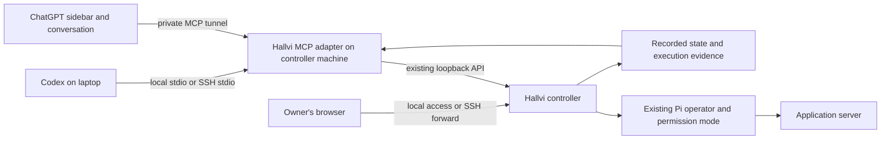

# Use Hallvi from Codex and ChatGPT

This proof of concept connects a coding conversation to an **existing Hallvi
controller**. Hallvi can run on your Mac or another machine. Codex doesn't
need its own Hallvi installation when the controller is remote: SSH starts
the small adapter on the controller machine.

The adapter lists applications, reads recorded evidence, submits a request to
the application's existing Pi operator and follows its result. It neither
creates applications nor replaces Pi. Approvals, missing input, Continue and
Stop remain in the Hallvi page. Requests use the existing CLI origin label,
so the adapter also works with controllers that predate this plugin.

## Build

Use Node.js 22 in this checkout, then:

```sh
npm ci
npm run plugin:build -- --controller http://127.0.0.1:4747
```

Use the actual controller port. This creates `dist/hallvi-plugin/` containing
a bundled `server.mjs`, a self-contained `panel.html`, a product skill and
local plugin metadata. Building contacts no controller and copies no state,
keys or logins. The adapter needs Node 22, but no `node_modules` or repository
checkout at runtime. The controller needs the `apps/exec/wait/inspect` HTTP
API described in [Working from a terminal](cli.md).

## Codex on the same machine

The build prints an exact `codex mcp add` command using the current Node binary
and absolute bundle path. Run it to register the adapter in Codex. Equivalent
configuration in your Codex `config.toml` is:

```toml
[mcp_servers.hallvi]
command = "/absolute/path/to/node22"
args = ["/absolute/path/to/dist/hallvi-plugin/server.mjs", "--controller", "http://127.0.0.1:4747"]
startup_timeout_sec = 20
tool_timeout_sec = 60
```

Start a new Codex chat to load its tools. Ask:

> Use Hallvi to list my applications. Inspect whoami and report its recorded
> state without running anything on the server.

Then, for a fresh check:

> Ask Hallvi to check whether whoami answers correctly. Read-only: no
> redeployment, restart, configuration changes or data changes. Follow the
> request and show the evidence.

`hallvi_open` supplies the optional application panel to compatible MCP Apps
hosts. Tools work without the panel. Rendering and selection have also been
checked in the installed Codex MCP Apps panel; native ChatGPT rendering
remains unverified.

To install the skill and tools together as a local plugin:

```sh
codex plugin marketplace add /absolute/path/to/dist
codex plugin add hallvi@hallvi-poc
```

This installs and enables Hallvi in the active Codex profile. For daily use,
copy the generated marketplace to a stable location outside the worktree
before registering it. For a remote controller, replace the generated
`hallvi-plugin/.mcp.json` connection with the SSH command below before
installing. The controller must already be running; installation does not
start Hallvi. If the desktop app has not refreshed its plugin list, restart
it after finishing active work. Check that Hallvi actually opens from the
sidebar: successful installation and tool discovery alone do not verify that
UI. Choose either this route or the direct MCP configuration
to avoid duplicate tools. The generated local manifest uses the build
machine's Node path; it is not a public distribution package. Preserve the
bundle directory while that connection is configured.

## Codex on your laptop, Hallvi on another server

1. Have Hallvi running on the server with your application already connected.
2. Copy **only `server.mjs` and `panel.html`** from the bundle to a directory
   such as `/opt/hallvi-plugin/` owned by your SSH account. Use an account
   already authorized to reach that Hallvi controller.
3. Confirm noninteractive SSH to the host using its established host key and
   your normal SSH configuration. The remote Node executable must be Node 22.
4. Add this connection to Codex, replacing the host, paths and ports:

```toml
[mcp_servers.hallvi]
command = "ssh"
args = ["-T", "-o", "BatchMode=yes", "hallvi-host", "/usr/bin/node /opt/hallvi-plugin/server.mjs --controller http://127.0.0.1:4747 --ui-url http://127.0.0.1:8474"]
startup_timeout_sec = 30
tool_timeout_sec = 60
```

Those example remote paths contain no spaces. If your paths do, quote them
for the remote shell inside the final argument. SSH authenticates the channel;
no provider credential passes through MCP. Don't disable host-key checking.
The remote shell must leave stdout clean for MCP messages.

For approvals and other actions that still need Hallvi's page, keep an SSH
forward open in your laptop terminal:

```sh
ssh -N -o ExitOnForwardFailure=yes -L 127.0.0.1:8474:127.0.0.1:4747 hallvi-host
```

Open `http://127.0.0.1:8474`. The installed Codex host silently ignores HTTP
open-link requests, so the panel shows **Copy address** for HTTP URLs. Paste
the address into your browser; keep the SSH forward running. If clipboard
access is denied, the panel selects the address for manual copying. HTTPS
URLs retain **Open in Hallvi**, with a copy fallback if the host reports a
failure. Reopen an already loaded panel after updating its HTML.

`--ui-url` controls browser links only; the
adapter still talks exclusively to the server's local controller. Request
handles contain that remote loopback address: pass them back to `hallvi_wait`,
not to a browser or an HTTP client on your laptop. Use a different MCP server
name for a second controller so each connection remains explicit.

## ChatGPT sidebar and conversation panel

The same server exposes an MCP Apps HTML resource. `hallvi_open` declares both
`global` and `thread` entrypoints through the new OpenAI Plugin Extensions.
The panel lets you select an application, inspect records and expand execution
output. Selection shares application identity with the host model. It does
not execute operations or approve them.

For private developer-mode testing, use OpenAI's
[Secure MCP Tunnel](https://developers.openai.com/api/docs/guides/secure-mcp-tunnels).
Run its `tunnel-client` on the machine that can reach Hallvi. Its stdio command
can launch this adapter directly with the explicit controller argument.
Alternatively start the adapter's private HTTP transport:

```sh
node /opt/hallvi-plugin/server.mjs --controller http://127.0.0.1:4747 --http 4748
```

Configure the tunnel client's MCP server URL as
`http://127.0.0.1:4748/mcp`. This listener binds only to loopback and rejects
foreign Host and Origin headers. It has the same **local trust** assumption as
Hallvi, not a new login system. Do not publish it through an unauthenticated
public tunnel or reverse proxy.

In ChatGPT developer mode, create a plugin using the **Tunnel** connection
and select your configured tunnel. Tunnel creation, workspace association,
runtime credentials and developer-mode access are account-level setup, not
performed by this build. Native ChatGPT rendering must be tested there; a
local MCP Apps test host is only a protocol and visual check.

A public directory release would require a stable HTTPS service with user
identity and authorization. That service and public submission are outside
this private proof of concept.

## Tools and outcomes

| Tool | Behavior |
| --- | --- |
| `hallvi_apps` | List applications and recorded condition. No live probe. |
| `hallvi_inspect` | Read identity, permission mode, attention and bounded evidence; optionally one execution in full. |
| `hallvi_exec` | Send one bounded request with a caller-supplied UUID key; return its handle after acceptance. |
| `hallvi_wait` | Read that handle, optionally waiting up to 20 seconds. Never restart or resend work. |
| `hallvi_open` | Read the application list and attach the panel resource. |

An MCP send has a 40-second observer deadline. Acceptance can be unknown if a
reply is lost; keep the handle and retry the exact message with the same key
when necessary. Retries under a new key can duplicate work. Disconnecting
Codex or stopping a wait does not stop Pi. The controller, not the adapter,
retains work and determines outcomes.

`completed` means Pi finished answering. It is not verified success. Read the
answer, evidence, omission flags and pending attention. A failed outcome read
is unknown, never healthy or idle. The adapter cannot approve calls, change
permission modes or continue interrupted work.

## Connection boundary



This adds no operational state store, approval system, autonomous scheduler
or second Pi session. Runtime files are self-contained; the host UI exchanges
MCP messages rather than fetching the controller directly.

## Verification and removal

Run `npm test -- hallvi-plugin controller-client` for real MCP HTTP and stdio
round trips against a disposable controller stand-in. The tests exercise lost
acceptance, same-key retries, approval waits, completed-but-unsuccessful
answers, unavailable workers, foreign handles, invalid IDs and browser-origin
rejection. They do not prove native host support or a remote SSH deployment.

For real operational verification, use [the shared workflow](verification.md)
and send a bounded request through these tools against the exclusively
attached controller. Verify its resulting application behavior independently.

Remove a direct Codex connection with `codex mcp remove hallvi`, or uninstall
the local plugin through the directory. Stop only the adapter/tunnel and SSH
forward you started. Hallvi's service, applications and history remain intact.

Sources: [MCP in Codex](https://developers.openai.com/codex/mcp),
[Plugin Extensions](https://developers.openai.com/plugins/build/extensions),
[MCP Apps UI](https://developers.openai.com/plugins/build/chatgpt-ui).
