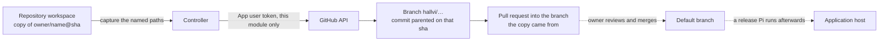

# GitHub connection

This is the GitHub connection and repository-access reference.

Three separate things decide what Hallvi can do with a repository, and they are easy to confuse:

1. **Which repositories the installation reaches.** The owner chooses them on GitHub when they install the App, and can change the selection at any time. Hallvi never widens it.
2. **What GitHub grants the App there.** `hallvi-app` asks for **Contents: read and write**, **Pull requests: read and write** and **Metadata: read**. The token is a real write credential for the selected repositories; it is not technically restricted to pull requests.
3. **What Hallvi does with it.** It reads the repository to work out how the application is deployed, and it writes only by publishing a branch of its own and opening a pull request against the branch the copy came from. It never writes to that branch, never merges, and opening a pull request deploys nothing. Each publish is a change like any other and follows the application's [permission mode](../../PRODUCT.md#permission-modes).

The [product boundary](../../PRODUCT.md#operating-boundary) limits what those changes may contain: narrow operability changes — packaging, configuration, a start entrypoint, a health endpoint, an environment-driven port — which the owner reviews and merges. Business logic and general bug fixes stay outside it.

Repository access uses an explicitly chosen installation-wide connection; application records and repository evidence remain scoped to the application. Schema 14 retired the old publication workflow and its per-application publishing grants; their records remain as read-only history, and branches or pull requests it opened on GitHub are left as they are. What replaced it has no preparation phase, no publication state, no separate grant and no queue: [proposing a change](#proposing-a-change) is one tool call inside the conversation.

## One GitHub App connection

Connect GitHub through Hallvi's configured GitHub App device flow. Hallvi stores the resulting user access/refresh tokens, expiries and connection identity in its own protected settings file. It does not discover, adopt or borrow `gh`, `GH_TOKEN` or `GITHUB_TOKEN` credentials. An older saved CLI selection is rejected with instructions to reconnect; Hallvi does not sign the host CLI out or alter its account.

Legacy response fields are compatibility details, not a second supported login method. GitHub CLI credential adoption is retired.

## App configuration for a distributed release

The release distributor configures **one** Hallvi GitHub App. An end user
connects their own GitHub account to that App and chooses which repositories
it may reach; they do not register an App, paste a token or edit environment
files. GitHub states that a private App can only be installed by its owning
account, while an App set to **Any account** can be installed by other users.
[GitHub visibility rules](https://docs.github.com/en/apps/creating-github-apps/registering-a-github-app/making-a-github-app-public-or-private).

The published App is [`hallvi-app`](https://github.com/apps/hallvi-app), client
ID `Iv23likHtcclbuys1lVG`. Both values are public, and `npm run package` ships
them unless the environment names another App. On 20 September 2026 GitHub
issued a device code for that client ID from a loopback-only development
controller, which establishes that Device Flow is enabled and that no callback
is needed. Sign-in, installation and a private-repository read by an account
other than the App's owner are not yet exercised (step 5).

The distributor should review the App's identity, homepage, ownership and
permissions before including it in a candidate:

1. Use **Any account** for external selected-repository installs. Marketplace
   publication is a separate option, not required to make the App public.
2. Enable **Device Flow** and keep user-token expiration enabled. Device login
   needs no callback URL. Leave **Request user authorization during
   installation** disabled because Hallvi initiates sign-in separately.
3. Disable webhooks. The published Hallvi App requests **Contents: Read &
   write**, **Pull requests: Read & write** and mandatory **Metadata: Read**
   (verified through GitHub’s public App API on 20 September 2026). Keep other
   permissions unset and let users select repositories. These are the grants
   [proposing a change](#proposing-a-change) needs: a branch and a pull
   request. Consent must disclose them as write grants; neither read-only
   inspection nor a branch-and-PR workflow makes the credential technically
   read-only. A release whose App grants Contents read only still reads
   repositories; proposing a change then fails naming the missing permission.
   Device flow needs no private key.
4. Review the public client ID and slug. `npm run package` writes the
   published App's values to `dist/github-app.json`; a fork sets both
   `HALLVI_RELEASE_GITHUB_CLIENT_ID` and `HALLVI_RELEASE_GITHUB_APP_SLUG` to
   name its own. A controller with neither a release App nor a local override
   says that the release cannot sign in, keeps public repositories working and
   offers no Connect button. Do not put client secrets, private keys or user
   tokens in the archive.
5. Test with a different GitHub account: device sign-in, selected-repository
   installation, a private repository check, permission denial and retry.
   A personal owner's existing installation is not external-user proof.

[GitHub registration options](https://docs.github.com/en/apps/creating-github-apps/registering-a-github-app/registering-a-github-app).

For a personal development checkout, the owner can still register a private
App and set its public **Client ID** and URL slug in `.env.local`:

   ```dotenv
   HALLVI_GITHUB_CLIENT_ID=your_public_client_id
   HALLVI_GITHUB_APP_SLUG=your-app-slug
   ```

For an installed service, local overrides go in
`~/.local/share/hallvi/hallvi.env` and require `hallvi restart`. The release
App identity is used when no local override exists.

In the browser, open Settings → GitHub, start sign-in and enter the displayed
code at GitHub. Hallvi polls at GitHub's requested interval and slows down if
told to. Use **Choose repositories on GitHub** to install the App for **only
selected repositories**. Sign-in identifies the user; installation grants
repository access. Both are needed for a private repository and either can
come first. Add an application to check its repository. Reconnecting from
Settings automatically checks existing applications. After changing access,
open an application and choose **Check again** in its repository notice.
Public repositories need neither GitHub step.

The device flow exchanges the public client ID and device code for a user access token; no App secret is required. Keep private keys/client secrets out of the distributed app, git and browser. A real installation and device sign-in were verified without generating either. GitHub's own [user access-token documentation](https://docs.github.com/en/apps/creating-github-apps/authenticating-with-a-github-app/generating-a-user-access-token-for-a-github-app) describes the supported flow and expiration.

## Proposing a change

`open_pull_request` publishes files Pi changed in the repository workspace and
opens a pull request for the owner. It exists because some of what an
application needs to run lives in its repository, and a change Hallvi makes
only in its disposable copy is lost when the copy goes.



The workspace is a folder holding a copy of one commit, not a Git checkout, so
nothing inside it knows where it came from and there is no remote to push to.
The revision travels beside the copy and the commit is assembled through
GitHub's git data API — blob, tree on top of that exact commit's tree, commit,
ref, pull request — which is what makes the published diff the diff Pi
inspected even when the branch has moved on meanwhile. If the default branch
has been renamed or replaced since the copy was taken, the publish is refused
rather than silently rebased onto something else.

- The branch always starts `hallvi/`, so it can never be the branch the
  application deploys from. Merging is the owner's.
- Only the paths Pi names are published, each under the one spelling the
  workspace reads it by, so `./config.yml` cannot slip past a check made
  against `config.yml`. A path the copy holds only redacted, one whose current
  contents are credential-shaped, build output and installed dependencies are
  each refused with the reason. Files are not deleted. A file whose bytes
  already match but whose executable bit does not is still a change: making an
  entrypoint executable is often the fix. In a repository too large for GitHub
  to list in one response that bit cannot be read, and the path is reported as
  left out rather than called unchanged.
- Asked again with the same branch, it commits on top of the work already
  there and returns the pull request already open for it rather than a second
  one. That branch has to be Hallvi's own: one that does not continue the
  revision this work is based on, or that carries a commit Hallvi did not
  publish, is refused by name rather than committed onto.
- When the push succeeds and the pull request does not, the result says so and
  names the branch and commit, so the owner can find the work and a retry does
  not duplicate it.
- The token stays inside `src/server/github-proposal.ts`. It reaches no shell,
  no Git remote, no commit, no branch name, no pull request and no execution
  record; what leaves is a URL and a list of paths.

Access is three separate failures with three separate recoveries: no connected
account, this repository not inside the installation, or the installation
without **Contents: read and write** / **Pull requests: read and write**. The
tool names which one it met. A repository the owner cannot write to would need
a fork of their own; Hallvi says so and does not create one.

## Automatic checks after reconnecting

After either login path succeeds in Settings, the page shows **Checking repository…** and sends a same-origin POST with the newly saved connection ID. Hallvi checks each existing application's repository and shows the individual results with links back to the applications. This uses the GitHub adapter directly, not Pi or another model call.

The check runs once for the new connection; it does not repeat on every page load. Already-recorded attempts for that connection, including permission failures, are not automatically retried. **Check again** on the application page remains available after fixing access. Concurrent automatic requests share one in-process batch. A changed/disconnected login stops the batch, and late results cannot overwrite evidence for a replacement login. Application history is preserved.

This is a bounded request, not a durable background job: a server crash can interrupt it. If the browser cannot retrieve the result, it points to the application's manual retry. Changing installation permissions directly on GitHub does not trigger a webhook or a new check by itself.

## Exactly what a passing check proves

The adapter verifies, in order:

1. The saved connection is present, unexpired and not known invalid; a reused credential still matches the consented fingerprint.
2. `/user` returns the recorded numeric account ID.
3. Repository metadata matches the requested `owner/name`. Once an application has a recorded numeric repository ID, a new repository at the same URL cannot reuse its history.
4. For App login: the App installation is active, grants Contents read access, belongs to the repository owner, and lists the exact numeric repository ID among accessible repositories. Even public repository metadata alone is not enough.
5. The default branch resolves to an exact 40-character commit SHA, and the selected connection has not changed during the check.

The Observation stores account/repository IDs, connection ID, credential source, check time, commit and safe permission evidence. `grantedPermissions` describes the App installation; `accountRepositoryPermissions` describes the user's repository role, **not** the token's effective permission. For example, an owner may have `admin: true` while the App has only `contents: read`. CLI OAuth scopes are recorded separately and can be empty for tokens that do not use classic scopes. No token, device secret, raw provider error or CLI stderr is recorded.

Repository access counts only a passing Observation from the **currently selected connection ID**. Changing/disconnecting the connection, known revocation or expired access without usable renewal makes old evidence insufficient. Routine token rotation preserves the connection ID and its existing evidence; it is not a new consent or repository check. Reconnecting requires a new check; previous Observations and chats remain readable. This is an observed-at-time check, not continuous revocation monitoring: an upstream permission change is discovered on the next provider request.

## Storage, recovery and limits

- Own configuration: `.hallvi/github-connection.json`, or `HALLVI_CONFIG_DIR/github-connection.json`. Writes are atomic with file mode `0600`. Access and refresh tokens are unencrypted at rest; do not expose this local prototype to the network or share its state directory. Neither token is included in browser data, evidence or provider-error messages.
- **Disconnect** cancels pending sign-in and replaces the owned file with `null`, removing both tokens and the selection from that file. A pending renewal cannot restore them. It does not erase disk backups, revoke authorization on GitHub, alter CLI credentials, or delete application history.
- Revoke upstream at [authorized GitHub Apps](https://github.com/settings/apps/authorizations); manage installed repository access at [installed GitHub Apps](https://github.com/settings/installations).
- User access tokens normally expire after eight hours. Hallvi renews them on the next GitHub request, starting within one minute of expiry; there is no timer or background worker. [GitHub supports refreshing device-flow user tokens without a client secret](https://docs.github.com/en/apps/creating-github-apps/authenticating-with-a-github-app/refreshing-user-access-tokens). The refresh token lasts six months and rotates when used. Reading Settings does not perform renewal; its “Access renews automatically” message means a usable local refresh token exists, not that remote authorization was just tested.
- Concurrent requests share one refresh exchange in the local Node process. Both tokens are validated and saved together before use. Late success or rejection cannot overwrite/invalidate a replacement login or a newer token; a repository request rejected because another request rotated its token retries once with the same connection's new token. Multiple server processes sharing this credential file are not supported: a future multi-process deployment needs cross-process coordination before sharing single-use refresh tokens.
- Temporary network/provider failures preserve the saved connection for retry. A rejected or expired refresh token requires sign-in; there is never a silent CLI/account fallback. If the provider rotates tokens but its response is lost, or saving fails, a subsequent attempt may also require sign-in because the old refresh token is single-use.
- Logins saved before automatic renewal was implemented need one new sign-in: their refresh token was not retained and cannot be recovered from the access token. They continue working until their existing access token expires. Legacy CLI selections require reconnecting through the App.
- Cancelled, denied, expired and interrupted device attempts have visible retry paths. Replacing a connection activates only after success; late completion cannot undo cancellation/disconnect/reuse. Attempts live in one Node process; a restart requires starting sign-in again.
- App permissions and the user's permissions intersect. Missing installation, missing Contents permission, an unselected/inaccessible private repository, or organization restrictions cannot become a passing check.

## Verification

`tests/application/integration/github-setup.test.ts` exercises the real coordinator, connection files, route boundary and repository adapter against synthetic provider responses. `tests/application/unit/github-api.test.ts` tests request/error handling without real tokens or network requests. `tests/application/integration/github-proposal.test.ts` runs a real workspace
and Pi's real file tools against an in-memory GitHub, and covers the published
diff and its parent revision, the untouched default branch, refusing a redacted
or credential-carrying file, naming the missing installation permission, and
the retry after a pull request that did not open.
`tests/browser/github.spec.ts` covers consent, device cancellation/denial/success, disconnect/reconnect, the application's repository notice and permission recovery with **Check again** in a disposable desktop app.

The browser fixture replaces only GitHub's API/credential boundary. The real GitHub setup routes, coordinator, domain code and SQLite run in the fixture. Pi and ChatGPT login use their existing synthetic adapters. CI never authorizes a real account. Earlier local/live evidence is recorded in the [archived acceptance guide](https://github.com/lustoykov/hallvi/blob/0682ab257469bc5cee994572285283ea949bc3c6/docs/archive/implementation/phase-one-acceptance.md#latest-verification).

UI conventions for future changes live in the [shared settings design reference](../design/settings.md).
