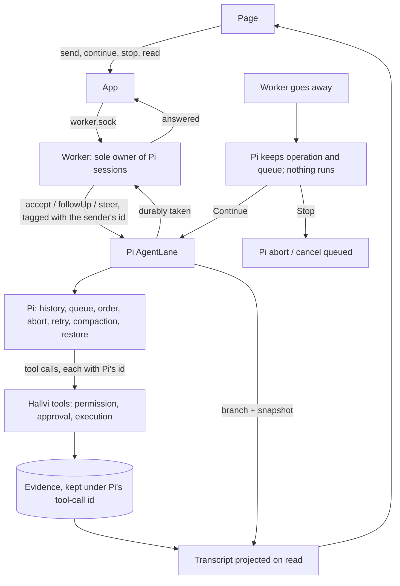

# Application operator design

Design discussion started 12 September 2026. This is the living record of the agreed direction and remaining questions. Delivery status and the active UI/UX checkpoint are maintained in the [roadmap](../ROADMAP.md).

This document describes the intended architecture. [Architecture](architecture.md) describes implementation, and the roadmap records the merged execution, storage, provisioning, terminal and transcript checkpoints. Historical fixed workflows and effect-specific approval rules are not requirements for the operator.

## Documentation alignment

The repository documentation was reconciled with this design on 12 September 2026, before implementation. [Product](../PRODUCT.md) states the new direction, [Roadmap](../ROADMAP.md) owns staged delivery, [requirements](requirements.md) describes the deployment outcomes, and [UI guidance](design/screens.md), [test guidance](../tests/README.md) and [review guidance](../REVIEW.md) follow the same scope and deletion policy.

[Architecture](architecture.md) remains an explicit account of the existing implementation. Runner/setup instructions, fixture documentation and dated proof reports describe the systems they actually exercise; they do not impose old workflow gates, data preservation or a broader acceptance matrix on the redesign. This alignment does not mark any redesign feature as implemented.

## Product premise

Hallvi gives a capable model general tools to operate an application and relies on its intelligence to investigate, execute, verify and recommend next steps. Improved models should improve the operator without requiring an expanding catalog of application-specific workflows and rules.

The product's differentiation belongs in:

- A carefully designed user experience: clear explanations, coherent interactions, delightful animations and useful presentation of the agent's work.
- Always-on care: monitoring, follow-through, keeping applications reliable, updated and backed up.
- Operational practices and timely nudges that help users care for their applications.
- Eventually, access for other agents to request work and consume useful outcomes and evidence through the same operator.

The product guides users on **what deserves care**. Pi decides **how to provide that care**.

## Agreed direction

### Default application access

Applications are private by default: bind application ports and reverse proxies to server loopback, keep application HTTP/HTTPS firewall ports closed, and use an SSH tunnel bound to the controller PC's `127.0.0.1`. Pi opens/reuses the tunnel with `open_server_port` through the normal permission boundary and gives the user its local URL. The tool checks local HTTP response status; Pi must also verify application behavior and server IPv4/IPv6 exposure. Public application access requires an explicit user request. Since 18 September 2026 that request does not need a domain: the hand-over offers a **direct address**, `https://<ip-with-dashes>.sslip.io`, which the owner chooses with one click and Pi publishes and verifies like any other public name. On a home-network machine the direct address is the machine's own LAN address over plain HTTP, reachable from that network only, and is never described as public. The default stays private; [onboarding](design/onboarding.md) owns the ladder and its limits. A local link works on the PC running Hallvi while its SSH tunnel is alive; reopening after disconnect/reboot is an explicit tool call, not an automatic recovery service. A remote controller requires a separate user access arrangement.

### Current focus: the main deployment journey

The owner confirmed on 12 September that application deployment has been demonstrated. The next stage, being worked on by Opus according to the owner, is the presentation architecture and a delightful simple-app happy path. Connect real database records and execution evidence to the reference UI through the [presentation contract](presentation-contract.md): Pi produces structured observations, shared projections assemble the information each view needs, and components own its visual presentation.

Walk the entire path from adding the repository to opening the verified application from the user's PC. Refine the explanations, permission decisions, live progress, saved result and return visits together. Use the existing deployment to inspect the mapping, then a fresh real deployment to verify that Pi produces records the same UI can render. Owner acceptance of both the appearance and interaction is the gate before the medium and more complicated scenarios; deployment capability alone does not close this checkpoint.

UI changes are welcome wherever this journey reveals a need. Preserve the sidebar's guiding purpose and use its existing structure as the starting point; do not freeze view interiors or interactions to match the old implementation.

Application-error detection is explicitly deferred. Interpreting arbitrary application errors and designing useful monitors is not understood well enough to include in the initial scope. After the main deployment experience works well, review the sidebar views individually and decide what care is genuinely useful and how to present it simply. Do not build a generic monitoring framework or detailed per-vertical policies ahead of that work.

### Sequencing boundary and working plan

1. **Connect data to the designed views.** Implement the agreed presentation-contract slice against real deployment records, preserving evidence, freshness and honest empty states.
2. **Polish and accept the simple deployment experience.** Verify a fresh real happy path, coherent chat and views, a usable application link, and persistence through refresh. Review visual and interaction quality with the owner.
3. **Then increase application complexity.** Use the medium and more complicated examples to discover concrete missing capabilities; keep the same operator and presentation architecture.
4. **Review further sidebar capabilities and broaden care after that foundation works.** Let actual use establish the need for additional actions, monitoring and hardening.

This is a sequencing boundary, not a promise to implement every example elsewhere in this document. Broader monitoring, per-view actions, detailed care policies and speculative extensibility are not prerequisites for the deployment path. Add supporting capability only when the main journey demonstrates a concrete need.

### Verification during development

Architecture-first does not mean unverified. Exercise the actual user journey with Pi and a representative application, inspect tool results and the resulting deployment, and verify that the UI accurately reflects what happened. A successful command alone is not sufficient evidence that the application works.

Use focused automated checks for consequential behavior introduced or changed, and fix concrete failures that prevent the path from working. Keep checks proportional to the current design; do not build exhaustive application matrices, speculative fault-injection suites or extensive defensive infrastructure while the architecture may still change. Retain checks that protect behavior the new design still needs; delete or rewrite tests that enforce retired workflows, redundant gates or obsolete hardening requirements. Investigate failures against the intended design rather than treating every old test as a requirement to preserve.

Record what was actually verified and material limitations. Defer broad edge-case coverage and resilience work until the main journey is established. Basic correctness, the chosen permission behavior and truthful execution outcomes remain part of making that journey work, rather than a separate hardening project.

### Delete what the new design no longer needs

Explicitly prefer a minimal implementation. Remove unnecessary code, tests, validators, workflow branches and hardening cases when their purpose no longer belongs in the agreed architecture. Existing code and test coverage are not reasons to preserve an obsolete product constraint. Do not retain parallel old and new execution paths or compatibility machinery without a concrete need.

Deletion is part of the redesign, under the authorization and the boundary in
[discarding development data](development-resources.md#discarding-development-data).

### Three application complexity tiers

Validate the same deployment journey progressively against three representative application shapes. These are development examples, not user-facing application stages, new database classifications or separate execution workflows. Complexity means operational dependencies, not just CPU or memory usage.

| Tier | Representative shape | What the deployment should demonstrate |
| --- | --- | --- |
| Lightweight | One web service with a straightforward build/start process and no external database. | Pi can inspect, configure, deploy and verify a useful response, with clear progress and a usable result in the UI. |
| Medium | A web application with a database, migrations, private configuration and persistent data. | Pi can establish dependencies and configuration and verify a meaningful write/read interaction, including persistence across an ordinary application restart. |
| More complicated | A multi-service application with a web/API service, background worker, database, queue or cache where needed, and persistent uploads. | Pi can discover service relationships, start the stack and verify one useful end-to-end behavior involving background work and stored data. |

Start with one concrete application per tier. Complete and obtain owner acceptance of the lightweight UI/UX checkpoint first, then use the medium and more complicated examples to expose necessary generalization. The same operator, general tools and presentation primitives should serve all three. Do not build three deployment engines or expand this into an exhaustive feature matrix. Exact repositories remain to be selected; backup automation and ongoing error detection are not added to deployment scope by these tiers.

## Draft deployment happy path

### Proposed implementation checkpoints

The architectural direction is sufficiently clear to begin bounded implementation after agreeing the first stage. Resolve remaining details inside the smallest relevant stage rather than planning every vertical up front. Each stage should produce a coherent diff, something the user can try, a short account of verification and limitations, and a list of obsolete machinery removed. Offer review between stages rather than accumulating one large redesign.

1. **Main operator, execution and permissions — first slice implemented.** One conversation owns changes and has general host commands, the three permission modes and execution history. This proved execution; it did not complete the new database model or deployment onboarding.
2. **Four-table storage and presentation references.** Implement the agreed storage checkpoint below, remove replaced workflow code and reset disposable application data. Verify refresh, approvals, native conversation continuity and rich saved-information cards. Review separately.
3. **Hetzner provisioning.** Pi inspects a real repository and arranges a host within the deployment journey. Save its identity and connection using the new application model; review the interaction before deployment.
4. **Complete the lightweight deployment UI/UX checkpoint — current focus.** Deployment has been demonstrated. Implement the data-to-view mapping and polish the complete journey against the reference designs. Prove it with fresh Pi output and obtain owner acceptance before expanding complexity.
5. **Prove generalization progressively.** Review the lightweight journey before moving to the medium example, then the more complicated example. Add capabilities those deployments actually need. These remain separate reviewable increments.

**The conversation is Pi's.** Send next and Steer are Pi's own durable follow-up and steering queues on an `AgentLane`; a send is answered once Pi has taken the message, and Hallvi keeps only the evidence of what Pi's tools did. Applications work concurrently, and so do read-only side conversations. Contextual side-chat opening and concurrent side explanations remain deferred. Existing read-only tool restrictions remain in effect.

After those checkpoints establish the deployment journey, begin the view-by-view design work described above. Detailed care features and broad hardening remain deferred. Exact application repositories, final record fields and visual details can be settled at the relevant checkpoint; they do not require another comprehensive architecture exercise.

This walkthrough is a proposal to refine with the user, not a fixed workflow or new set of state-machine stages. Start with a repository-backed application on one server; use the existing provider as the initial concrete example. Do not design every source, provider and topology variant at once. Use Pi decides for the illustrative interaction; it does not settle the product's default permission mode.

| Moment | Pi's responsibility | User experience |
| --- | --- | --- |
| “Deploy this repository” | Inspect available source, existing connections and saved preferences. | Enter or select the repository and a request; enter the main conversation without an infrastructure questionnaire. |
| Understand what is needed | Determine how the application runs, its dependencies, configuration and persistent data. | A concise explanation of the intended setup; ask only for access, private inputs or consequential choices that are actually missing. |
| Establish the target | Recommend an appropriate server using available context, explain any new cost, and obtain authority when needed under the permission mode. | A concrete recommendation or decision in the conversation, not a mandatory release-proposal workflow. |
| Prepare and deploy | Use general tools to prepare the host and configuration and start the application; respond to native tool feedback. | Legible progress and expandable execution logs. Send next keeps a follow-up for when Pi is done and Steer reaches Pi at its next step; Stop also settles what was waiting as not started. Contextual side chats remain deferred. |
| Verify useful behavior | Choose and execute checks appropriate to the actual application, including reachability and meaningful behavior. | Explain what was actually verified and any remaining limitation. |
| Hand over a working application | Preserve useful configuration and consequential knowledge and publish the relevant outcome. | An application link where applicable, an understandable deployment result and evidence available in the relevant existing views. |

Only save and surface information that earns its place in this journey. UI components, exact tool contracts and storage changes should follow the walkthrough. Recommendations for later care may appear where useful, but configuring every care feature is not a condition of completing the first deployment.

## Operator and presentation principles

### One main operator per application

One main conversation owns commands and changes for an application. Side conversations are read-only places to understand the application, inspect available evidence and explore alternatives. Two conversations must not independently deploy or modify the same application at once.

The current separate deployment planning session is an implementation choice, not a requirement to preserve. Deployment, investigation, backup and recovery should be things the operator accomplishes using general tools, rather than separate workflows controlling which commands it may execute.

Background work and, eventually, requests from other agents must coordinate with that same owner of operational work. The exact wakeup, scheduling and continuation mechanics remain to be designed. Always-on availability does not require a continuously generating model call or an unbounded active context.

### Interaction while Pi is busy

**Pi keeps the conversation.** Its persisted history, its queues and its operation state are the record of what was said, what waits, what is running and what an interruption left behind (published `pi-agent-core` 0.85.1, `AgentHarness`/`AgentLane`). Hallvi stores no messages, no replies, no conversation status and no record of what it has handed over. The page is projected on every read from Pi's lane — its whole branch for the history, its snapshot for the queue, the open operation and the text being streamed — and Hallvi's execution evidence is placed into it by the id Pi gave each tool call. The database keeps the conversation's title, which application it belongs to, and the id of the Pi session that holds it.

**The worker owns Pi's sessions.** It is the only process that opens one. The app asks it over a Unix socket beside the database (`worker.sock`, readable only by its user): for the transcript, to send, to continue, to stop, and to remove an application's histories. One process at a time may serve that socket. Which one is decided before the socket is touched, by an exclusive lock on a small file beside the database that the operating system holds for the process and releases when it ends, however it ends; there is no lease, heartbeat or stale-owner check. A socket path cannot decide it by itself: a path left by a dead worker has to be removed, and two starters that both find it unanswered would each remove the other's. With the lock held, whatever is at the path is stale and is replaced. A worker that does not get the lock leaves, having touched nothing: evidence left unsettled by a crash is settled only by the process that became the owner. There is no per-application lock and no heartbeat file.

**Sending.** The composer stays editable during work. **Send**, **Send next** and **Steer** are answered only once Pi has durably taken the message: an idle lane accepts it as a prompt, which Pi writes to its history before anything runs; a busy lane takes it as a follow-up or a steer into Pi's queue. If the worker cannot be reached, or Pi cannot be opened, the send fails, says why, and the composer keeps the text. The sender's request key is the message's id for good: it is carried on the message into Pi, it is the operation id of a prompt, and a send repeated after a lost answer is recognised in Pi's queue or history and accepted again without being taken twice. The same key with different text is refused.

Pi decides when a message runs: a follow-up when its current work is done, a steer after the tool calls of its current step and before its next model call, one message per turn. A steer does not interrupt a running command or a pending approval, and the interface says so. A message queued in the instant Pi finished stays in Pi's queue under its own entry id, and the worker has Pi read it from there with an empty prompt; nothing is cancelled and sent again.

Hallvi schedules nothing. Conversations of different applications run at the same time, including two applications on one server, and a read-only side conversation answers while its application's main conversation is busy. Within a conversation Pi sequences its own work. What protects a target is what always did: the application's permission mode and approvals, tool calls one at a time within a turn, side conversations having no tools that change anything, and each application's own host, secrets and records. No operation is known to need more than that; one that does would be fenced where it happens, not by holding conversations back.

**Stop** is Pi's `abort`: it ends the operation and empties Pi's queues. Queued messages are no longer Pi's after that and leave the transcript, which is what the control says it does (“Stop + cancel 2 waiting”). With no operation open, Stop cancels what is queued by its id. There is no taking back a single waiting message.

**A worker going away** — killed or shut down — aborts nothing in Pi, and a worker coming back opens nothing. Nothing runs because a worker restarted. When the conversation is next read, Pi restores what it had, and unfinished work that nobody is running is shown as interrupted: the history and evidence as they were, the reply saying that whether the last command finished is not known, anything queued still waiting, and two controls, always both:

- **Continue.** Pi resumes its operation. An interrupted tool call is not made again: Pi gives the model an error result saying the outcome is unknown, and the model investigates. What Pi held queued then runs in its order. With only a queue left, Pi reads it as above.
- **Stop.** As above, whether or not anything is queued.

A new message is refused until one of them is chosen, so an ordinary question cannot quietly resume old operational work ahead of itself. Evidence that still said “running” when the worker started, or when a stretch of work ended, is settled as interrupted.

**Tools, authentication, compaction and retry are Pi's.** Hallvi hands the harness coding-agent's own `ModelRuntime` for credentials, refresh and model access; the same tool definitions as before, with `execute` delegated to Hallvi's workspace and permission wrapper; and nothing at all for compaction and retry, which the harness does by itself. A definition's `prepareArguments` and `constrainedSampling` pass through unchanged. `executionMode` does not: the harness has one setting for a whole turn's tool calls, so it is set to run them one at a time, and nothing that mutates can run concurrently within a conversation. A tool is stopped through the signal Pi gives that call.

**What Hallvi still keeps, and why.** Permissions and approvals, because they are the product's decision and not the model's. Execution evidence (activity and execution records, saved information), because it outlives what a model context retains and carries redaction; each record keeps Pi's tool-call id, and its place in the conversation is read from Pi. Whether this worker is driving a lane right now, in memory, because that is the one fact Pi's records cannot hold; it is what distinguishes working from interrupted.

**What depends on undocumented Pi behaviour.** A caller's own field on a message (`hallviMessageId`) survives Pi's queue, a restart and its history. `accept` with an empty prompt followed by `drive` reads an idle lane's queue. A lane snapshot's transcript stops at the last compaction, so the page reads the branch with `findEntries`. Each is exercised by `tests/application/integration/pi-owner.test.ts`.



**Upgrading an existing installation.** `npm run db:upgrade` takes a schema-15 database to the current one and keeps the original beside it as `<database>.before-v18`. Nothing in the database is rewritten: the earlier `messages` table and the two conversation columns that tracked a reply are simply no longer read, and stay where they are. A conversation's earlier history (`pi-sessions/<application>/<chat>.jsonl`) is opened through Pi's public `JsonlSessionRepo`, which reads that format: on first use it is copied into the conversation's own directory (`pi-sessions/<application>/<chat>/`), where Pi rewrites the copy in its current format. The original file is never modified. Earlier conversations are shown from those histories; evidence recorded earlier is placed by the same tool-call ids. What only the earlier `messages` table held — a failure Hallvi reported without Pi having written anything — is not shown. Rollback is: stop the app and worker, put the database copy back, run the earlier version; it reads the original histories where they always were. Messages sent after the upgrade exist only in the new copies.

A destination's question keeps its origin in a removable chip and offers a return action after submission. It never replaces an existing draft. Drafts are kept in browser storage scoped to the controller origin, application and conversation, survive tab closure, and are cleared after acceptance. Storage being unavailable must not block ordinary messaging. Credential-entry fields do not use draft persistence.

Contextual read-only side chats remain future work; Pi's session branching primitives are available building blocks.

### General tools and independent permissions

Pi should have general tools for working on the application server, including shell execution. A request such as “fix this application” authorizes ordinary operational work within that request; Pi should choose individual commands without mandatory command-by-command approval except when the selected mode requires it.

The three modes are defined in [Product](../PRODUCT.md#permission-modes).

Permissions govern execution independently of deployment, backup or other workflow categories. Workspace execution must be accounted for alongside server execution. An important published record is not automatically an approval request, and permission does not require manufacturing a release proposal.

The modes govern what Pi composes. Hallvi's own fixed, read-only observations — the machine check, the way in, and requests as they arrive on Overview — are a closed list outside them; [Product](../PRODUCT.md#what-the-modes-cover) owns the list and the conditions an observation must meet.

The executor runs tools, handles credentials and records execution output and known outcomes. Errors and incomplete results return to Pi, which investigates and corrects through the same general tools. Do not add dedicated recovery tools, reconciliation workflows, cleanup journals or a framework of pending-effect holds. A lost connection is reported honestly; Pi can inspect the host to determine what happened.

[Jev](https://docs.typesafe.ai/introduction), TypeSafe's model for typed choices, scores and probabilities, is a viable candidate to test for failure triage: classify a bounded, redacted error excerpt as likely DNS, credentials, storage, application failure or insufficient evidence. Compare whether this helps Pi investigate faster than using the native error directly. These are provisional interpretations; Pi still verifies the cause. Jev has not been evaluated or selected for Hallvi, and typed outputs do not guarantee correct judgments.

Use a simple Codex-style approval interaction: a pending tool call asks the UI, waits asynchronously for a decision, and continues or declines within the active turn. Do not require an approval table, ending or restarting a turn, replay logic, or restoration of a pending approval after a worker restart.

Read-only side conversations require an appropriate tool boundary; unrestricted server shell access cannot be made read-only merely by naming the conversation that way. The exact inspection capabilities remain open.

### Beta security and later hardening

During beta, prioritize the application's deployment experience and communicate the risks of the current general tools. Recommend the most capable supported model, but never describe any model as immune to prompt injection: logs, repository content and other tool results can carry attacker-controlled instructions. Model capability and user guidance reduce risk; they do not establish an enforced security boundary. The [beta guidance](../README.md#beta-safety) owns practical user precautions, and the [roadmap](../ROADMAP.md) owns delivery timing. Existing permission behavior and fixes for concrete failures remain required.

After beta, revisit the execution boundary as the product matures: useful host diagnostics and disposable testing, restricted access to secrets and production data, network controls, destructive operations and independently protected backups. A separate LLM judge could review proposed tool calls before execution; treat this as a candidate additional check, not proof that two agents cannot be injected. No sandbox library, policy engine, reviewer architecture or new permission mode is selected by this note. Keep the work deferred rather than expanding the current sprint into a security platform.

Jev is a viable candidate to test alongside that command-review use case: flag possible data deletion, credential exposure or effects outside the requested application. Evaluate missed risks and false alarms against representative attacks and legitimate repairs. Its verdict cannot establish safety, grant authority or replace the existing permission boundary; this experiment remains part of deferred hardening.

### Stable navigation, model-curated content

Keep the existing sidebar as the starting information architecture. Its sections teach users the recurring responsibilities of operating their application. The interiors of those views can change as the architecture changes.

**Pi decides what matters and what to surface. The product provides a stable, carefully designed way to communicate it.**

Pi can choose that a failed backup deserves prominence, connect it to an investigation and recommend a next step. The interface provides consistent components, placement options, interactions and animations.

**Views share evidence and records. Navigation reflects user concerns; storage does not need to mirror the sidebar.**

One investigation may contribute to the overview, logs and backup view. These views should reference the same records and execution evidence, not create separate copies of the operational result. Users should not have to interpret logs or reconstruct a chat transcript to understand their application.

Releases, upgrades and backups may be important information to preserve and resurface. They do not need mandatory proposal entities or dedicated workflow engines merely to be possible. Pi decides which consequential information deserves a record.

### Session history, execution logs and saved knowledge

Use three complementary sources of continuity:

| Source | Purpose |
| --- | --- |
| Native Pi session history | Resume conversations using the messages and tool interactions retained by the runtime. |
| Execution logs | Automatically retain what ran, its target, output, timing and known or uncertain outcome. |
| Saved application knowledge | Information Pi deliberately preserves for retrieval, with optional presentation to users. |

Restoring a session does not guarantee every historical detail remains in active model context. Conversations can be compacted, and side conversations have separate histories. Important knowledge needs to remain directly retrievable.

Start with **one kind of saved application record with optional presentation information**, rather than separate systems for Pi's memory and user-facing information.

- Without presentation information, a record is retained for retrieval by Pi.
- With presentation information, the same record also appears in selected user views.
- Records without presentation remain inspectable; “for Pi” does not mean secret from the owner.
- Adding or removing presentation does not duplicate or delete the underlying knowledge.

Example: Pi learns that uploads live outside PostgreSQL and must be included in backups. It saves that discovery once. The same record can later appear in the backup view with a short explanation and next step.

Provide simple capabilities to **search, save, update and retire** records. Pi decides what deserves preservation. Guidance can encourage saving discoveries costly to rediscover, user preferences, ongoing concerns and consequential outcomes without requiring a database entry for every thought.

A modest common record structure should support content, application identity, recorded/last-checked times and evidence links, plus optional presentation. This is a conceptual structure, not a finalized schema or a commitment to a new table for each concept. Credentials and executable schedules may need dedicated storage for their actual runtime responsibilities.

### Immediate views with recorded evidence

Views read saved information from the database immediately. Opening a section should not require a model call to reconstruct the application. The always-on operator updates saved information as it works.

Timestamps and evidence distinguish “last established” from “checked just now.” Automatic execution facts remain distinguishable from Pi's interpretations: a command's exit status is recorded automatically; whether it establishes a successful upgrade or warrants user attention is Pi's judgment.

### Proportionate care

Most first applications are small: a personal tool, a test, a site with a handful of visitors and little data. Their owners want to get the application running and go back to building it. The product's care must be sized to what there is to lose, and grow with it.

- **Absence is a fact, not a failure.** "Nothing copies this data yet" is recorded as information, in calm words, with no failed check and no next step. Concrete failures still need attention: a copy that did not complete, a certificate that expired, a check that did not pass, a process that died.
- **Nudge once, then wait for the data to earn more.** The option of a backup, a monitor or a firewall change is mentioned at most once, in one sentence, when the owner is not in the middle of something. It becomes a warning only when the data is large or clearly growing, the application has real users or traffic, the owner said the data matters, or the thing broke.
- **Routine protection setup stays off the homepage.** The card says what runs and where. Protection details live on the application's own pages; a recorded problem or consequential risk can still warrant attention.
- **Every view follows the record's own status.** Pi sets `status` from the evidence and the stakes; the pages render that and do not add alarm of their own. The Backups page's "quiet" verdict is the visible form of this rule: an established absence on a small application reads as a fact and an offer, in grey, not amber.

This is the operating form of the product rule "Most first users run something small" in [PRODUCT.md](../PRODUCT.md#experience). Broader hardening stays deferred as described under beta security above.

For future care prioritization, Jev is a viable candidate to test whether an ambiguous combination of data growth, traffic, owner-stated importance and protection evidence warrants attention. Keep straightforward thresholds deterministic and compare its judgments against human review. Any result would inform Pi's recommendation, not independently change a record's status or add warnings in the UI.

### Always-on care and visible commitments

The following captures the longer-term direction. The application-error monitoring scenarios are exploratory and deferred, not requirements for the initial deployment journey. Specific care features will be revisited view by view after the main path is established.

Agreed wakeup sources are user messages, scheduled wakeups and incoming signals. They reach the same application operator. Ordinary installed processes such as backup jobs and lightweight monitors run independently of a model call. Pi can arrange ongoing checks and follow-ups within the selected permission mode.

**Deferred Pi heartbeat for state synchronization (owner request, 12 September 2026).** A periodic review should keep recorded application knowledge reasonably up to date between user conversations. Start with the concrete observations required by each designed view: what to inspect, how to collect it, and when it needs refreshing. Small deterministic checks can record observations directly; the heartbeat can wake Pi to investigate a change, obtain missing evidence, or interpret a result. This updates the shared records from which the UI renders, not React's local interaction state.

Synchronization means refreshing our knowledge of the application. It does not mean automatically changing the server to match an old record or plan; corrective actions follow the owner's intent and existing permission mode. If a check cannot run, retain the last successful observation and show the failed check or freshness gap. Do not turn inability to inspect into a claim that the application stopped or disappeared. Cadence, checks and wakeup policy remain to be designed after the current simple deployment UI/UX checkpoint; this note does not start a heartbeat now.

Jev is a viable candidate to test when designing this heartbeat: use recent probe results and bounded, redacted log excerpts to assess whether an ambiguous signal deserves Pi's investigation or repeats an already-known issue. Deterministic checks still record observations directly; model uncertainty or failure must not silently suppress a known failure or monitoring gap. Test missed incidents, unnecessary wakeups, latency and cost before allowing classifications to influence live routing. This remains a deferred experiment, not an implemented heartbeat or a selected model.

Whenever Pi establishes or changes ongoing care, surface that commitment in the relevant views: what is watched or scheduled, its cadence, the last established result and the next expected check. Quiet care means avoiding repetitive attention demands, not hiding the automation. Important changes, failures, decisions and useful recommendations deserve prominence; routine results can update existing information.

Pi should know the sidebar verticals and their purposes. The product can provide opinionated guidance to assess backup coverage, install useful monitoring and check that monitoring still works. Pi chooses and may author the scripts and procedures appropriate to the actual application. Start with sensible defaults and improve them through use and community feedback; do not design a comprehensive policy engine for every vertical now.

Two complementary monitoring paths:

- Pi can write and install a lightweight script that examines relevant logs or health signals and sends an incoming signal when something appears wrong.
- A scheduled Pi check independently reviews recent evidence and checks that the monitoring script and its delivery path are functioning. A 15–30 minute interval is an initial example to evaluate, not a finalized universal cadence.

The periodic wakeup should originate from the always-on service independently of the monitored script. These paths provide complementary detection; they do not guarantee detection of every failure. A stopped script, broken signal delivery or unavailable host should be visible as a monitoring gap when established.

#### Scenario: database backups

1. Pi assesses the database and surfaces a backup recommendation in the database view, with other placements as useful.
2. When asked to establish backups, Pi configures a suitable recurring backup procedure using general tools and the chosen permission mode, then checks the result.
3. Pi arranges a daily check-in to establish whether an expected recent backup actually completed. The backup job and the Pi check-in are distinct schedules: one creates the copy; the other checks protection.
4. The view surfaces the installed backup cadence, daily check-in, last successful backup evidence and next expected check. Restore testing remains a separately stated observation or recommendation; a backup success does not imply a tested restoration.
5. A failure signal can wake Pi sooner. Pi investigates and updates the same records with what failed, what it did and anything the user needs to decide. Ordinary successful checks update existing information without generating a new prominent card every time.

#### Deferred scenario: application errors and monitoring failure

1. Pi installs an application-appropriate log/health monitor and arranges periodic independent reviews. It surfaces both as ongoing care in the relevant views.
2. The monitor detects a concerning signal and wakes the operator with evidence. Pi determines its meaning, investigates and acts within the permission mode.
3. A later periodic review checks recent application evidence and whether the monitor and delivery path are functioning, rather than treating silence as proof of health.
4. If the monitor stopped, Pi surfaces the coverage gap, repairs it where authorized and checks that it works again. The record distinguishes the last observed application condition from monitoring availability.

These are experience scenarios, not mandatory executable backup or monitoring workflows. Specific cadences, signal transport and detailed per-vertical defaults remain to be designed.

## Current proposal: assigning records to views

The latest proposal is for Pi to receive a catalog of existing sidebar sections and their purposes. When saving or updating a record, Pi chooses one or more placements. Views query those assignments and render them using designed components. No model call is needed when a view opens.

An illustrative presentation object:

```json
{
  "placements": [
    { "view": "backups", "role": "attention" },
    { "view": "overview", "role": "attention" }
  ],
  "summary": "Backups have failed since Tuesday.",
  "suggestedAction": "Investigate the backup failure"
}
```

The view identifiers and fields above are illustrative, not finalized API names. Candidate presentation roles are current information, attention, recommendation and update. The roles, ordering and component library should be tested against actual view designs before being settled.

The view owns its layout; Pi chooses content, placement and meaning. As circumstances change, Pi can update or retire records and adjust their presentation. A suggested action can route a request into the main conversation; its exact interaction and execution semantics remain open.

Views should remain useful before Pi has populated them. For example, “Backup protection hasn't been assessed” can offer an assessment action. Missing records must not imply that no backups exist or that everything is healthy.

## Open design questions

### Decisions after Fable's review

The user chose simplicity: use the Codex-style pending-call approval interaction, retain exactly three permission modes without exceptions, discard existing development data and obsolete code, and let Pi handle operational problems through general tools. These decisions replace earlier proposals for durable approval suspension, mandatory host receipts/reconciliation and preservation of old runtime records.

[Codex's documented approval interaction](https://learn.chatgpt.com/docs/app-server#approvals) is a pending command/file-change item, an approval request, a client decision and continuation or decline. We are following that interaction, not claiming that Codex guarantees restoration of pending approvals across process restarts.

Conversations run on published Pi 0.85.1: `pi-agent-core`'s `AgentHarness`/`AgentLane` for the conversation lifecycle, composed with `pi-coding-agent`'s `ModelRuntime` and tool definitions, as described under Interaction while Pi is busy. Upstream's own coding-agent composition of the harness is unpublished (`experimental/` on main) and is not depended on. Tool wrappers await UI approval inside the live turn; there is no default conversation timeout while a person decides. The worker is the one owner of every history, so side conversations need no lock of their own.

Use explicit host execution and controller-held credentials, with named private inputs and known-value redaction. Keep the minimum repository access needed before a host exists. Details of the saved-record index, revision history and output storage can follow the working slice rather than become prerequisites. Side chats can follow useful execution records. No dedicated recovery subsystem is planned.

- How scheduled checks and external requests use the operator's native queue/steer capabilities when ongoing care enters scope. User-facing queue, steer and read-only side-chat interactions are agreed above.
- What read-only side conversations can inspect, and how findings move into the main conversation when action is desired.
- Permission scope is per application, defaults to Pi decides and is saved in its operator settings. The first interaction is inline Approve/Decline on the pending tool call.
- The minimum saved-record structure, update/history behavior and evidence references; how stale or conflicting knowledge gets corrected.
- The exact view catalog, presentation roles, ordering, record lifecycle and suggested-action interactions.
- Which current records remain necessary for executable state, and which can become shared knowledge or execution history. Avoid adding a new Task entity alongside existing Runs and Operations without a demonstrated need.
- The eventual interface for other agents; it should share the operator and evidence rather than create competing execution paths.

The immediate next design exercise is the main deployment happy path. Monitoring mechanisms, error-detection scripts and detailed per-view care defaults are deferred until that journey is established.

## Design test

When adding an operational capability, can Pi accomplish it through general tools and explain it through existing presentation primitives? Requiring another workflow, approval type and database entity for each capability is a sign that the design is drifting from this direction.

The four-table checkpoint below is approved for implementation. Keep this document updated as decisions are made, and distinguish agreed principles from illustrative proposals.


## First implementation checkpoint — 12 September 2026

The first conversation is the main operator and cannot be archived. Other conversations receive only repository read/search and stored application/execution evidence tools. Only the main operator gets workspace mutations, server Bash and approval requests. The worker runs one live stretch per application; concurrent side explanations are deferred until the core deployment experience is established.

An existing server connection contains address, SSH user/port and controller-side paths to a key and verified known-hosts file. Pi sees the target and command, not those credential paths. Provider provisioning and named private-input injection are not implemented in this checkpoint.

In that first checkpoint, permission settings and per-call execution JSON files lived under the application’s operator directory. Schema 15 moves settings into the application row; executions remain files. Each execution retains target, input, mode, status, bounded output, exit code and any approval reference. A pending approval waits in the live tool call for the UI's decision. There is no approval replay after a worker restart. Cancelled/failed turns may have already produced effects; Pi reads the evidence and investigates through general tools.

The old deployment/operation workers, mutation endpoints and approval cards have been deleted. Remaining workflow modules and tables are transitional implementation to remove as the new deployment path replaces them; they are not constraints on that path. No compatibility migration is required.

Verification and limits are recorded in the [checkpoint evidence](testing/2026-09-12-operator-execution.md). This is an execution checkpoint, not a completed deployment journey.


### Server setup belongs in the deployment journey

The execution checkpoint proves that Pi can run commands on a selected host. It does not establish server onboarding. Its test ran against a temporary SSH server on the development Mac, not a Hetzner host. The standalone SSH attachment button and file-path form were premature and have been removed from the product UI.

The deployment journey should first let Pi inspect the application and determine its needs. When a host is needed, integrate Hetzner provisioning or bring-your-own-machine setup into that journey, using the chosen permission mode and designed input controls. Pi then executes on the selected host and verifies the application. Detailed provider and machine-connection interactions belong to that upcoming checkpoint.

Conversation identity appears in the page header and corresponding navigation entry. The permission control should not repeat the conversation title, and the chat body needs no second title header.


### Controller storage versus the deployed application's database

The controller uses SQLite. The storage checkpoint replaced the legacy `deployments` and `application_operations` tables with the four in [Architecture](architecture.md#what-is-stored); neither exists any more. There is no requirement to provision a separate hosted database for Hallvi merely to use Hetzner.

A database needed by the deployed application is a separate concern. Pi determines that requirement from the repository and prepares the appropriate database on the target as part of deployment. A lightweight application may not need one at all.

## Agreed storage checkpoint — four tables

Implement and review storage before Hetzner provisioning, then review provisioning before the first lightweight deployment. Queue/steer and further side-chat interactions stay deferred. Old development application data is disposable; account credentials and `.env.local` are separate and must remain.

- **Applications:** repository identity and latest access check, permission mode (Pi decides by default), optional host connection with controller credential references and optional provider/server identity, timestamps.
- **Conversations:** application/title, one main conversation and read-only sides, native session reference, current status, timestamps. The worker enforces one live conversation per application; the main label alone is not a lock.
- **Messages:** user-facing text and structured references to saved information or executions, source, completion state and timestamps. Response delivery metadata belongs here; there is no separate runs table. An in-memory response projection may serve the worker/API without duplicating database records.
- **Saved information:** application, title/body, evidence references, establishment time, optional presentation (views, role, outcome, checks, next step and URL), creation/update/retirement times. Pi searches, saves, updates and retires it. Presentation is optional: private working knowledge and surfaced information use the same record. Saved preferences cannot override permission settings.

Native Pi JSONL holds full model/tool context. Executor-owned files automatically hold execution IDs, commands, targets, approvals, bounded output and outcomes. Approval waits on the original live call and uses a separate decision file; no reissued-command hash matching or replay framework. Refresh loads SQLite and file evidence and reconnects to streaming updates; worker restart marks unfinished replies interrupted and never replays commands.

Messages support a small product-owned block vocabulary, not arbitrary generated UI. A saved-information reference renders the same card in chat and its selected sidebar views. Pi chooses the content; components provide consistent badges, checks, links and expansion. A deployment outcome has a structured URL and evidence. Empty views never infer that a recorded host means a verified deployment.

### Typed deployment and access presentation

The optional `presentation.content` JSON field selects a product-owned component. `deployment` carries `repositoryUrl`, `revision`, `image`, `server` and `changes`: the source revision and running image are separate, and material changes made while deploying remain explicit. `application-access` carries `mode` (`private` or `public`) and `server`, with the browser URL in `presentation.url`. Private SSH access also requires `localPort` and `remotePort`; the writer validates that the URL uses `127.0.0.1` and matches the local port. These fields use the existing saved-information table, without another storage model.

Pi receives the content contract in its instructions and `save_information` description; the shared Zod schema rejects invalid writes. Chat stores references to these same records and shows compact details. Overview uses the selected timeline, recorded-work log, architecture miniature and recent-work composition. Optional check `subject` (`application`, `backups`, `server`, `access`) selects the timeline lane; `establishedAt` selects its time. Unclassified checks remain in record details and the log, without guessed lane assignments. Missing evidence remains unknown. Deployment expands source, image, changes and checks. Unrecognized content kinds are rejected; records without typed content retain the generic presentation. Components own layout and styling, and never derive a verified status from the content kind.

Keep deployment results as separate historical events. Update the current application-access record in place when its URL or access mode changes. Reformatting existing records preserves their original establishment times and evidence; it is a presentation preview, not proof that a fresh Pi journey writes the new contract successfully.

Ordinary knowledge can update in place. Historical outcomes remain separate records for separate events; no universal superseding/version-history mechanism. Controller-managed secrets are named and application-scoped; database records hold references. Secret-generation and injection tools arrive with the deployment need.

Delete decisions, observations, activity events, deployment/operation records and chat-summary storage as their callers are replaced. Detailed vertical design and hardening follow the working deployment journey.


## Provisioning checkpoint — 12 September 2026

After the owner accepted the storage UI, PR #55 was merged as `95b3829`. The separate provisioning implementation follows the existing model-owned judgment and permission rules: a general Hetzner REST tool, an application public-key tool, and a connection tool that resolves the provider address, verifies SSH and saves controller credential references. Pi chooses server type, location and image from current evidence and saves its recommendation or preparation outcome through the existing cards.

Bring-your-own-machine setup stays in the conversation. The owner installs the controller-generated public key through their trusted terminal and supplies public connection details plus an ED25519 host-key fingerprint. No secret is pasted into chat and no standalone file-path form returns. Hetzner can pin the host key on first use at the provider-reported address; a supplied fingerprint is checked when available. This limit is explicit in the [checkpoint evidence](testing/2026-09-12-hetzner-provisioning.md).

Provisioning stops at an SSH-verified host for review. Software installation, application deployment and its reachable URL belong to the next increment. No generic monitoring or recovery machinery is required first.
